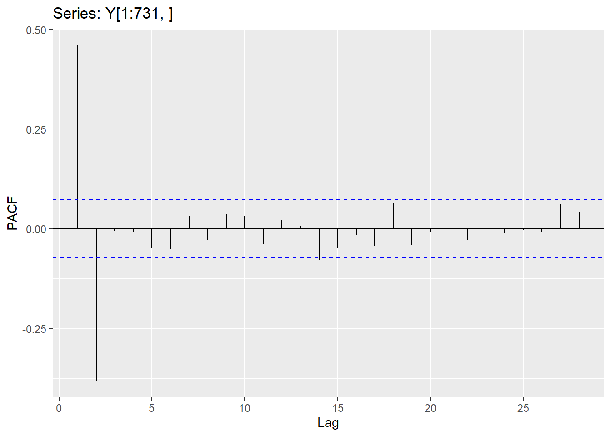
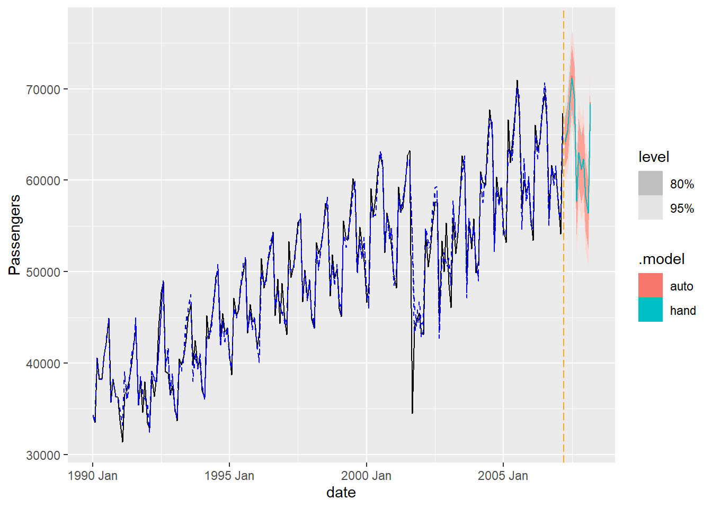

--- 
title: "Time Series 1"
author: "by Dr. Susan Simmons and Dr. Aric LaBarr "
date: "2023-09-07"
site: bookdown::bookdown_site
---

# Time series 1

This is your introduction in Time Series.  By the end of this course, you should be able to understand time series data and different formats for doing time series; understand and identify the different characteristics of a time series (trend, cycle, seasonality, etc); perform a time series decomposition on seasonal data; perform numerous exponential smoothing models; understand stationarity and how to test for it; understand AR, MA and mixed models and when to use differencing; and be able to identify if a series has white noise.  All of the data sets needed for this class are on the github repository.  Enjoy your TIME in Time Series!!


<!--chapter:end:index.Rmd-->

# Introduction


This document provides the code and output from Time Series I and II class. This is a living document and may be updated throughout the semester (when this occurs, you will be notified that it has been updated).  First, here is a list of all the libraries that you will need:


```r
library(tseries)
library(forecast)
library(haven)
library(fma)
library(expsmooth)
library(lmtest)
library(zoo)
library(seasonal)
library(ggplot2)
library(seasonalview)
library(aTSA)
library(imputeTS)
library(reticulate)
library(prophet)
use_python("C:\\ProgramData\\Anaconda3\\envs\\R_Env2\\python.exe")
#use_python("C:\\ProgramData\\Anaconda3\\python.exe")
```

The data sets that you will need are as follows (be sure to put the correct location and file name for your computer):


```r
file.dir = "https://raw.githubusercontent.com/sjsimmo2/TimeSeries/master/" 
input.file1 = "usairlines.csv"
input.file2 = "steel.csv"
input.file3 = "leadyear.csv"
input.file4 = "ebay9899.csv"
input.file5 = "fpp_insurance.csv" 
input.file6 = "ar2.csv"
input.file7 = "MA2.csv"
input.file8 = "hurrican.csv"

# Reads the data at specified directory
# If the file directory is incorrect, then this won't run
USAirlines = read.csv(paste(file.dir, input.file1,sep = ""))
Steel = read.csv(paste(file.dir, input.file2, sep = ""))
Lead.Year = read.csv(paste(file.dir, input.file3, sep = ""))
Ebay = read.csv(paste(file.dir, input.file4, sep = ""))
Quotes= read.csv(paste(file.dir, input.file5, sep = ""))
Y= read.csv(paste(file.dir, input.file6, sep = ""))
x=read.csv(paste(file.dir, input.file7, sep = ""))
hurricane=read.csv(paste(file.dir, input.file8, sep = ""))
```


For many time series applications, you will need a time series object in R.  This is created using the function ts.  For example, the time series data set in the airlines data frame is in the column "passengers".  Let's go ahead and create the time series object for this data set and graph it.


```r
Passenger <- ts(USAirlines$Passengers, start = 1990, frequency =12)

autoplot(Passenger)+labs(title="Time Series plot for Passengers", x="Date",y="Passengers")
```


Within the ts command, the only required argument is the vector of data that contains the time series information (in this case USAirlines$Passengers).  The optional arguments of "start" is for nice plotting purposes (it has the correct time frame when it plots instead of just using 1,2,3 for time).  The last argument shown is "frequency", which is for seasonal data.  If your time series object has a seasonality to it, then you should specify the length of the season (it does not know this unless you provide it).  For future analysis, we will need to create the time series objects for Steel (this data is monthly, so we will set frequency to 12, since there are 12 months in a year).


```r
SteelShp <- ts(Steel$steelshp, start = 1984, frequency = 12)
```


## Time series decomposition


IF your time series has a seasonal component to it, a useful visualization is the decomposition.  We will be using the STL decomposition (which can only do the additive decomposition, NOT multiplicative!).  The following code creates the decomposition and then plots it:


```r
# Time Series Decomposition ...STL#
decomp_stl <- stl(Passenger, s.window = 7)

# Plot the individual components of the time series
plot(decomp_stl)
```


```r
autoplot(decomp_stl)
```


NOTE: You will need to specify the length of the seasonal window for STL...this is done by specifying s.window = "size of window".  Your window should be an odd number.\\
You can pull off the different components (Seasonal, Trend or Remainder). The below command provides the first few rows of the decomposition (you can see what information is contained within the decomposition...season, trend and remainder).


```r
head(decomp_stl$time.series)
```

```
##            seasonal    trend remainder
## Jan 1990 -4526.7610 39081.77 -207.0131
## Feb 1990 -5827.5592 38942.75  420.8128
## Mar 1990   560.4986 38803.72 1213.7829
## Apr 1990  -802.2312 38664.69  404.5406
## May 1990   139.2095 38533.15 -423.3574
## Jun 1990  2953.8857 38401.61 -563.4910
```

Which means we can overlay the original data with the trend component (which is the second column.)


```r
autoplot(Passenger)+geom_line(aes(y=decomp_stl$time.series[,2]),color="blue")
```


Notice that the trend component is VERY similar to the "seasonally adjusted" data!  Do you know what the difference between the two series is?


```r
seas_adj=Passenger-decomp_stl$time.series[,1]

autoplot(Passenger) +
  geom_line(aes(y=decomp_stl$time.series[,2]),color="blue") +
  geom_line(aes(y=seas_adj),color="orange")
```


Another interesting plot is the subseries plot.  This looks at the individual series (in this case, the series for January, the series for February, etc....).


```r
# Plot seasonal subseries by months
ggsubseriesplot(Passenger)
```


Just a quick note.  STL ONLY does additive seasonal decomposition.  There is a decompose library that will do both additive AND multiplicative decomposition.

To get a measure of strength for trend and seasonality using Hyndman and Athanasopoulos' technique:


```r
Ft=max(0,1-var(decomp_stl$time.series[,3])/(var(decomp_stl$time.series[,3])+var(decomp_stl$time.series[,2]) + 2*cov(decomp_stl$time.series[,3],decomp_stl$time.series[,2])))
Ft
```

```
## [1] 0.9803349
```

```r
Fs=max(0,1-var(decomp_stl$time.series[,3])/(var(decomp_stl$time.series[,3])+var(decomp_stl$time.series[,1])+2*cov(decomp_stl$time.series[,3],decomp_stl$time.series[,1])))
Fs
```

```
## [1] 0.9339462
```


## Python code and results for Time Series plot

The following code shows the time series plot and classical decomposition (using additive model).


```python

import pandas as pd
import numpy as np
import matplotlib.pyplot as plt
from matplotlib import pyplot
from statsmodels.tsa.seasonal import seasonal_decompose
from statsmodels.tsa.seasonal import STL
usair_p=pd.read_csv("Q:\\My Drive\\Fall 2017 - Time Series\\DataR\\usairlines.csv")
df=pd.date_range(start='1/1/1990', end='3/1/2008', freq='MS')
usair_p.index=pd.to_datetime(df)
print(usair_p.head())
```

```
##             Year  Month  Passengers
## 1990-01-01  1990      1       34348
## 1990-02-01  1990      2       33536
## 1990-03-01  1990      3       40578
## 1990-04-01  1990      4       38267
## 1990-05-01  1990      5       38249
```

```python
plt.plot(usair_p["Passengers"])
plt.xlabel("Date")
plt.ylabel("Passengers")
plt.title("Airline Passengers")
plt.show()

## Classical Decomposition
```


```python
result = seasonal_decompose(usair_p["Passengers"], model='additive', period=12)
result.plot()
pyplot.show()

```


 You can also specify multiplicative by changing "additive" to "multiplicative" in the Python code.  If you want to do the STL decomposition, then you can apply the following code:


```python
import pandas as pd
import matplotlib.pyplot as plt
from matplotlib import pyplot
from statsmodels.tsa.seasonal import seasonal_decompose
from statsmodels.tsa.seasonal import STL
usair_p=pd.read_csv("Q:\\My Drive\\Fall 2017 - Time Series\\DataR\\usairlines.csv")
df=pd.date_range(start='1/1/1990', end='3/1/2008', freq='MS')
usair_p.index=pd.to_datetime(df)


## STL Decomposition

stl = STL(usair_p["Passengers"], period=12)
res = stl.fit()
fig = res.plot()
pyplot.show()
```


## SAS code for time series plot and decomposition

The following code is in SAS (creates the time series plot and the decomposition...which is the next section).  The use of the id statement can only be used if the series has a properly formatted date column.  Great thing about SAS is that if there is a missing value (or missing date), it will impute it for you.  It can also aggregate easily in SAS.  If you do not have a date column, you can still use this command, you will use seasonality = and then set the length of the season.  However, if you use the seasonality option, SAS will not recognize missing dates.

_Create library for data sets_  \  

libname Time 'Q:\My Drive\Fall 2017 - Time Series\Data';  \  
run; \  

_Time series plot and decomposition of Airline Passengers_ \  

proc timeseries data=Time.USAirlines plots=(series decomp sc); \  
	id date interval=month; \  
	var Passengers; \  
	run; \  

_Time series and decomposition of Airline Passengers, but now the seasonal cycle is set to a year_ \ 

proc timeseries data=Time.USAirlines plots=(series decomp sc) seasonality=12; \  
	var Passengers; \  
run; \  


proc timeseries data=Time.Steel plots=(series decomp sc) seasonality=12; \  
	var steelshp; \  
run; \  


## Self-study

Here is something to get you started if you want to take a look at the X13 decomposition!


```r
decomp_x13=seas(Passenger)
summary(decomp_x13)
```

```
## 
## Call:
## seas(x = Passenger)
## 
## Coefficients:
##                     Estimate Std. Error z value Pr(>|z|)    
## Leap Year          1.610e+03  4.003e+02   4.021 5.79e-05 ***
## Weekday            5.586e+01  1.890e+01   2.956  0.00312 ** 
## LS1992.Jun         4.006e+03  8.439e+02   4.747 2.07e-06 ***
## LS1992.Oct        -3.511e+03  8.409e+02  -4.176 2.97e-05 ***
## LS2001.Sep        -1.580e+04  8.633e+02 -18.296  < 2e-16 ***
## LS2001.Nov         5.492e+03  8.629e+02   6.365 1.96e-10 ***
## AO2002.Dec         4.412e+03  8.402e+02   5.251 1.51e-07 ***
## MA-Nonseasonal-01  5.073e-01  5.991e-02   8.468  < 2e-16 ***
## MA-Seasonal-12     4.981e-01  6.133e-02   8.121 4.62e-16 ***
## ---
## Signif. codes:  0 '***' 0.001 '**' 0.01 '*' 0.05 '.' 0.1 ' ' 1
## 
## SEATS adj.  ARIMA: (0 1 1)(0 1 1)  Obs.: 219  Transform: none
## AICc:  3501, BIC:  3533  QS (no seasonality in final):    0  
## Box-Ljung (no autocorr.): 22.77   Shapiro (normality): 0.9914  
## Messages generated by X-13:
## Warnings:
## - At least one visually significant trading
##   day peak has been found in one or more of
##   the estimated spectra.
```

```r
## Neat R shiny application....run OUTSIDE of RMarkdown
#view(decomp_x13)
```


<!--chapter:end:01-Introduction.Rmd-->

# Exponential Smoothing


In R, we are able to do Simple (or Single) Exponential Smoothing Models, Holt Exponential Smoothing Models and Holt-Winters Exponential Smoothing Models.  For the first two (Simple and Holt), we will be using the Steel data set and for the last one (Holt-Winters), we will be using the airline data set (we will also use the airline data set to illustrate the damped trend model).  Each of these are shown below.  

## Simple Exponential Smoothing

For Simple Exponential Smoothing Models (SES), we have only one component, referred to as the level component.
$$\hat{Y}_{t+1}= L_{t}\\
  L_{t} = \theta Y_{t} + (1-\theta)L_{t-1}$$
  
This is basically a weighted average with the last observation and the last predicted value.  Since this only has a level component, forecasts from SES models will be a horizontal line (hence why this method is called "one-step ahead" forecasting).  

In the R code, you can choose how the initial values are selected.  If you specify simple, then the first few observations will be used to estimate the starting value.  If you select optimal, then the algorithm uses the ets algorithm (will be discussed later) to optimize the starting values and the smoothing parameters.  You can also specify the value for "h", which is the number of forecasts to create (take a look at the forecast...do you see a horizontal line?).


```r
# Building a Single Exponential Smoothing (SES) Model - Steel Data #
SES.Steel <- ses(SteelShp, initial = "simple", h = 24)
summary(SES.Steel)
```

```
## 
## Forecast method: Simple exponential smoothing
## 
## Model Information:
## Simple exponential smoothing 
## 
## Call:
##  ses(y = SteelShp, h = 24, initial = "simple") 
## 
##   Smoothing parameters:
##     alpha = 0.4549 
## 
##   Initial states:
##     l = 5980 
## 
##   sigma:  460.4357
## Error measures:
##                    ME     RMSE      MAE        MPE     MAPE
## Training set 11.43866 460.4357 363.9341 -0.2204828 5.708307
##                   MASE        ACF1
## Training set 0.8287599 -0.04379112
## 
## Forecasts:
##          Point Forecast    Lo 80    Hi 80    Lo 95    Hi 95
## Jan 1992       6479.571 5889.499 7069.643 5577.133 7382.008
## Feb 1992       6479.571 5831.305 7127.836 5488.134 7471.007
## Mar 1992       6479.571 5777.922 7181.219 5406.492 7552.649
## Apr 1992       6479.571 5728.323 7230.819 5330.636 7628.505
## May 1992       6479.571 5681.801 7277.340 5259.487 7699.654
## Jun 1992       6479.571 5637.847 7321.295 5192.265 7766.876
## Jul 1992       6479.571 5596.077 7363.065 5128.383 7830.758
## Aug 1992       6479.571 5556.194 7402.947 5067.388 7891.754
## Sep 1992       6479.571 5517.964 7441.177 5008.920 7950.221
## Oct 1992       6479.571 5481.197 7477.944 4952.690 8006.452
## Nov 1992       6479.571 5445.736 7513.405 4898.458 8060.684
## Dec 1992       6479.571 5411.453 7547.689 4846.025 8113.116
## Jan 1993       6479.571 5378.236 7580.906 4795.224 8163.917
## Feb 1993       6479.571 5345.992 7613.150 4745.911 8213.230
## Mar 1993       6479.571 5314.640 7644.502 4697.962 8261.179
## Apr 1993       6479.571 5284.110 7675.032 4651.271 8307.871
## May 1993       6479.571 5254.340 7704.801 4605.742 8353.399
## Jun 1993       6479.571 5225.277 7733.864 4561.294 8397.847
## Jul 1993       6479.571 5196.872 7762.269 4517.853 8441.289
## Aug 1993       6479.571 5169.083 7790.058 4475.353 8483.789
## Sep 1993       6479.571 5141.871 7817.271 4433.735 8525.406
## Oct 1993       6479.571 5115.201 7843.940 4392.948 8566.194
## Nov 1993       6479.571 5089.043 7870.098 4352.942 8606.199
## Dec 1993       6479.571 5063.368 7895.773 4313.676 8645.465
```

```r
# Plot the SES model on steel data
autoplot(SES.Steel)+
  autolayer(fitted(SES.Steel),series="Fitted")+ylab("US Steel Shipments") + geom_vline(xintercept = 1992,color="orange",linetype="dashed")
```


```r
# Computes accuracy statistics for SES model on steel data (training data...NOT validation nor test)
round(accuracy(SES.Steel),2) 
```

```
##                 ME   RMSE    MAE   MPE MAPE MASE  ACF1
## Training set 11.44 460.44 363.93 -0.22 5.71 0.83 -0.04
```

## Holt ESM

The Holt model incorporates trend information.  So, now there are two components: level and trend.  For each component, there will be a smoothing coefficient (or weight).  CAREFUL, when you look at parameter estimates, these are NOT the estimates for the mean nor the linear trend...you should be thinking of them as weights (between 0 and 1).  The overall form for Holt's method is:

$$\hat{Y}_{t+h}= L_{t}+hT_{t}\\
  L_{t} = \theta Y_{t} + (1-\theta)(L_{t-1}+T_{t-1})\\
  T_{t} = \gamma (L_{t}-L_{t-1}) + (1-\gamma) T_{t-1}$$
  
For the Holt's method, when you forecast, you will see a trending line.  


```r
# Building a Linear Exponential Smoothing Model - Steel Data #
LES.Steel <- holt(SteelShp, initial = "optimal", h = 24)
summary(LES.Steel)
```

```
## 
## Forecast method: Holt's method
## 
## Model Information:
## Holt's method 
## 
## Call:
##  holt(y = SteelShp, h = 24, initial = "optimal") 
## 
##   Smoothing parameters:
##     alpha = 0.4329 
##     beta  = 1e-04 
## 
##   Initial states:
##     l = 6678.9989 
##     b = -0.0651 
## 
##   sigma:  471.4322
## 
##      AIC     AICc      BIC 
## 1626.001 1626.667 1638.822 
## 
## Error measures:
##                     ME     RMSE      MAE        MPE     MAPE
## Training set -4.167318 461.5062 369.9177 -0.4760441 5.818476
##                   MASE        ACF1
## Training set 0.8423858 -0.03556298
## 
## Forecasts:
##          Point Forecast    Lo 80    Hi 80    Lo 95    Hi 95
## Jan 1992       6495.463 5891.298 7099.627 5571.472 7419.453
## Feb 1992       6495.357 5836.979 7153.736 5488.455 7502.260
## Mar 1992       6495.252 5786.775 7203.730 5411.729 7578.775
## Apr 1992       6495.147 5739.865 7250.429 5340.043 7650.251
## May 1992       6495.042 5695.672 7294.412 5272.511 7717.573
## Jun 1992       6494.937 5653.768 7336.106 5208.479 7781.395
## Jul 1992       6494.832 5613.826 7375.838 5147.450 7842.214
## Aug 1992       6494.727 5575.592 7413.861 5089.032 7900.421
## Sep 1992       6494.622 5538.862 7450.381 5032.914 7956.330
## Oct 1992       6494.516 5503.468 7485.565 4978.839 8010.194
## Nov 1992       6494.411 5469.273 7519.549 4926.598 8062.225
## Dec 1992       6494.306 5436.161 7552.452 4876.013 8112.600
## Jan 1993       6494.201 5404.033 7584.369 4826.933 8161.470
## Feb 1993       6494.096 5372.805 7615.387 4779.229 8208.963
## Mar 1993       6493.991 5342.404 7645.578 4732.791 8255.191
## Apr 1993       6493.886 5312.767 7675.005 4687.520 8300.252
## May 1993       6493.781 5283.837 7703.725 4643.331 8344.230
## Jun 1993       6493.675 5255.565 7731.786 4600.149 8387.202
## Jul 1993       6493.570 5227.907 7759.234 4557.905 8429.235
## Aug 1993       6493.465 5200.824 7786.106 4516.541 8470.389
## Sep 1993       6493.360 5174.281 7812.439 4476.003 8510.718
## Oct 1993       6493.255 5148.246 7838.264 4436.241 8550.269
## Nov 1993       6493.150 5122.689 7863.611 4397.211 8589.089
## Dec 1993       6493.045 5097.585 7888.504 4358.874 8627.216
```

```r
# Plote the LES model on steel data

autoplot(LES.Steel)+
  autolayer(fitted(LES.Steel),series="Fitted")+labs(title="US Steel Shipment with Holt forecasts",y="US Steel Shipments") + geom_vline(xintercept = 1992,color="orange",linetype="dashed")
```


We can also perform Holt's method with a damped trend.  You will see the formula for the damped trend is similar to the previous Holt formula with an addition of a dampening parameter.

$$\hat{Y}_{t+h}= L_{t}+\sum_{i}^{k}\phi^{i}T_{t}\\
  L_{t} = \theta Y_{t} + (1-\theta)(L_{t-1}+\phi T_{t-1})\\
  T_{t} = \gamma (L_{t}-L_{t-1}) + (1-\gamma) \phi T_{t-1}$$

We will illustrate the damped trend on both the Steel and Airline data sets.


```r
LDES.Steel <- holt(SteelShp, initial = "optimal", h = 24, damped = TRUE)
summary(LDES.Steel)
```

```
## 
## Forecast method: Damped Holt's method
## 
## Model Information:
## Damped Holt's method 
## 
## Call:
##  holt(y = SteelShp, h = 24, damped = TRUE, initial = "optimal") 
## 
##   Smoothing parameters:
##     alpha = 0.4202 
##     beta  = 1e-04 
##     phi   = 0.9083 
## 
##   Initial states:
##     l = 6692.5352 
##     b = -54.4181 
## 
##   sigma:  472.702
## 
##      AIC     AICc      BIC 
## 1627.468 1628.412 1642.854 
## 
## Error measures:
##                    ME     RMSE     MAE        MPE     MAPE
## Training set 8.669068 460.2275 367.178 -0.2689588 5.765085
##                  MASE        ACF1
## Training set 0.836147 -0.02936686
## 
## Forecasts:
##          Point Forecast    Lo 80    Hi 80    Lo 95    Hi 95
## Jan 1992       6504.538 5898.746 7110.330 5578.059 7431.017
## Feb 1992       6504.482 5847.350 7161.614 5499.485 7509.479
## Mar 1992       6504.432 5799.671 7209.192 5426.594 7582.269
## Apr 1992       6504.386 5755.003 7253.768 5358.304 7650.467
## May 1992       6504.344 5712.838 7295.850 5293.839 7714.849
## Jun 1992       6504.306 5672.796 7335.817 5232.621 7775.992
## Jul 1992       6504.272 5634.585 7373.958 5174.201 7834.342
## Aug 1992       6504.241 5597.976 7410.505 5118.229 7890.252
## Sep 1992       6504.212 5562.783 7445.642 5064.420 7944.005
## Oct 1992       6504.187 5528.852 7479.521 5012.541 7995.832
## Nov 1992       6504.163 5496.057 7512.269 4962.398 8045.928
## Dec 1992       6504.142 5464.292 7543.992 4913.829 8094.455
## Jan 1993       6504.123 5433.465 7574.780 4866.693 8141.552
## Feb 1993       6504.105 5403.498 7604.712 4820.871 8187.339
## Mar 1993       6504.089 5374.322 7633.856 4776.260 8231.919
## Apr 1993       6504.075 5345.879 7662.271 4732.767 8275.383
## May 1993       6504.062 5318.115 7690.008 4690.313 8317.810
## Jun 1993       6504.050 5290.985 7717.114 4648.827 8359.272
## Jul 1993       6504.039 5264.447 7743.631 4608.247 8399.831
## Aug 1993       6504.029 5238.464 7769.594 4568.514 8439.544
## Sep 1993       6504.020 5213.002 7795.038 4529.578 8478.462
## Oct 1993       6504.012 5188.032 7819.992 4491.394 8516.630
## Nov 1993       6504.005 5163.526 7844.483 4453.919 8554.090
## Dec 1993       6503.998 5139.459 7868.537 4417.116 8590.880
```

```r
autoplot(LDES.Steel)+
  autolayer(fitted(LDES.Steel),series="Fitted")+labs(title="US Steel Shipment Linear Damped ESM Forecast") + geom_vline(xintercept = 1992,color="orange",linetype="dashed")
```


```r
LDES.USAir <- holt(Passenger, initial = "optimal", h = 24, damped = TRUE)
summary(LDES.USAir)
```

```
## 
## Forecast method: Damped Holt's method
## 
## Model Information:
## Damped Holt's method 
## 
## Call:
##  holt(y = Passenger, h = 24, damped = TRUE, initial = "optimal") 
## 
##   Smoothing parameters:
##     alpha = 0.5721 
##     beta  = 1e-04 
##     phi   = 0.8057 
## 
##   Initial states:
##     l = 36886.1093 
##     b = 527.1535 
## 
##   sigma:  4874.3
## 
##      AIC     AICc      BIC 
## 4906.527 4906.924 4926.862 
## 
## Error measures:
##                    ME     RMSE      MAE        MPE     MAPE
## Training set 196.2283 4818.336 3529.079 -0.2896149 7.191284
##                  MASE       ACF1
## Training set 1.326257 0.04535328
## 
## Forecasts:
##          Point Forecast    Lo 80    Hi 80    Lo 95    Hi 95
## Apr 2008       63673.96 57427.30 69920.63 54120.51 73227.42
## May 2008       63674.11 56477.18 70871.04 52667.35 74680.87
## Jun 2008       63674.23 55638.45 71710.01 51384.57 75963.89
## Jul 2008       63674.33 54879.22 72469.44 50223.37 77125.29
## Aug 2008       63674.41 54180.40 73168.41 49154.58 78194.23
## Sep 2008       63674.47 53529.54 73819.40 48159.13 79189.80
## Oct 2008       63674.52 52917.92 74431.12 47223.71 80125.32
## Nov 2008       63674.56 52339.20 75009.92 46338.63 81010.49
## Dec 2008       63674.59 51788.59 75560.59 45496.53 81852.66
## Jan 2009       63674.62 51262.36 76086.88 44691.70 82657.53
## Feb 2009       63674.64 50757.52 76591.76 43919.61 83429.67
## Mar 2009       63674.66 50271.67 77077.65 43176.55 84172.76
## Apr 2009       63674.67 49802.80 77546.54 42459.48 84889.86
## May 2009       63674.68 49349.27 78000.09 41765.85 85583.51
## Jun 2009       63674.69 48909.65 78439.73 41093.51 86255.87
## Jul 2009       63674.70 48482.74 78866.66 40440.60 86908.80
## Aug 2009       63674.70 48067.49 79281.91 39805.54 87543.87
## Sep 2009       63674.71 47663.01 79686.40 39186.93 88162.48
## Oct 2009       63674.71 47268.49 80080.93 38583.57 88765.85
## Nov 2009       63674.71 46883.24 80466.19 37994.37 89355.06
## Dec 2009       63674.72 46506.63 80842.80 37418.39 89931.04
## Jan 2010       63674.72 46138.10 81211.34 36854.78 90494.66
## Feb 2010       63674.72 45777.16 81572.28 36302.76 91046.68
## Mar 2010       63674.72 45423.35 81926.09 35761.66 91587.78
```

```r
autoplot(LDES.USAir)+
  autolayer(fitted(LDES.USAir),series="Fitted")+labs(title="US Airline Passengers with Linear Damped ESM Forecast") + geom_vline(xintercept = 2008.25,color="orange",linetype="dashed")
```


## Holt-Winters

The Holt-Winters (HW) model has three components to it (level, trend and seasonality).  Seasonality is an interesting component to model since we can have an additive seasonal component or a multiplicative seasonal component.  Both models are shown below:

Additive HW
$$\hat{Y}_{t+h}= L_{t}+hT_{t} + S_{t-p+h}\\
  L_{t} = \theta (Y_{t} - S_{t-p}) + (1-\theta)(L_{t-1}+T_{t-1})\\
  T_{t} = \gamma (L_{t}-L_{t-1}) + (1-\gamma) T_{t-1}\\
  S_{t} = \delta (Y_{t}-L_{t-1}-T_{t-1}) + (1-\delta) S_{t-p}$$

Multiplicative HW
$$\hat{Y}_{t+h}= (L_{t}+hT_{t}) S_{t-p+h}\\
  L_{t} = \theta \frac{Y_{t}} {S_{t-p}} + (1-\theta)(L_{t-1}+T_{t-1})\\
  T_{t} = \gamma (L_{t}-L_{t-1}) + (1-\gamma) T_{t-1}\\
  S_{t} = \delta \frac{Y_{t}}{L_{t-1}+T_{t-1}} + (1-\delta) S_{t-p}$$

Where p is the frequency of the seasonality (i.e. how many "seasons" there are within one year).  


```r
# Building a Holt-Winters ESM - US Airlines Data - Additive Seasonality
HWES.USAir <- hw(Passenger, seasonal = "additive")
summary(HWES.USAir)
```

```
## 
## Forecast method: Holt-Winters' additive method
## 
## Model Information:
## Holt-Winters' additive method 
## 
## Call:
##  hw(y = Passenger, seasonal = "additive") 
## 
##   Smoothing parameters:
##     alpha = 0.5967 
##     beta  = 1e-04 
##     gamma = 1e-04 
## 
##   Initial states:
##     l = 38384.1383 
##     b = 171.3139 
##     s = -1607.408 -2735.133 -266.9438 -4488.589 6259.346 6626.648
##            4166.006 1369.769 250.523 2806.828 -6741.171 -5639.874
## 
##   sigma:  1949.79
## 
##      AIC     AICc      BIC 
## 4515.651 4518.696 4573.265 
## 
## Error measures:
##                     ME     RMSE      MAE        MPE     MAPE
## Training set -84.80235 1877.214 1168.093 -0.2917412 2.495749
##                   MASE       ACF1
## Training set 0.4389788 0.06636172
## 
## Forecasts:
##          Point Forecast    Lo 80    Hi 80    Lo 95    Hi 95
## Apr 2008       65005.38 62506.62 67504.13 61183.86 68826.90
## May 2008       66294.00 63384.09 69203.92 61843.67 70744.34
## Jun 2008       69259.75 65989.86 72529.64 64258.88 74260.62
## Jul 2008       71890.05 68295.96 75484.15 66393.36 77386.74
## Aug 2008       71692.11 67800.64 75583.59 65740.62 77643.61
## Sep 2008       61113.61 56945.83 65281.39 54739.54 67487.68
## Oct 2008       65504.72 61077.76 69931.67 58734.27 72275.16
## Nov 2008       63206.01 58534.16 67877.87 56061.02 70351.00
## Dec 2008       64502.98 59598.36 69407.60 57002.01 72003.95
## Jan 2009       60640.36 55513.46 65767.26 52799.44 68481.28
## Feb 2009       59708.43 54368.43 65048.44 51541.60 67875.27
## Mar 2009       69425.67 63880.68 74970.66 60945.34 77906.01
## Apr 2009       67038.85 61296.05 72781.64 58255.99 75821.70
## May 2009       68327.47 62393.46 74261.49 59252.18 77402.76
## Jun 2009       71293.22 65173.90 77412.54 61934.53 80651.91
## Jul 2009       73923.52 67624.29 80222.75 64289.67 83557.37
## Aug 2009       73725.58 67251.38 80199.79 63824.14 83627.03
## Sep 2009       63147.08 56502.45 69791.72 52984.99 73309.17
## Oct 2009       67538.18 60727.34 74349.03 57121.89 77954.48
## Nov 2009       65239.48 58266.32 72212.64 54574.96 75904.01
## Dec 2009       66536.45 59404.62 73668.27 55629.26 77443.63
## Jan 2010       62673.83 55386.73 69960.92 51529.18 73818.47
## Feb 2010       61741.90 54302.73 69181.07 50364.67 73119.13
## Mar 2010       71459.14 63870.89 79047.39 59853.92 83064.36
```

```r
autoplot(HWES.USAir)+
  autolayer(fitted(HWES.USAir),series="Fitted")+ylab("Airlines Passengers")+ geom_vline(xintercept = 2008.25,color="orange",linetype="dashed")
```


```r
# Building a Holt-Winters ESM - US Airlines Data - Multiplicative Seasonality
HWES.USAir <- hw(Passenger, seasonal = "multiplicative")
summary(HWES.USAir)
```

```
## 
## Forecast method: Holt-Winters' multiplicative method
## 
## Model Information:
## Holt-Winters' multiplicative method 
## 
## Call:
##  hw(y = Passenger, seasonal = "multiplicative") 
## 
##   Smoothing parameters:
##     alpha = 0.4372 
##     beta  = 1e-04 
##     gamma = 0.2075 
## 
##   Initial states:
##     l = 38293.1221 
##     b = 173.9926 
##     s = 0.9658 0.962 1.0064 0.9745 1.1393 1.0801
##            1.0368 0.9994 1.0012 1.0401 0.8799 0.9146
## 
##   sigma:  0.0381
## 
##      AIC     AICc      BIC 
## 4504.228 4507.272 4561.842 
## 
## Error measures:
##                     ME     RMSE      MAE       MPE     MAPE
## Training set -113.1889 1848.797 1090.105 -0.383246 2.303162
##                   MASE      ACF1
## Training set 0.4096702 0.1713934
## 
## Forecasts:
##          Point Forecast    Lo 80    Hi 80    Lo 95    Hi 95
## Apr 2008       65528.49 62329.64 68727.34 60636.28 70420.70
## May 2008       66821.29 63262.13 70380.46 61378.02 72264.57
## Jun 2008       70075.52 66056.65 74094.40 63929.19 76221.86
## Jul 2008       73144.30 68671.62 77616.98 66303.93 79984.68
## Aug 2008       71313.29 66698.66 75927.92 64255.83 78370.76
## Sep 2008       58655.19 54662.55 62647.83 52548.97 64761.40
## Oct 2008       64544.10 59944.79 69143.41 57510.06 71578.13
## Nov 2008       62554.65 57906.98 67202.32 55446.66 69662.65
## Dec 2008       63629.25 58716.73 68541.77 56116.20 71142.30
## Jan 2009       59379.95 54629.79 64130.10 52115.21 66644.68
## Feb 2009       57852.76 53069.42 62636.10 50537.28 65168.25
## Mar 2009       70682.78 64655.56 76710.00 61464.94 79900.62
## Apr 2009       67606.25 61473.18 73739.32 58226.52 76985.97
## May 2009       68934.51 62519.04 75349.97 59122.89 78746.12
## Jun 2009       72285.87 65393.58 79178.16 61745.02 82826.72
## Jul 2009       75445.45 68084.46 82806.44 64187.79 86703.11
## Aug 2009       73551.02 66215.90 80886.14 62332.92 84769.12
## Sep 2009       60490.96 54330.83 66651.08 51069.86 69912.06
## Oct 2009       66558.97 59644.04 73473.89 55983.50 77134.43
## Nov 2009       64502.39 57671.58 71333.21 54055.56 74949.22
## Dec 2009       65605.36 58528.93 72681.80 54782.90 76427.83
## Jan 2010       61219.37 54498.44 67940.31 50940.59 71498.16
## Feb 2010       59640.30 52980.57 66300.04 49455.12 69825.49
## Mar 2010       72861.19 64590.90 81131.47 60212.88 85509.49
```

```r
autoplot(HWES.USAir)+
  autolayer(fitted(HWES.USAir),series="Fitted")+ylab("Airlines Passengers")+ geom_vline(xintercept = 2008.25,color="orange",linetype="dashed")
```


## Evaluating forecasts

In order to get a better idea of the forecasting properties of the algorithms, it is best to divide your data into a training data set and a test data set.  Time series is VERY different than other algorithms in which you have done.  The test data set should come at the END of the time series (to truly see how well you can forecast!).  An example code is shown below in which the last 12 observations are used as the test data set:


```r
# Create training set from overall Airlines Data
training=subset(Passenger,end=length(Passenger)-12)

# Create test set from overall Airlines Data
test=subset(Passenger,start=length(Passenger)-11)

# Fit Holt-Winters ESM (multiplicative seasonality) on training data
HWES.USAir.train <- hw(training, seasonal = "multiplicative",initial='optimal',h=12)


# Calculate prediction errors from forecast
error=test-HWES.USAir.train$mean

# Calculate prediction error statistics (MAE and MAPE)
MAE=mean(abs(error))
MAPE=mean(abs(error)/abs(test))

MAE
```

```
## [1] 1134.58
```

```r
MAPE
```

```
## [1] 0.01763593
```

## ETS

You can also allow the computer to search for the best model.  The ETS (Error, Trend, Seasonality) algorithm will search for the best model and estimate the parameters.  For the error term, we can have either an additive or multiplicative error structure.  For the trend, we can have none, additive, multiplicative, damped additive or damped multiplicative . For the seasonal component, we can have none, additive or multiplicative (lots of choices!). An example of how to run this is:


```r
ets.passenger<-ets(training)
summary(ets.passenger)
```

```
## ETS(M,Ad,M) 
## 
## Call:
##  ets(y = training) 
## 
##   Smoothing parameters:
##     alpha = 0.6485 
##     beta  = 1e-04 
##     gamma = 1e-04 
##     phi   = 0.9755 
## 
##   Initial states:
##     l = 38298.6991 
##     b = 99.6316 
##     s = 0.9696 0.9436 0.9968 0.919 1.1276 1.1289
##            1.0784 1.0223 1.0025 1.0531 0.8681 0.89
## 
##   sigma:  0.0369
## 
##      AIC     AICc      BIC 
## 4225.929 4229.567 4285.918 
## 
## Training set error measures:
##                    ME     RMSE      MAE       MPE    MAPE
## Training set 157.1888 1747.817 1043.596 0.1980283 2.19083
##                 MASE        ACF1
## Training set 0.38762 0.008869188
```

```r
ets.forecast.passenger<-ets.passenger%>%forecast::forecast(h=12)
error=mean(abs(test-ets.forecast.passenger$mean))
error
```

```
## [1] 1153.042
```

## Python Code for Exponential Smoothing

The following Python codes will produce exponential smoothing models.  I do recommend that you take some time to understand some of the differences between the models fit in R versus Python.


```python

import numpy as np
import pandas as pd
import matplotlib.pyplot as plt
from matplotlib import pyplot
from statsmodels.tsa.api import ExponentialSmoothing, SimpleExpSmoothing, Holt

steel=pd.read_csv("Q:\\My Drive\\Fall 2017 - Time Series\\DataR\\steel.csv")
df=pd.date_range(start='1/1/1984', end='12/1/1991', freq='MS')
steel.index=pd.to_datetime(df)

fit = SimpleExpSmoothing(steel['steelshp']).fit()
fit.params['smoothing_level']
```

```
## 0.42865253426712535
```

```python
fcast = fit.forecast(24)
fcast
```

```
## 1992-01-01    6498.665388
## 1992-02-01    6498.665388
## 1992-03-01    6498.665388
## 1992-04-01    6498.665388
## 1992-05-01    6498.665388
## 1992-06-01    6498.665388
## 1992-07-01    6498.665388
## 1992-08-01    6498.665388
## 1992-09-01    6498.665388
## 1992-10-01    6498.665388
## 1992-11-01    6498.665388
## 1992-12-01    6498.665388
## 1993-01-01    6498.665388
## 1993-02-01    6498.665388
## 1993-03-01    6498.665388
## 1993-04-01    6498.665388
## 1993-05-01    6498.665388
## 1993-06-01    6498.665388
## 1993-07-01    6498.665388
## 1993-08-01    6498.665388
## 1993-09-01    6498.665388
## 1993-10-01    6498.665388
## 1993-11-01    6498.665388
## 1993-12-01    6498.665388
## Freq: MS, dtype: float64
```

```python
plt.plot(steel["steelshp"],color="black")
plt.plot(fcast,color="blue")
plt.show()
```


The Holt models in Python:


```python

import numpy as np
import pandas as pd
import matplotlib.pyplot as plt
from matplotlib import pyplot
from statsmodels.tsa.api import ExponentialSmoothing, SimpleExpSmoothing, Holt

steel=pd.read_csv("Q:\\My Drive\\Fall 2017 - Time Series\\DataR\\steel.csv")
df=pd.date_range(start='1/1/1984', end='12/1/1991', freq='MS')
steel.index=pd.to_datetime(df)

fit1 = Holt(steel['steelshp']).fit()
fit1.summary()
```

```{=html}
<table class="simpletable">
<caption>Holt Model Results</caption>
<tr>
  <th>Dep. Variable:</th>    <td>steelshp</td> <th>  No. Observations:  </th>        <td>96</td>       
</tr>
<tr>
  <th>Model:</th>              <td>Holt</td>   <th>  SSE                </th>   <td>21299746.384</td>  
</tr>
<tr>
  <th>Optimized:</th>          <td>True</td>   <th>  AIC                </th>     <td>1189.746</td>    
</tr>
<tr>
  <th>Trend:</th>            <td>Additive</td> <th>  BIC                </th>     <td>1200.004</td>    
</tr>
<tr>
  <th>Seasonal:</th>           <td>None</td>   <th>  AICC               </th>     <td>1190.690</td>    
</tr>
<tr>
  <th>Seasonal Periods:</th>   <td>None</td>   <th>  Date:              </th> <td>Thu, 07 Sep 2023</td>
</tr>
<tr>
  <th>Box-Cox:</th>            <td>False</td>  <th>  Time:              </th>     <td>23:45:42</td>    
</tr>
<tr>
  <th>Box-Cox Coeff.:</th>     <td>None</td>   <th>                     </th>         <td> </td>       
</tr>
</table>
<table class="simpletable">
<tr>
         <td></td>                 <th>coeff</th>                <th>code</th>               <th>optimized</th>     
</tr>
<tr>
  <th>smoothing_level</th> <td>           0.5325556</td> <td>               alpha</td> <td>                True</td>
</tr>
<tr>
  <th>smoothing_trend</th> <td>           0.0501636</td> <td>                beta</td> <td>                True</td>
</tr>
<tr>
  <th>initial_level</th>   <td>           5994.5445</td> <td>                 l.0</td> <td>                True</td>
</tr>
<tr>
  <th>initial_trend</th>   <td>          -0.5416928</td> <td>                 b.0</td> <td>                True</td>
</tr>
</table>
```

```python
fcast1 = fit1.forecast(24)
fcast1
```

```
## 1992-01-01    6405.763623
## 1992-02-01    6388.350856
## 1992-03-01    6370.938089
## 1992-04-01    6353.525323
## 1992-05-01    6336.112556
## 1992-06-01    6318.699789
## 1992-07-01    6301.287022
## 1992-08-01    6283.874255
## 1992-09-01    6266.461488
## 1992-10-01    6249.048721
## 1992-11-01    6231.635954
## 1992-12-01    6214.223188
## 1993-01-01    6196.810421
## 1993-02-01    6179.397654
## 1993-03-01    6161.984887
## 1993-04-01    6144.572120
## 1993-05-01    6127.159353
## 1993-06-01    6109.746586
## 1993-07-01    6092.333820
## 1993-08-01    6074.921053
## 1993-09-01    6057.508286
## 1993-10-01    6040.095519
## 1993-11-01    6022.682752
## 1993-12-01    6005.269985
## Freq: MS, dtype: float64
```

```python
fit2 = Holt(steel['steelshp'],exponential=True).fit()
```

```
## C:\PROGRA~3\ANACON~1\envs\R_Env2\lib\site-packages\statsmodels\tsa\holtwinters\model.py:915: ConvergenceWarning: Optimization failed to converge. Check mle_retvals.
##   warnings.warn(
```

```python
fit2.summary()
```

```{=html}
<table class="simpletable">
<caption>Holt Model Results</caption>
<tr>
  <th>Dep. Variable:</th>       <td>steelshp</td>    <th>  No. Observations:  </th>        <td>96</td>       
</tr>
<tr>
  <th>Model:</th>                 <td>Holt</td>      <th>  SSE                </th>   <td>22718462.013</td>  
</tr>
<tr>
  <th>Optimized:</th>             <td>True</td>      <th>  AIC                </th>     <td>1195.937</td>    
</tr>
<tr>
  <th>Trend:</th>            <td>Multiplicative</td> <th>  BIC                </th>     <td>1206.194</td>    
</tr>
<tr>
  <th>Seasonal:</th>              <td>None</td>      <th>  AICC               </th>     <td>1196.880</td>    
</tr>
<tr>
  <th>Seasonal Periods:</th>      <td>None</td>      <th>  Date:              </th> <td>Thu, 07 Sep 2023</td>
</tr>
<tr>
  <th>Box-Cox:</th>               <td>False</td>     <th>  Time:              </th>     <td>23:45:42</td>    
</tr>
<tr>
  <th>Box-Cox Coeff.:</th>        <td>None</td>      <th>                     </th>         <td> </td>       
</tr>
</table>
<table class="simpletable">
<tr>
         <td></td>                 <th>coeff</th>                <th>code</th>               <th>optimized</th>     
</tr>
<tr>
  <th>smoothing_level</th> <td>           0.5471429</td> <td>               alpha</td> <td>                True</td>
</tr>
<tr>
  <th>smoothing_trend</th> <td>           0.0705991</td> <td>                beta</td> <td>                True</td>
</tr>
<tr>
  <th>initial_level</th>   <td>           5980.0000</td> <td>                 l.0</td> <td>                True</td>
</tr>
<tr>
  <th>initial_trend</th>   <td>           1.0284281</td> <td>                 b.0</td> <td>                True</td>
</tr>
</table>
```

```python
fcast2 = fit2.forecast(24)
fcast2
```

```
## 1992-01-01    6398.185756
## 1992-02-01    6378.947353
## 1992-03-01    6359.766797
## 1992-04-01    6340.643915
## 1992-05-01    6321.578532
## 1992-06-01    6302.570476
## 1992-07-01    6283.619574
## 1992-08-01    6264.725655
## 1992-09-01    6245.888547
## 1992-10-01    6227.108080
## 1992-11-01    6208.384083
## 1992-12-01    6189.716386
## 1993-01-01    6171.104820
## 1993-02-01    6152.549216
## 1993-03-01    6134.049406
## 1993-04-01    6115.605223
## 1993-05-01    6097.216498
## 1993-06-01    6078.883066
## 1993-07-01    6060.604759
## 1993-08-01    6042.381413
## 1993-09-01    6024.212861
## 1993-10-01    6006.098940
## 1993-11-01    5988.039485
## 1993-12-01    5970.034332
## Freq: MS, dtype: float64
```

```python
fit3 = Holt(steel['steelshp'],damped=True).fit()
```

```
## <string>:1: FutureWarning: the 'damped'' keyword is deprecated, use 'damped_trend' instead
```

```python
fit3.summary()
```

```{=html}
<table class="simpletable">
<caption>Holt Model Results</caption>
<tr>
  <th>Dep. Variable:</th>    <td>steelshp</td> <th>  No. Observations:  </th>        <td>96</td>       
</tr>
<tr>
  <th>Model:</th>              <td>Holt</td>   <th>  SSE                </th>   <td>20886858.243</td>  
</tr>
<tr>
  <th>Optimized:</th>          <td>True</td>   <th>  AIC                </th>     <td>1189.867</td>    
</tr>
<tr>
  <th>Trend:</th>            <td>Additive</td> <th>  BIC                </th>     <td>1202.689</td>    
</tr>
<tr>
  <th>Seasonal:</th>           <td>None</td>   <th>  AICC               </th>     <td>1191.140</td>    
</tr>
<tr>
  <th>Seasonal Periods:</th>   <td>None</td>   <th>  Date:              </th> <td>Thu, 07 Sep 2023</td>
</tr>
<tr>
  <th>Box-Cox:</th>            <td>False</td>  <th>  Time:              </th>     <td>23:45:42</td>    
</tr>
<tr>
  <th>Box-Cox Coeff.:</th>     <td>None</td>   <th>                     </th>         <td> </td>       
</tr>
</table>
<table class="simpletable">
<tr>
         <td></td>                 <th>coeff</th>                <th>code</th>               <th>optimized</th>     
</tr>
<tr>
  <th>smoothing_level</th> <td>           0.4785874</td> <td>               alpha</td> <td>                True</td>
</tr>
<tr>
  <th>smoothing_trend</th> <td>           0.0409672</td> <td>                beta</td> <td>                True</td>
</tr>
<tr>
  <th>initial_level</th>   <td>           6062.3344</td> <td>                 l.0</td> <td>                True</td>
</tr>
<tr>
  <th>initial_trend</th>   <td>           23.225833</td> <td>                 b.0</td> <td>                True</td>
</tr>
<tr>
  <th>damping_trend</th>   <td>           0.9680594</td> <td>                 phi</td> <td>                True</td>
</tr>
</table>
```

```python
fcast3 = fit3.forecast(24)
fcast3
```

```
## 1992-01-01    6451.860905
## 1992-02-01    6439.883672
## 1992-03-01    6428.289000
## 1992-04-01    6417.064667
## 1992-05-01    6406.198847
## 1992-06-01    6395.680086
## 1992-07-01    6385.497302
## 1992-08-01    6375.639761
## 1992-09-01    6366.097076
## 1992-10-01    6356.859189
## 1992-11-01    6347.916366
## 1992-12-01    6339.259182
## 1993-01-01    6330.878513
## 1993-02-01    6322.765528
## 1993-03-01    6314.911676
## 1993-04-01    6307.308681
## 1993-05-01    6299.948530
## 1993-06-01    6292.823466
## 1993-07-01    6285.925981
## 1993-08-01    6279.248806
## 1993-09-01    6272.784903
## 1993-10-01    6266.527461
## 1993-11-01    6260.469886
## 1993-12-01    6254.605793
## Freq: MS, dtype: float64
```

```python
fit4 = Holt(steel['steelshp'],exponential=True,damped=True).fit()
```

```
## C:\PROGRA~3\ANACON~1\envs\R_Env2\lib\site-packages\statsmodels\tsa\holtwinters\model.py:915: ConvergenceWarning: Optimization failed to converge. Check mle_retvals.
##   warnings.warn(
```

```python
fit4.summary()
```

```{=html}
<table class="simpletable">
<caption>Holt Model Results</caption>
<tr>
  <th>Dep. Variable:</th>       <td>steelshp</td>    <th>  No. Observations:  </th>        <td>96</td>       
</tr>
<tr>
  <th>Model:</th>                 <td>Holt</td>      <th>  SSE                </th>   <td>22424181.268</td>  
</tr>
<tr>
  <th>Optimized:</th>             <td>True</td>      <th>  AIC                </th>     <td>1196.685</td>    
</tr>
<tr>
  <th>Trend:</th>            <td>Multiplicative</td> <th>  BIC                </th>     <td>1209.507</td>    
</tr>
<tr>
  <th>Seasonal:</th>              <td>None</td>      <th>  AICC               </th>     <td>1197.958</td>    
</tr>
<tr>
  <th>Seasonal Periods:</th>      <td>None</td>      <th>  Date:              </th> <td>Thu, 07 Sep 2023</td>
</tr>
<tr>
  <th>Box-Cox:</th>               <td>False</td>     <th>  Time:              </th>     <td>23:45:42</td>    
</tr>
<tr>
  <th>Box-Cox Coeff.:</th>        <td>None</td>      <th>                     </th>         <td> </td>       
</tr>
</table>
<table class="simpletable">
<tr>
         <td></td>                 <th>coeff</th>                <th>code</th>               <th>optimized</th>     
</tr>
<tr>
  <th>smoothing_level</th> <td>           0.5471429</td> <td>               alpha</td> <td>                True</td>
</tr>
<tr>
  <th>smoothing_trend</th> <td>           0.0529493</td> <td>                beta</td> <td>                True</td>
</tr>
<tr>
  <th>initial_level</th>   <td>           5980.0000</td> <td>                 l.0</td> <td>                True</td>
</tr>
<tr>
  <th>initial_trend</th>   <td>           1.0281399</td> <td>                 b.0</td> <td>                True</td>
</tr>
<tr>
  <th>damping_trend</th>   <td>           0.9900000</td> <td>                 phi</td> <td>                True</td>
</tr>
</table>
```

```python
fcast4 = fit4.forecast(24)
fcast4
```

```
## 1992-01-01    6401.809327
## 1992-02-01    6388.238198
## 1992-03-01    6374.831120
## 1992-04-01    6361.585830
## 1992-05-01    6348.500102
## 1992-06-01    6335.571746
## 1992-07-01    6322.798608
## 1992-08-01    6310.178568
## 1992-09-01    6297.709542
## 1992-10-01    6285.389477
## 1992-11-01    6273.216353
## 1992-12-01    6261.188185
## 1993-01-01    6249.303016
## 1993-02-01    6237.558923
## 1993-03-01    6225.954011
## 1993-04-01    6214.486416
## 1993-05-01    6203.154304
## 1993-06-01    6191.955868
## 1993-07-01    6180.889331
## 1993-08-01    6169.952942
## 1993-09-01    6159.144978
## 1993-10-01    6148.463744
## 1993-11-01    6137.907569
## 1993-12-01    6127.474808
## Freq: MS, dtype: float64
```

```python
ax=steel.plot(color="black",figsize=(12,8))
fcast1.plot(ax=ax,color="blue")
fcast2.plot(ax=ax,color="orange")
fcast3.plot(ax=ax,color="purple")
fcast4.plot(ax=ax,color="gray")
plt.show()

```


Seasonal models in Python:


```python

import pandas as pd
import matplotlib.pyplot as plt
from matplotlib import pyplot
from statsmodels.tsa.seasonal import seasonal_decompose
from statsmodels.tsa.seasonal import STL
usair_p=pd.read_csv("Q:\\My Drive\\Fall 2017 - Time Series\\DataR\\usairlines.csv")
df=pd.date_range(start='1/1/1990', end='3/1/2008', freq='MS')
usair_p.index=pd.to_datetime(df)


usair_p['HWES_ADD'] = ExponentialSmoothing(usair_p['Passengers'],trend='add',seasonal='add',seasonal_periods=12).fit().fittedvalues
```

```
## C:\PROGRA~3\ANACON~1\envs\R_Env2\lib\site-packages\statsmodels\tsa\holtwinters\model.py:915: ConvergenceWarning: Optimization failed to converge. Check mle_retvals.
##   warnings.warn(
```

```python
usair_p['HWES_MUL'] = ExponentialSmoothing(usair_p['Passengers'],trend='mul',seasonal='mul',seasonal_periods=12).fit().fittedvalues
```

```
## C:\PROGRA~3\ANACON~1\envs\R_Env2\lib\site-packages\statsmodels\tsa\holtwinters\model.py:915: ConvergenceWarning: Optimization failed to converge. Check mle_retvals.
##   warnings.warn(
```

```python
usair_p[['Passengers','HWES_ADD','HWES_MUL']].plot(title='Holt Winters Exponential Smoothing: Additive and Multiplicative Seasonality')
plt.show()
```


```python
fit1=ExponentialSmoothing(usair_p['Passengers'],trend='add',seasonal='mul',seasonal_periods=12).fit()
```

```
## C:\PROGRA~3\ANACON~1\envs\R_Env2\lib\site-packages\statsmodels\tsa\holtwinters\model.py:915: ConvergenceWarning: Optimization failed to converge. Check mle_retvals.
##   warnings.warn(
```

```python
fit1.summary()
```

```{=html}
<table class="simpletable">
<caption>ExponentialSmoothing Model Results</caption>
<tr>
  <th>Dep. Variable:</th>         <td>Passengers</td>      <th>  No. Observations:  </th>        <td>219</td>      
</tr>
<tr>
  <th>Model:</th>            <td>ExponentialSmoothing</td> <th>  SSE                </th>   <td>810065387.907</td> 
</tr>
<tr>
  <th>Optimized:</th>                <td>True</td>         <th>  AIC                </th>     <td>3344.058</td>    
</tr>
<tr>
  <th>Trend:</th>                  <td>Additive</td>       <th>  BIC                </th>     <td>3398.283</td>    
</tr>
<tr>
  <th>Seasonal:</th>            <td>Multiplicative</td>    <th>  AICC               </th>     <td>3347.478</td>    
</tr>
<tr>
  <th>Seasonal Periods:</th>          <td>12</td>          <th>  Date:              </th> <td>Thu, 07 Sep 2023</td>
</tr>
<tr>
  <th>Box-Cox:</th>                  <td>False</td>        <th>  Time:              </th>     <td>23:45:44</td>    
</tr>
<tr>
  <th>Box-Cox Coeff.:</th>           <td>None</td>         <th>                     </th>         <td> </td>       
</tr>
</table>
<table class="simpletable">
<tr>
           <td></td>                  <th>coeff</th>                <th>code</th>               <th>optimized</th>     
</tr>
<tr>
  <th>smoothing_level</th>    <td>           0.3939286</td> <td>               alpha</td> <td>                True</td>
</tr>
<tr>
  <th>smoothing_trend</th>    <td>           0.0218849</td> <td>                beta</td> <td>                True</td>
</tr>
<tr>
  <th>smoothing_seasonal</th> <td>           0.3030357</td> <td>               gamma</td> <td>                True</td>
</tr>
<tr>
  <th>initial_level</th>      <td>           38232.794</td> <td>                 l.0</td> <td>                True</td>
</tr>
<tr>
  <th>initial_trend</th>      <td>          -95.864899</td> <td>                 b.0</td> <td>                True</td>
</tr>
<tr>
  <th>initial_seasons.0</th>  <td>           0.8828055</td> <td>                 s.0</td> <td>                True</td>
</tr>
<tr>
  <th>initial_seasons.1</th>  <td>           0.8473624</td> <td>                 s.1</td> <td>                True</td>
</tr>
<tr>
  <th>initial_seasons.2</th>  <td>           1.0108916</td> <td>                 s.2</td> <td>                True</td>
</tr>
<tr>
  <th>initial_seasons.3</th>  <td>           0.9777503</td> <td>                 s.3</td> <td>                True</td>
</tr>
<tr>
  <th>initial_seasons.4</th>  <td>           1.0088677</td> <td>                 s.4</td> <td>                True</td>
</tr>
<tr>
  <th>initial_seasons.5</th>  <td>           1.0761260</td> <td>                 s.5</td> <td>                True</td>
</tr>
<tr>
  <th>initial_seasons.6</th>  <td>           1.1385855</td> <td>                 s.6</td> <td>                True</td>
</tr>
<tr>
  <th>initial_seasons.7</th>  <td>           1.1824059</td> <td>                 s.7</td> <td>                True</td>
</tr>
<tr>
  <th>initial_seasons.8</th>  <td>           0.9607449</td> <td>                 s.8</td> <td>                True</td>
</tr>
<tr>
  <th>initial_seasons.9</th>  <td>           1.0081718</td> <td>                 s.9</td> <td>                True</td>
</tr>
<tr>
  <th>initial_seasons.10</th> <td>           0.9385590</td> <td>                s.10</td> <td>                True</td>
</tr>
<tr>
  <th>initial_seasons.11</th> <td>           0.9677292</td> <td>                s.11</td> <td>                True</td>
</tr>
</table>
```

```python
fit2=ExponentialSmoothing(usair_p['Passengers'],trend='add',seasonal='add',seasonal_periods=12).fit()
```

```
## C:\PROGRA~3\ANACON~1\envs\R_Env2\lib\site-packages\statsmodels\tsa\holtwinters\model.py:915: ConvergenceWarning: Optimization failed to converge. Check mle_retvals.
##   warnings.warn(
```

```python
fit2.summary()
```

```{=html}
<table class="simpletable">
<caption>ExponentialSmoothing Model Results</caption>
<tr>
  <th>Dep. Variable:</th>         <td>Passengers</td>      <th>  No. Observations:  </th>        <td>219</td>      
</tr>
<tr>
  <th>Model:</th>            <td>ExponentialSmoothing</td> <th>  SSE                </th>   <td>818443222.270</td> 
</tr>
<tr>
  <th>Optimized:</th>                <td>True</td>         <th>  AIC                </th>     <td>3346.312</td>    
</tr>
<tr>
  <th>Trend:</th>                  <td>Additive</td>       <th>  BIC                </th>     <td>3400.537</td>    
</tr>
<tr>
  <th>Seasonal:</th>               <td>Additive</td>       <th>  AICC               </th>     <td>3349.732</td>    
</tr>
<tr>
  <th>Seasonal Periods:</th>          <td>12</td>          <th>  Date:              </th> <td>Thu, 07 Sep 2023</td>
</tr>
<tr>
  <th>Box-Cox:</th>                  <td>False</td>        <th>  Time:              </th>     <td>23:45:45</td>    
</tr>
<tr>
  <th>Box-Cox Coeff.:</th>           <td>None</td>         <th>                     </th>         <td> </td>       
</tr>
</table>
<table class="simpletable">
<tr>
           <td></td>                  <th>coeff</th>                <th>code</th>               <th>optimized</th>     
</tr>
<tr>
  <th>smoothing_level</th>    <td>           0.3939286</td> <td>               alpha</td> <td>                True</td>
</tr>
<tr>
  <th>smoothing_trend</th>    <td>           0.0218849</td> <td>                beta</td> <td>                True</td>
</tr>
<tr>
  <th>smoothing_seasonal</th> <td>           0.3305844</td> <td>               gamma</td> <td>                True</td>
</tr>
<tr>
  <th>initial_level</th>      <td>           38232.794</td> <td>                 l.0</td> <td>                True</td>
</tr>
<tr>
  <th>initial_trend</th>      <td>          -95.864899</td> <td>                 b.0</td> <td>                True</td>
</tr>
<tr>
  <th>initial_seasons.0</th>  <td>          -4632.4028</td> <td>                 s.0</td> <td>                True</td>
</tr>
<tr>
  <th>initial_seasons.1</th>  <td>          -6032.6319</td> <td>                 s.1</td> <td>                True</td>
</tr>
<tr>
  <th>initial_seasons.2</th>  <td>           494.52431</td> <td>                 s.2</td> <td>                True</td>
</tr>
<tr>
  <th>initial_seasons.3</th>  <td>          -873.71528</td> <td>                 s.3</td> <td>                True</td>
</tr>
<tr>
  <th>initial_seasons.4</th>  <td>           368.01389</td> <td>                 s.4</td> <td>                True</td>
</tr>
<tr>
  <th>initial_seasons.5</th>  <td>           3047.9618</td> <td>                 s.5</td> <td>                True</td>
</tr>
<tr>
  <th>initial_seasons.6</th>  <td>           5402.8993</td> <td>                 s.6</td> <td>                True</td>
</tr>
<tr>
  <th>initial_seasons.7</th>  <td>           7100.5243</td> <td>                 s.7</td> <td>                True</td>
</tr>
<tr>
  <th>initial_seasons.8</th>  <td>          -1505.9653</td> <td>                 s.8</td> <td>                True</td>
</tr>
<tr>
  <th>initial_seasons.9</th>  <td>           325.04514</td> <td>                 s.9</td> <td>                True</td>
</tr>
<tr>
  <th>initial_seasons.10</th> <td>          -2405.4861</td> <td>                s.10</td> <td>                True</td>
</tr>
<tr>
  <th>initial_seasons.11</th> <td>          -1288.7674</td> <td>                s.11</td> <td>                True</td>
</tr>
</table>
```

```python
fcast1=fit1.forecast(24)
fcast2=fit2.forecast(24)

ax=usair_p["Passengers"].plot(color="black",figsize=(12,8))
fcast1.plot(ax=ax,color="blue")
fcast2.plot(ax=ax,color="orange")
plt.show()
```


Evaluating forecasts in Python (and setting aside training/validation data):


```python

import pandas as pd
import numpy as np
import matplotlib.pyplot as plt
from matplotlib import pyplot
from statsmodels.tsa.seasonal import seasonal_decompose
from statsmodels.tsa.seasonal import STL
usair_p=pd.read_csv("Q:\\My Drive\\Fall 2017 - Time Series\\DataR\\usairlines.csv")
df=pd.date_range(start='1/1/1990', end='3/1/2008', freq='MS')
usair_p.index=pd.to_datetime(df)

train=usair_p.iloc[:207]
test=usair_p.iloc[207:]

fit=ExponentialSmoothing(train['Passengers'],trend='add',seasonal='mul',seasonal_periods=12).fit()
```

```
## C:\PROGRA~3\ANACON~1\envs\R_Env2\lib\site-packages\statsmodels\tsa\holtwinters\model.py:915: ConvergenceWarning: Optimization failed to converge. Check mle_retvals.
##   warnings.warn(
```

```python
fcast=fit.forecast(12)
error=test['Passengers']-fcast
MAE=np.mean(abs(error))
MAE
```

```
## 1373.7628412264887
```

```python
MAPE=np.mean(abs(error)/test['Passengers'])
MAPE
```

```
## 0.02125707712076534
```


## SAS Code for Exponential Smoothing Models

The following code is for Exponential Smoothing models in SAS.


_Create library for data sets_
libname Time 'Q:\My Drive\Fall 2017 - Time Series\Data'; \  
run;

_SIMPLE EXPONENTIAL SMOOTHING MODEL_

_Create a simple exponential smoothing model_ \  


proc esm data=Time.Steel print=all plot=all lead=24; \  
	forecast steelshp / model=simple; \  
run; \  

_Create a simple exponential smoothing model with ID statement_ \  

proc esm data=Time.USAirlines print=all plot=all lead=24; \  
	id date interval=month; \  
	forecast Passengers / model=simple; \  
run; \  


_LINEAR TREND FOR EXPONENTIAL SMOOTHING_ \  

_Double exponential smoothing_ \  

proc esm data=Time.Steel print=all plot=all lead=24; \  
	forecast steelshp / model=double; \  
run; \  

_linear exponential smoothing_ \  

proc esm data=Time.Steel print=all plot=all lead=24; \  
	forecast steelshp / model=linear; \  
	run; \  
	

_damped trend exponential smoothing_ \  

proc esm data=Time.Steel print=all plot=all lead=24; \  
	forecast steelshp / model=damptrend; \  
	run; \  
	

_linear exponential smoothign with interval = month_ \  

proc esm data=Time.USAirlines print=all plot=all lead=24; \  
	id date interval=month; \  
		forecast Passengers / model=linear; \  
		run; \  
		

_SEASONAL EXPONENTIAL SMOOTHING MODEL_ \  

_Additive seasonal exponential smoothing model_ \  

proc esm data=Time.USAirlines print=all plot=all \  
		 seasonality=12 lead=24 outfor=test1; \  
		 forecast Passengers / model=addseasonal; \  
		 run; \  
		 
_mulitplicative seasonal exponential smoothing model_ \  

proc esm data=Time.USAirlines print=all plot=all \  
		 seasonality=12 lead=24; \  
		 	forecast Passengers / model=multseasonal; \  
		 	run; \  
		 	

_Winters additive exponential smoothing model (includes trend)_ \  

proc esm data=Time.USAirlines print=all plot=all \  
		 seasonality=12 lead=24; \  
		 forecast Passengers / model=addwinters; \  
		 run; \  
		 
_Winters multiplicative exponential smoothing model (includes trend) (Lead = 24)_ \  

proc esm data=Time.USAirlines print=all plot=all \  
		 seasonality=12 lead=24; \  
		 forecast Passengers / model=multwinters; \  
		 run; \  
		 
_Winters multiplicative exponential smoothing model (includes trend) Lead = 12_ \  

proc esm data=Time.USAirlines print=all plot=all lead=12 \  
  back=12 seasonality=12; \  
  forecast Passengers / model=multwinters; \  
  run; \  
  

_EXPLORATION of SEASONAL EXPONENTIAL SMOOTHING MODEL_ \  


_Winters multiplicative exponential smoothing model (includes trend) Lead = 12, uses outfor statement to output forecasts_ \  

proc esm data=Time.USAirlines print=all plot=all \
		 seasonality=12 lead=12 back=12 outfor=test; \  
		 	forecast Passengers / model=multwinters; \  
		 	run; \ 

_calculate |error|/|actual value|_ \  

data test2; \  
set test; \  
if _TIMEID_>207; \  
abs_error=abs(error); \  
abs_err_obs=abs_error/abs(actual); \  
run; \  


_mean of |error|/|actual value| for this forecast_ \  

proc means data=test2 mean; \  
var abs_error abs_err_obs; \  
run;


<!--chapter:end:02-Exponential-Smoothing.Rmd-->

# ARIMA


We will now be switching over to doing ARMA/ARIMA models!!  There are a number of different concepts you will need in order to do this type of modeling.

## Stationarity

Before we can try to model the dependency structure (the AR and MA terms), we must first have a stationarity!  The ADF test is one of the most well-known and accepted test for testing stationarity.  There are several packages that will do this for you, however, below, I am focusing on the ADF test within the package aTSA.


```r
Quotes.ts<-ts(Quotes$Quotes,start=2002,frequency=12)
autoplot(Quotes.ts)+labs(title="Time Series of Daily Stock quotes", x="Time", y="Quotes")
```


The following code produces output similar to the output seen in SAS (under the tau test).


```r
# Perform the ADF test (k=0)
aTSA::adf.test(Quotes.ts)
```

```
## Augmented Dickey-Fuller Test 
## alternative: stationary 
##  
## Type 1: no drift no trend 
##      lag     ADF p.value
## [1,]   0 -0.3061   0.550
## [2,]   1 -0.5980   0.458
## [3,]   2 -0.0632   0.620
## [4,]   3 -0.0950   0.611
## Type 2: with drift no trend 
##      lag   ADF p.value
## [1,]   0 -2.66  0.0939
## [2,]   1 -3.42  0.0192
## [3,]   2 -2.45  0.1608
## [4,]   3 -2.36  0.1943
## Type 3: with drift and trend 
##      lag   ADF p.value
## [1,]   0 -2.62  0.3212
## [2,]   1 -3.36  0.0772
## [3,]   2 -2.41  0.4012
## [4,]   3 -2.29  0.4463
## ---- 
## Note: in fact, p.value = 0.01 means p.value <= 0.01
```


## Correlation Functions


The Acf and the Pacf in R will calculate the autocorrelation (up to the lag you specify) and the partial autocorrelation, respectively.  You can either output these values to look at them or plot them (see code below).


```r
acf1=Acf(Y, lag=10)$acf
```


```r
pacf1=Pacf(Y, lag=10)$acf
```


```r
index1=seq(1,length(pacf1))

all.dat=data.frame(cbind(acf1[2:11],pacf1,index1))
colnames(all.dat)=c("acf","pacf","index")

ggplot(all.dat,aes(x=factor(index),y=acf))+geom_col()+labs(x="Lags")
```


## AutoRegressive Models (AR)

AutoRegressive (AR) models involve modeling the lags of Y.  We can write an autoregressive model as

$$ Y_{t} = c + \phi_{1}Y_{t-1}+\phi_{2}Y_{t-2}+...\phi_{p}Y_{t-p}+\epsilon_{t} $$
Where there are *p* lags of *Y*.  Below is the code to fit an AR(2) model. The *order* in the *Arima* function needs the p,d,q values (p=# of AR terms, d=how many differences should be taken and q=# of MA terms).


```r
ggAcf(Y)
```


```r
ggPacf(Y)
```



```r
Y.ts <- ts(Y)
Y.ARIMA <- Arima(Y.ts, order=c(2,0,0))

ggAcf(Y.ARIMA$residuals)
```


```r
ggPacf(Y.ARIMA$residuals)
```


## Moving Average model (MA)

Moving average (MA) models involve modeling the lags of the error.  We can write a moving average model as

$$ Y_{t} = c - \theta_{1}\epsilon_{t-1}-\theta_{2}\epsilon_{t-2}-...\theta_{q}\epsilon_{t-q}+\epsilon_{t} $$
Where there are *q* lags of $\epsilon$.  Below is code to fit an MA(2) model.


```r
ggAcf(x)
```


```r
ggPacf(x)
```


```r
x.ts <- ts(x)
x.ARIMA <- Arima(x.ts, order=c(0,0,2))
summary(x.ARIMA)
```

```
## Series: x.ts 
## ARIMA(0,0,2) with non-zero mean 
## 
## Coefficients:
##           ma1     ma2    mean
##       -0.2460  0.4772  0.0250
## s.e.   0.0857  0.0923  0.0567
## 
## sigma^2 = 0.2207:  log likelihood = -65.1
## AIC=138.2   AICc=138.63   BIC=148.62
## 
## Training set error measures:
##                        ME      RMSE       MAE      MPE
## Training set 0.0008828966 0.4627151 0.3808289 74.99115
##                  MAPE      MASE         ACF1
## Training set 114.4434 0.5453401 -0.002299708
```

```r
ggAcf(x.ARIMA$residuals)
```


```r
ggPacf(x.ARIMA$residuals)
```


## White noise

For residuals to exhibit white noise, they must be "independent" and normally distributed with mean 0 and constant variance.  You already know how to assess normality and constant variance, however, we need to focus on assessing "independence".  We can assess if there is significant dependence through the Ljung-Box test. The hypotheses being tested are

$$H_{0}:No\quad significant\quad autocorrelation\\
H_{A}:Significant\qquad autocorrletion $$

This should be assessed on a stationary time series.  Looking at a stationary time series, going back 10 lags should be sufficient (this will be different when we get to seasonal models).  We would like for all of the p-values (for lags 1-10) to be insignificant (large p-values).  However, keep in mind that sample size will matter when assessing significance.


```r
White.LB <- rep(NA, 10)
for(i in 1:10){
  White.LB[i] <- Box.test(Y, lag=i, type="Ljung-Box", fitdf = 0)$p.value
}

white.dat=data.frame(cbind(White.LB,index1))
colnames(white.dat)=c("pvalues","Lag")

ggplot(white.dat,aes(x=factor(Lag),y=pvalues))+geom_col()+labs(title="Ljung-Box test p-values",x="Lags",y="p-values")+coord_cartesian(ylim = c(0, 0.025))
```


```r
####Fit appropriate model
Y.ARIMA=Arima(Y,order=c(2,0,0))
White.LB <- rep(NA, 10)
for(i in 3:10){
  White.LB[i] <- Box.test(Y.ARIMA$residuals, lag=i, type="Ljung-Box", fitdf = 2)$p.value
}

white.dat=data.frame(cbind(White.LB[3:10],index1[3:10]))
colnames(white.dat)=c("pvalues","Lag") 


ggplot(white.dat,aes(x=factor(Lag),y=pvalues))+geom_col()+labs(title="Ljung-Box test when there is white noise",x="Lags",y="p-values")
```


## Trending Series

If the series is trending then it is NOT stationary.  You will NEED to do something to the series in order to make it stationary!!  You will either fit a linear regression line (then use the residuals to model dependencies) or take differences and use the differenced series to model dependencies.  We will be using the Ebay stock data of "Daily High" (however, this data has missing values!!).  If you do not impute missing values, it simply ignores the missing values (could create an issue).  I would recommend FIRST imputing those values BEFORE doing the ADF test (in the na_interpolation algorithm, missing values are imputed).


```r
Daily.High <- ts(Ebay$DailyHigh)
###NOT appropriate since there are missing values!!
aTSA::adf.test(Daily.High)
```

```
## Augmented Dickey-Fuller Test 
## alternative: stationary 
##  
## Type 1: no drift no trend 
##      lag   ADF p.value
## [1,]   0 0.410   0.762
## [2,]   1 0.157   0.689
## [3,]   2 0.254   0.717
## [4,]   3 0.327   0.738
## [5,]   4 0.396   0.758
## [6,]   5 0.431   0.768
## Type 2: with drift no trend 
##      lag   ADF p.value
## [1,]   0 -1.79   0.409
## [2,]   1 -1.99   0.331
## [3,]   2 -1.90   0.366
## [4,]   3 -1.89   0.372
## [5,]   4 -1.88   0.375
## [6,]   5 -1.91   0.365
## Type 3: with drift and trend 
##      lag   ADF p.value
## [1,]   0 -1.74   0.687
## [2,]   1 -2.09   0.538
## [3,]   2 -1.94   0.600
## [4,]   3 -1.87   0.632
## [5,]   4 -1.81   0.657
## [6,]   5 -1.80   0.662
## ---- 
## Note: in fact, p.value = 0.01 means p.value <= 0.01
```

```r
ggplot_na_distribution(Daily.High)+labs(y="Stock prices for Ebay")
```


```r
# Interpolate the missing observations in this data set
Daily.High<-Daily.High %>% na_interpolation(option = "spline")

autoplot(Daily.High)+labs(title="Daily high stock quotes",x="Time",y="Quotes")
```


```r
# Perform an ADF test
aTSA::adf.test(Daily.High)
```

```
## Augmented Dickey-Fuller Test 
## alternative: stationary 
##  
## Type 1: no drift no trend 
##      lag   ADF p.value
## [1,]   0 0.414   0.763
## [2,]   1 0.148   0.687
## [3,]   2 0.266   0.720
## [4,]   3 0.330   0.739
## [5,]   4 0.385   0.755
## [6,]   5 0.434   0.769
## Type 2: with drift no trend 
##      lag   ADF p.value
## [1,]   0 -1.80   0.405
## [2,]   1 -2.01   0.324
## [3,]   2 -1.91   0.364
## [4,]   3 -1.90   0.367
## [5,]   4 -1.90   0.368
## [6,]   5 -1.92   0.361
## Type 3: with drift and trend 
##      lag   ADF p.value
## [1,]   0 -1.76   0.679
## [2,]   1 -2.13   0.520
## [3,]   2 -1.96   0.595
## [4,]   3 -1.89   0.622
## [5,]   4 -1.84   0.642
## [6,]   5 -1.82   0.653
## ---- 
## Note: in fact, p.value = 0.01 means p.value <= 0.01
```

```r
### Definitely a Random Walk!!
```


How do we fit each situation?  If the series is stationary about the line, we need to fit a line (and then model the AR and MA terms on the residuals).  If series is a random walk with drift, then need to take differences.  Here is the R code for each situation.


```r
###Fitting a regression line...
time.high=seq(1,length(Daily.High))
resid.y =lm(Daily.High ~ time.high)$resid
#Now use resid.y to explore what p and q to fit
ggAcf(resid.y)
```


```r
ggPacf(resid.y)
```


```r
### You can CLEARLY see this is a random walk...can't really fit p,q

## DO NOT RUN!!
#ARIMA.line=Arima(Daily.High,order=c(p,0,q),xreg=time.high)


####Fitting a random walk with drift
diff.y=diff(Daily.High)
ggAcf(diff.y) 
```


```r
ggPacf(diff.y)
```


```r
ARIMA.RW=Arima(Daily.High,order=c(1,1,0))
summary(ARIMA.RW)
```

```
## Series: Daily.High 
## ARIMA(1,1,0) 
## 
## Coefficients:
##          ar1
##       0.2059
## s.e.  0.0549
## 
## sigma^2 = 45.87:  log likelihood = -1055.72
## AIC=2115.44   AICc=2115.48   BIC=2122.95
## 
## Training set error measures:
##                     ME     RMSE      MAE       MPE     MAPE
## Training set 0.3815611 6.751471 4.749967 0.4017785 4.444782
##                   MASE       ACF1
## Training set 0.9673213 0.01647521
```

```r
####  automatic procedure will determine if you need differencing or not!
```


## Fitting ARIMA models

We can use an automatic procedure to help us find a model. For this illustration, we will be using the mean of the maximum velocity in the hurricane data set.  This data also has some missing values which we need to look into first.


```r
max.velocity=hurricane$MeanVMax

ggplot_na_distribution(max.velocity)+labs(y="Mean Max Velocity")
```


This is yearly data and the reason those values are missing is because there were no hurricanes recorded for that year.  Since there is no trend (nor seasonality), I am going to remove these NA values and then run the Dickey-Fuller test.


```r
max.velocity=na.omit(max.velocity)
hurrican.ts=ts(max.velocity)
aTSA::adf.test(hurrican.ts)
```

```
## Augmented Dickey-Fuller Test 
## alternative: stationary 
##  
## Type 1: no drift no trend 
##      lag     ADF p.value
## [1,]   0 -0.8242   0.384
## [2,]   1 -0.4391   0.517
## [3,]   2 -0.2585   0.569
## [4,]   3 -0.1254   0.607
## [5,]   4 -0.0692   0.623
## Type 2: with drift no trend 
##      lag    ADF p.value
## [1,]   0 -10.69    0.01
## [2,]   1  -7.69    0.01
## [3,]   2  -5.09    0.01
## [4,]   3  -4.09    0.01
## [5,]   4  -3.62    0.01
## Type 3: with drift and trend 
##      lag    ADF p.value
## [1,]   0 -11.37    0.01
## [2,]   1  -8.37    0.01
## [3,]   2  -5.70    0.01
## [4,]   3  -4.67    0.01
## [5,]   4  -4.23    0.01
## ---- 
## Note: in fact, p.value = 0.01 means p.value <= 0.01
```

Series is stationary!! Let's see if there is any significant dependecies here...


```r
index1=seq(1,10)
White.LB <- rep(NA, 10)
for(i in 1:10){
  White.LB[i] <- Box.test(hurrican.ts, lag=i, type="Ljung-Box", fitdf = 0)$p.value
}

white.dat=data.frame(cbind(White.LB[1:10],index1[1:10]))
colnames(white.dat)=c("pvalues","Lag") 


ggplot(white.dat,aes(x=factor(Lag),y=pvalues))+geom_col()+labs(title="Hurricane data",x="Lags",y="p-values")
```


There is definitely something to be modeled here!!  Let's try an automated search first...


```r
model1=auto.arima(hurrican.ts)
model2=auto.arima(hurrican.ts,d=0)
```

Let's take a look at ACF and PACF plots and see how well we do manually..


```r
ggAcf(hurrican.ts)
```


```r
ggPacf(hurrican.ts)
```


Using the graphs and some trial and error, here was the model I chose...


```r
model3=Arima(hurrican.ts,order=c(2,0,3))
summary(model3)
```

```
## Series: hurrican.ts 
## ARIMA(2,0,3) with non-zero mean 
## 
## Coefficients:
##          ar1     ar2      ma1      ma2     ma3     mean
##       0.7921  0.1100  -0.7257  -0.1803  0.1578  91.4046
## s.e.  0.4161  0.3958   0.4094   0.3583  0.0791   1.8812
## 
## sigma^2 = 94.76:  log likelihood = -569.79
## AIC=1153.58   AICc=1154.34   BIC=1174.88
## 
## Training set error measures:
##                      ME     RMSE      MAE       MPE    MAPE
## Training set 0.07215997 9.544078 7.471114 -1.024043 8.28476
##                   MASE          ACF1
## Training set 0.7050813 -0.0003383851
```


Comparing the ACF and PACF plots for these models:


```r
ggAcf(model1$residuals,lag.max = 10)
```


```r
ggPacf(model1$residuals,lag.max = 10)
```


```r
ggAcf(model2$residuals,lag.max = 10)
```


```r
ggPacf(model2$residuals,lag.max = 10)
```


```r
ggAcf(model3$residuals,lag.max = 10)
```


```r
ggPacf(model3$residuals,lag.max = 10)
```


Let's take a look at white noise for each model:


```r
index1=seq(1,10)
White.LB <- rep(NA, 10)
for(i in 2:10){
  White.LB[i] <- Box.test(model1$residuals, lag=i, type="Ljung-Box", fitdf = 1)$p.value
}

white.dat=data.frame(cbind(White.LB[2:10],index1[2:10]))
colnames(white.dat)=c("pvalues","Lag") 


ggplot(white.dat,aes(x=factor(Lag),y=pvalues))+geom_col()+labs(title="Model 1",x="Lags",y="p-values")
```


```r
White.LB <- rep(NA, 10)
for(i in 3:10){
  White.LB[i] <- Box.test(model2$residuals, lag=i, type="Ljung-Box", fitdf = 2)$p.value
}

white.dat=data.frame(cbind(White.LB[3:10],index1[3:10]))
colnames(white.dat)=c("pvalues","Lag") 


ggplot(white.dat,aes(x=factor(Lag),y=pvalues))+geom_col()+labs(title="Model 2",x="Lags",y="p-values")
```


```r
White.LB <- rep(NA, 10)
for(i in 6:10){
  White.LB[i] <- Box.test(model3$residuals, lag=i, type="Ljung-Box", fitdf = 5)$p.value
}

white.dat=data.frame(cbind(White.LB[6:10],index1[6:10]))
colnames(white.dat)=c("pvalues","Lag") 


ggplot(white.dat,aes(x=factor(Lag),y=pvalues))+geom_col()+labs(title="Model 3",x="Lags",y="p-values")
```


```r
ggplot(data =hurrican.ts, aes(x = model1$residuals)) +
    geom_histogram() +
    labs(title = 'Histogram of Residuals for Model 1', x = 'Residuals', y = 'Frequency')
```

```
## Don't know how to automatically pick scale for object of type
## <ts>. Defaulting to continuous.
## `stat_bin()` using `bins = 30`. Pick better value with
## `binwidth`.
```


```r
ggplot(data =hurrican.ts, aes(x = model2$residuals)) +
    geom_histogram() +
    labs(title = 'Histogram of Residuals for Model 2', x = 'Residuals', y = 'Frequency')
```

```
## Don't know how to automatically pick scale for object of type
## <ts>. Defaulting to continuous.
## `stat_bin()` using `bins = 30`. Pick better value with
## `binwidth`.
```


```r
ggplot(data =hurrican.ts, aes(x = model3$residuals)) +
    geom_histogram() +
    labs(title = 'Histogram of Residuals for Model 3', x = 'Residuals', y = 'Frequency')
```

```
## Don't know how to automatically pick scale for object of type
## <ts>. Defaulting to continuous.
## `stat_bin()` using `bins = 30`. Pick better value with
## `binwidth`.
```


You can now forecast the data with these models:


```r
forecast::forecast(model1, h = 10)
```

```
##     Point Forecast    Lo 80    Hi 80    Lo 95    Hi 95
## 156       94.59774 82.06430 107.1312 75.42950 113.7660
## 157       94.59774 82.00783 107.1877 75.34314 113.8524
## 158       94.59774 81.95162 107.2439 75.25716 113.9383
## 159       94.59774 81.89565 107.2998 75.17157 114.0239
## 160       94.59774 81.83993 107.3556 75.08635 114.1091
## 161       94.59774 81.78445 107.4110 75.00151 114.1940
## 162       94.59774 81.72921 107.4663 74.91703 114.2785
## 163       94.59774 81.67421 107.5213 74.83291 114.3626
## 164       94.59774 81.61944 107.5760 74.74914 114.4463
## 165       94.59774 81.56490 107.6306 74.66573 114.5298
```

```r
autoplot(forecast::forecast(model1, h = 10))
```


```r
autoplot(forecast::forecast(model2, h = 10))
```


```r
autoplot(forecast::forecast(model3, h = 10))
```


## Python Code for ARMA/ARIMA models


```python

import numpy as np
import pandas as pd
import matplotlib.pyplot as plt
from matplotlib import pyplot
from pandas import DataFrame
from statsmodels.tsa.stattools import adfuller
from statsmodels.graphics.tsaplots import plot_acf
from statsmodels.graphics.tsaplots import plot_pacf
from statsmodels.tsa.arima.model import ARIMA

quotes=pd.read_csv("Q:\\My Drive\\Fall 2017 - Time Series\\DataR\\fpp_insurance.csv")
y=pd.read_csv("Q:\\My Drive\\Fall 2017 - Time Series\\DataR\\ar2.csv")

result=adfuller(quotes["Quotes"])
print(f'ADF p-value: {result[1]}')
```

```
## ADF p-value: 0.010194998749727997
```

```python
plot_acf(quotes["Quotes"],lags=12)
pyplot.show()
```


```python
plot_pacf(quotes["Quotes"],lags=12)
pyplot.show
```

```
## <function make_python_function.<locals>.python_function at 0x000002385BC2EE60>
```

```python
model = ARIMA(y, order=(2,0,0))
model_fit = model.fit()
print(model_fit.summary())
```

```
##                                SARIMAX Results                                
## ==============================================================================
## Dep. Variable:                      Y   No. Observations:                 1000
## Model:                 ARIMA(2, 0, 0)   Log Likelihood               -3695.014
## Date:                Thu, 07 Sep 2023   AIC                           7398.028
## Time:                        23:45:59   BIC                           7417.659
## Sample:                             0   HQIC                          7405.489
##                                - 1000                                         
## Covariance Type:                  opg                                         
## ==============================================================================
##                  coef    std err          z      P>|z|      [0.025      0.975]
## ------------------------------------------------------------------------------
## const         -0.1365      0.420     -0.325      0.745      -0.960       0.687
## ar.L1          0.6406      0.030     21.165      0.000       0.581       0.700
## ar.L2         -0.3759      0.030    -12.466      0.000      -0.435      -0.317
## sigma2        94.7853      4.193     22.604      0.000      86.567     103.004
## ===================================================================================
## Ljung-Box (L1) (Q):                   0.02   Jarque-Bera (JB):                 0.26
## Prob(Q):                              0.89   Prob(JB):                         0.88
## Heteroskedasticity (H):               1.04   Skew:                            -0.03
## Prob(H) (two-sided):                  0.73   Kurtosis:                         3.05
## ===================================================================================
## 
## Warnings:
## [1] Covariance matrix calculated using the outer product of gradients (complex-step).
```

```python
residuals = DataFrame(model_fit.resid)
residuals.plot()
pyplot.show()
```


```python
print(residuals.describe())
```

```
##                  0
## count  1000.000000
## mean     -0.001313
## std       9.747534
## min     -33.282545
## 25%      -6.475670
## 50%       0.117391
## 75%       6.510636
## max      30.318100
```

```python
plot_acf(residuals,lags=12)
pyplot.show()
```


```python
plot_pacf(residuals,lags=12)
pyplot.show()
```


Checking for white noise:
The first value in the Ljung-Box test is the test statistic and the second value is the p-value.


```python

import numpy as np
import pandas as pd
import matplotlib.pyplot as plt
from matplotlib import pyplot
from pandas import DataFrame
import statsmodels.api as sm
from statsmodels.tsa.stattools import adfuller
from statsmodels.graphics.tsaplots import plot_acf
from statsmodels.graphics.tsaplots import plot_pacf
from statsmodels.tsa.arima.model import ARIMA

quotes=pd.read_csv("Q:\\My Drive\\Fall 2017 - Time Series\\DataR\\fpp_insurance.csv")
y=pd.read_csv("Q:\\My Drive\\Fall 2017 - Time Series\\DataR\\ar2.csv")


model = ARIMA(y, order=(2,0,0))
model_fit = model.fit()
print(model_fit.summary())
```

```
##                                SARIMAX Results                                
## ==============================================================================
## Dep. Variable:                      Y   No. Observations:                 1000
## Model:                 ARIMA(2, 0, 0)   Log Likelihood               -3695.014
## Date:                Thu, 07 Sep 2023   AIC                           7398.028
## Time:                        23:46:00   BIC                           7417.659
## Sample:                             0   HQIC                          7405.489
##                                - 1000                                         
## Covariance Type:                  opg                                         
## ==============================================================================
##                  coef    std err          z      P>|z|      [0.025      0.975]
## ------------------------------------------------------------------------------
## const         -0.1365      0.420     -0.325      0.745      -0.960       0.687
## ar.L1          0.6406      0.030     21.165      0.000       0.581       0.700
## ar.L2         -0.3759      0.030    -12.466      0.000      -0.435      -0.317
## sigma2        94.7853      4.193     22.604      0.000      86.567     103.004
## ===================================================================================
## Ljung-Box (L1) (Q):                   0.02   Jarque-Bera (JB):                 0.26
## Prob(Q):                              0.89   Prob(JB):                         0.88
## Heteroskedasticity (H):               1.04   Skew:                            -0.03
## Prob(H) (two-sided):                  0.73   Kurtosis:                         3.05
## ===================================================================================
## 
## Warnings:
## [1] Covariance matrix calculated using the outer product of gradients (complex-step).
```

```python
lag_test=[3,4,5,6,7,8,9,10]

for x in lag_test:
  sm.stats.acorr_ljungbox(model_fit.resid, lags=[x], model_df=2)
  
```

```
##     lb_stat  lb_pvalue
## 3  0.312026    0.57644
##    lb_stat  lb_pvalue
## 4  0.48802    0.78348
##     lb_stat  lb_pvalue
## 5  0.514998   0.915584
##     lb_stat  lb_pvalue
## 6  4.115336   0.390622
##    lb_stat  lb_pvalue
## 7  4.12802   0.531135
##     lb_stat  lb_pvalue
## 8  4.256921   0.641952
##     lb_stat  lb_pvalue
## 9  4.313757   0.743012
##      lb_stat  lb_pvalue
## 10  6.360916   0.606873
```

Trending series...


```python

import numpy as np
import pandas as pd
import matplotlib.pyplot as plt
from matplotlib import pyplot
from pandas import DataFrame
import statsmodels.api as sm
from statsmodels.tsa.stattools import adfuller
from statsmodels.graphics.tsaplots import plot_acf
from statsmodels.graphics.tsaplots import plot_pacf
from statsmodels.tsa.arima.model import ARIMA


Daily_High_all=pd.read_csv("Q:\\My Drive\\Fall 2017 - Time Series\\DataR\\ebay9899.csv")
Daily_High=Daily_High_all["DailyHigh"]
Daily_High2=Daily_High.interpolate(option='spline')
result=adfuller(Daily_High2)
print(f'ADF p-value: {result[1]}')

##Fitting a Random Walk
```

```
## ADF p-value: 0.28418702727378115
```

```python
model = ARIMA(y, order=(0,1,0))
model_fit = model.fit()

###NOT correct, but if you wanted to fit a regression to data
x=pd.Series(range(318))
model2=ARIMA(endog=Daily_High2,exog=x,order=[0,0,0])
model2_fit=model2.fit()
model2_fit

### Now you can model residuals from the regression (if that is the route you took)
  
```

```
## <statsmodels.tsa.arima.model.ARIMAResultsWrapper object at 0x0000023877EB4F10>
```


Fitting ARIMA models.


```python
import numpy as np
import pandas as pd
import matplotlib.pyplot as plt
from matplotlib import pyplot
from pandas import DataFrame
import statsmodels.api as sm
from statsmodels.tsa.stattools import adfuller
from statsmodels.graphics.tsaplots import plot_acf
from statsmodels.graphics.tsaplots import plot_pacf
from statsmodels.tsa.arima.model import ARIMA
import pmdarima as pm


hurricane=pd.read_csv("Q:\\My Drive\\Fall 2017 - Time Series\\DataR\\hurrican.csv")
max_velocity=hurricane["MeanVMax"]
max2=max_velocity.dropna()

### Testing stationarity 

result=adfuller(max2)
print(f'ADF p-value: {result[1]}')

### Same result as auto.arima in R!
```

```
## ADF p-value: 0.0010116374636738128
```

```python
model1=pm.auto_arima(max2, start_p=0,start_q=0,max_p=5,max_q=5,seasonal=False)
model1.summary()

# Force d=0
```

```{=html}
<table class="simpletable">
<caption>SARIMAX Results</caption>
<tr>
  <th>Dep. Variable:</th>           <td>y</td>        <th>  No. Observations:  </th>    <td>155</td>  
</tr>
<tr>
  <th>Model:</th>           <td>SARIMAX(0, 1, 1)</td> <th>  Log Likelihood     </th> <td>-570.040</td>
</tr>
<tr>
  <th>Date:</th>            <td>Thu, 07 Sep 2023</td> <th>  AIC                </th> <td>1144.080</td>
</tr>
<tr>
  <th>Time:</th>                <td>23:46:03</td>     <th>  BIC                </th> <td>1150.154</td>
</tr>
<tr>
  <th>Sample:</th>                  <td>0</td>        <th>  HQIC               </th> <td>1146.547</td>
</tr>
<tr>
  <th></th>                      <td> - 155</td>      <th>                     </th>     <td> </td>   
</tr>
<tr>
  <th>Covariance Type:</th>        <td>opg</td>       <th>                     </th>     <td> </td>   
</tr>
</table>
<table class="simpletable">
<tr>
     <td></td>       <th>coef</th>     <th>std err</th>      <th>z</th>      <th>P>|z|</th>  <th>[0.025</th>    <th>0.975]</th>  
</tr>
<tr>
  <th>ma.L1</th>  <td>   -0.9050</td> <td>    0.036</td> <td>  -25.036</td> <td> 0.000</td> <td>   -0.976</td> <td>   -0.834</td>
</tr>
<tr>
  <th>sigma2</th> <td>   95.0278</td> <td>   10.416</td> <td>    9.123</td> <td> 0.000</td> <td>   74.612</td> <td>  115.443</td>
</tr>
</table>
<table class="simpletable">
<tr>
  <th>Ljung-Box (L1) (Q):</th>     <td>0.05</td> <th>  Jarque-Bera (JB):  </th> <td>0.30</td>
</tr>
<tr>
  <th>Prob(Q):</th>                <td>0.81</td> <th>  Prob(JB):          </th> <td>0.86</td>
</tr>
<tr>
  <th>Heteroskedasticity (H):</th> <td>2.10</td> <th>  Skew:              </th> <td>0.08</td>
</tr>
<tr>
  <th>Prob(H) (two-sided):</th>    <td>0.01</td> <th>  Kurtosis:          </th> <td>3.15</td>
</tr>
</table><br/><br/>Warnings:<br/>[1] Covariance matrix calculated using the outer product of gradients (complex-step).
```

```python
model2=pm.auto_arima(max2, start_p=0,start_q=0,max_p=5,max_q=5,d=0,seasonal=False)
model2.summary()

```

```{=html}
<table class="simpletable">
<caption>SARIMAX Results</caption>
<tr>
  <th>Dep. Variable:</th>           <td>y</td>        <th>  No. Observations:  </th>    <td>155</td>  
</tr>
<tr>
  <th>Model:</th>           <td>SARIMAX(1, 0, 1)</td> <th>  Log Likelihood     </th> <td>-574.278</td>
</tr>
<tr>
  <th>Date:</th>            <td>Thu, 07 Sep 2023</td> <th>  AIC                </th> <td>1156.556</td>
</tr>
<tr>
  <th>Time:</th>                <td>23:46:04</td>     <th>  BIC                </th> <td>1168.729</td>
</tr>
<tr>
  <th>Sample:</th>                  <td>0</td>        <th>  HQIC               </th> <td>1161.500</td>
</tr>
<tr>
  <th></th>                      <td> - 155</td>      <th>                     </th>     <td> </td>   
</tr>
<tr>
  <th>Covariance Type:</th>        <td>opg</td>       <th>                     </th>     <td> </td>   
</tr>
</table>
<table class="simpletable">
<tr>
      <td></td>         <th>coef</th>     <th>std err</th>      <th>z</th>      <th>P>|z|</th>  <th>[0.025</th>    <th>0.975]</th>  
</tr>
<tr>
  <th>intercept</th> <td>   26.5825</td> <td>   20.863</td> <td>    1.274</td> <td> 0.203</td> <td>  -14.308</td> <td>   67.473</td>
</tr>
<tr>
  <th>ar.L1</th>     <td>    0.7082</td> <td>    0.228</td> <td>    3.103</td> <td> 0.002</td> <td>    0.261</td> <td>    1.156</td>
</tr>
<tr>
  <th>ma.L1</th>     <td>   -0.5717</td> <td>    0.281</td> <td>   -2.031</td> <td> 0.042</td> <td>   -1.123</td> <td>   -0.020</td>
</tr>
<tr>
  <th>sigma2</th>    <td>   97.3309</td> <td>   11.556</td> <td>    8.423</td> <td> 0.000</td> <td>   74.682</td> <td>  119.979</td>
</tr>
</table>
<table class="simpletable">
<tr>
  <th>Ljung-Box (L1) (Q):</th>     <td>0.23</td> <th>  Jarque-Bera (JB):  </th> <td>2.12</td>
</tr>
<tr>
  <th>Prob(Q):</th>                <td>0.63</td> <th>  Prob(JB):          </th> <td>0.35</td>
</tr>
<tr>
  <th>Heteroskedasticity (H):</th> <td>1.75</td> <th>  Skew:              </th> <td>0.29</td>
</tr>
<tr>
  <th>Prob(H) (two-sided):</th>    <td>0.05</td> <th>  Kurtosis:          </th> <td>2.95</td>
</tr>
</table><br/><br/>Warnings:<br/>[1] Covariance matrix calculated using the outer product of gradients (complex-step).
```


## SAS Code for ARMA/ARIMA


_AUGMENTED DICKEY-FULLER TESTING_

proc arima data=Time.fpp_insurance plot=all; \  
	identify var=quotes nlag=10 stationarity=(adf=2); \  
		identify var=quotes(1) nlag=10 stationarity=(adf=2); \  
		run;
quit;

_CORRELATION FUNCTIONS_ \

_Notice no model statement!_ \  

proc arima data=Time.ar2 plot(unpack)=all; \  
	identify var=y nlag=10 outcov=Corr; \  
		estimate method=ML; \  
		run;
quit;

_BUILDING AN AUTOREGRESSIVE MODEL_

_Fit an AR2 model_ \  

proc arima data=Time.AR2 plot=all; \  
	identify var=y nlag=10; \  
		estimate p=2 method=ML; \  
		run;
quit; \  


_Add another estimate statement_ 
proc arima data=Time.AR2 plot=all;
	identify var=y nlag=10;
	estimate p=(2) method=ML;
	estimate p=(1,2,4) method=ML;
run;
quit; \  


_BUILDING A MOVING AVERAGE MODEL_

proc arima data=Time.ma2; \  
	identify var=x; \  
		estimate q=2 method=ML; \  
		run;
quit; \  

_Need to check for how to take care of trend_

proc arima data=Time.Ebay9899 plot=all; \  
	identify var=DailyHigh nlag=10 stationarity=(adf=2); \  
	run;
quit;


_It is a random walk!!  The way to model a random walk is by using differences_ \  


proc arima data=Time.Ebay9899 plot=all; \  
	identify var=DailyHigh(1) nlag=10 stationarity=(adf=2); \  
	run;
quit;

_IF it would have been deterministic...CAUTION, it is NOT deterministic!!_ \  


_You would need to create an "x" variable for time_ \  

data newebay; \  
set Time.Ebay9899; \  
time=_n_; \  
run; \  


_Keep in mind that this data is not deterministic!!_ \  

 
proc arima data=newebay plot=all; \  
	identify var=DailyHigh crosscorr=time; \  
		estimate input=time; \  
		run;
quit;


_BUILDING AN AUTOREGRESSIVE MOVING AVERAGE MODEL_ \  
   _(AUTOMATIC SELECTION TECHNIQUES)_ \  
   


_Fit an ARIMA model_ \  

proc arima data=Time.Hurricanes plot=all; \  
	identify var=MeanVMax nlag=12 stationarity=(adf=2); \  
	run;
quit; \  


_Model identification with minimum information criterion (MINIC)_ \  

proc arima data=Time.Hurricanes plot=all; \  
	identify var=MeanVMax nlag=12 minic P=(0:12) Q=(0:12); \  
	run;
quit; \  


_Model identification with smallest canonical correlation (SCAN);_ \  

proc arima data=Time.Hurricanes plot=all; \  
	identify var=MeanVMax nlag=12 scan P=(0:12) Q=(0:12); \  
	run;
quit; \  


_Model identificaiton with extended sample autocorrelation function (ESACF)_ \  

proc arima data=Time.Hurricanes plot=all; \  
	identify var=MeanVMax nlag=12 esacf P=(0:12) Q=(0:12); \  
	run;
quit; \  


_Create estimates with our ARIMA model p=2, q=3_ \  

proc arima data=Time.Hurricanes plot=all; \  
	identify var=MeanVMax nlag=12; \  
		estimate p=2 q=3 method=ML; \  
		run;
quit;

_FORECASTING_ \ 

proc arima data=Time.Hurricanes plot=all; \  
	identify var=MeanVMax nlag=10 ; \  
		estimate p=2 q=3 method=ML; \  
		forecast lead=10; \  
		run;
quit;


<!--chapter:end:03-ARIMA.Rmd-->

# Seasonality


Seasonality is the component of the time series that represents the effects of the seasonal variation within the dataset. This seasonal effect can be thought of as repetitive behavior that occurs every S time periods. Here, S is the seasonal period that gets repeated every S units of time. Remember though that seasonal data is **not** stationary. This is because the series itself does not revert to an overall, constant mean.

Let's explore the U.S. airline passenger data from 1990 to 2007.

First, we load the dataset into a time series object using the `ts` function. We use the `start =` option to define the starting point for our dataset, which is Janurary of 1990. The `frequency =` specifies the length of the seasonal period in our dataset. Our data is monthly with an annual seasonal pattern, so our frequency here is 12. From there we split our data into two pieces - training and testing - using the `subset` function. For the training set, we are subsetting the data to exclude the last 12 months. These last 12 months will be our test data set.


```r
# Load the Data
Passenger <- ts(USAirlines$Passengers, start = 1990, frequency =12)

autoplot(Passenger) + labs(title="Time Series plot for Passengers", x="Date",y="Passengers")
```


```r
# Create training set from overall Airlines Data
training <- subset(Passenger, end = length(Passenger)-12)

# Create test set from overall Airlines Data
test <- subset(Passenger, start = length(Passenger)-11)
```

Now, let's explore our training data by looking at a time series decomposition. This time series decomposition breaks down the data into three pieces - season, trend, and error.


```r
# Time Series Decomposition ...STL#
decomp_stl <- stl(Passenger, s.window = 7)

# Plot the individual components of the time series
plot(decomp_stl)
```


From the above plot we can see the annual season of our data as well as the upward trending pattern. We do have a shock to the system from the September 11 attacks. This impacted US airline travel for a number of months. We will have to account for this in our modeling as we go along. We can even see this shock in the error term of our decomposition as it resulted in large errors that were out of pattern of the rest of the data.

A great first place to start with any time series dataset is to build an exponential smoothing model. Exponential smoothing models are great first models as they are easy to build and relatively accurate. This allows us to set a baseline to try and beat with more sophisticated modeling approaches.

To build a Holt-Winters exponential smoothing model to account for both the trend and seasonality in our data, we use the `hw` function. With the `seasonal =` option we can specify whether our data has additive or multiplicative seasonality. The `initial =` option just specifies that the initial values of the HW model are optimized in the actual model building process as compared to just estimated with a simple calculation like the overall mean. The `h =` specifies that we want to forecast 12 time periods into the future on our training dataset.


```r
# Fit Holt-Winters ESM (multiplicative seasonality) on training data
HWES.USAir.train <- hw(training, seasonal = "multiplicative", initial='optimal', h=12)
```

Now that we have our model, let's plot the forecast as well as evaluate this forecast with our test dataset. The `mean` element in the ESM model object gives the 12 month forecast that we specified above. We can look at the difference between this forecast and our test dataset - what actually happened in those 12 months. From there we calculate the MAE and MAPE of this forecast. The `autoplot` function is used to visualize the forecast itself.


```r
# Calculate prediction errors from forecast
HW.error <- test - HWES.USAir.train$mean

# Calculate prediction error statistics (MAE and MAPE)
HW.MAE <- mean(abs(HW.error))
HW.MAPE <- mean(abs(HW.error)/abs(test))*100

HW.MAE
```

```
## [1] 1134.58
```


```r
HW.MAPE
```

```
## [1] 1.763593
```


```r
autoplot(HWES.USAir.train)+
  autolayer(fitted(HWES.USAir.train),series="Fitted")+ylab("Airlines Passengers")+ geom_vline(xintercept = 2007.25,color="orange",linetype="dashed")
```


From the output above, we see that we have an MAE of 1134.58 and a MAPE of 1.76%. This gives us a good baseline to try and beat with further modeling approaches.

## Seasonal Unit Root Testing

Exponential smoothing models do not require data to be stationary. However, ARIMA models do require stationary data for modeling. Since seasonal data is not stationary, we must account for this lack of stationarity in one of two broad categories of approaches - deterministic solutions and stochastic solutions.

Some examples of deterministic solutions to seasonality are seasonal dummy variables, Fourier transforms, and predictor variables. The stochastic solution to seasonality is taking a seasonal difference. Be careful, as the choice of these solutions will matter for modeling. This is why we need to evaluate which approach we need using seasonal unit root testing. Similar to trending data, unit root testing allows us to determine if differencing is the proper solution to make our seasonal data stationary. There are many tests for seasonal unit-root testing. Each test is a little different on what the null and alternative hypotheses are so we must be careful to know what we are looking it with results.

The `nsdiffs` function runs seasonal unit root tests and reports the number of seasonal differences that are needed for your dataset. If 0, that **does not** mean your data is stationary. It just means that your seasonality cannot be solved with differencing. If more than 0, then seasonal differencing is the solution to the seasonality problem of our data.


```r
training %>% nsdiffs()
```

```
## [1] 1
```


```r
cbind("Airlines Passengers" = training,
      "Annual change in Passengers" = diff(training, 12)) %>%
  autoplot(facets=TRUE) +
  xlab("Time") + ylab("") +
  ggtitle("Comparison of Differenced Data to Original")
```


We can see from the output above that we need one seasonal difference to account for the seasonality in our dataset. That means we need to solve our seasonality stochastically. The plot shows both the original data as well as the differenced data. This is not the end of our unit root testing however. There might still be a "regular" unit root in our data. Our data does not appear to be trending, but it still might contain a unity root. Again, we will want to test for whether our data requires an additional difference or whether it is stationary.

The `ndiffs` function applied to the differenced data will help with this. The `diff` function is used with a `lag = 12` to take our seasonal difference.


```r
training %>% diff(lag = 12) %>% ndiffs()
```

```
## [1] 0
```

From above we see that we require no more additional differencing. Since our data no longer appears to have a trend or season, we are ready to go to ARIMA modeling.

## Deterministic Solutions

If our dataset required a deterministic solution instead of a stochastic one, how would we go about solving this? Again, our dataset **does not** need a deterministic solution, but let's explore how we would solve seasonality deterministically for completion sake.

Unlike trend, there are many different approaches to accounting for seasonality deterministically. The approaches we will discuss are seasonal dummy variables, Fourier transforms, and predictor variables.

### Seasonal Dummy Variables

Seasonal dummy variables are exactly what their name implies. We will use a set of dummy variables to account for the seasonal effects in our dataset. For a time series with *S* periods within a season, there will be *S-1* dummy variables - one for each period (and one accounted for with the intercept). Since our dataset is monthly, we will build a dummy variable for each month and pick one to not include. For example, we could build the following model:

$$
Y_t = \beta_0 + \beta_1JAN + \beta_2FEB + \cdots + \beta_{11}NOV + e_t 
$$

In the above model, we chose to leave out the month of December's dummy variable since our model has an intercept. In fact, the intercept $\beta_0$ is the average effect of December. Each of the coefficients on the respective variables measures the average difference in effect from that month and December (our reference level).

There are a lot of ways to build month variables in a dataset. You could extract month from a time stamp variable for example. Here, we create our own month variable by repeating the values 1 to 12 across our dataset using the `rep` function. We then convert this to a factor with the `factor` function as well as set the reference level using the `relevel` function.


```r
# Seasonal Dummy Variables
Month <- rep(0, length(training))
Month <- Month + 1:12
```

```
## Warning in Month + 1:12: longer object length is not a
## multiple of shorter object length
```


```r
M <- factor(Month)
M <- relevel(M, ref="12")
```

By using an `lm` function we can see how building a linear regression with this factor variable would look. This is the exact same thing that is going on with the modeling in our data. If we were to use this factor variable in an ARIMA modeling function like `auto.arima`, the function will first build a linear regression and then evaluate which ARIMA model we need on the residuals from our model. Essentially, this "removes" the impact of the season from our dataset. The `auto.arima` function's `xreg =` option is how we incorporate any external variables (here our dummy variables) into the model. The `seasonal = FALSE` option tells the function to not try and account for season itself since we are accounting for it with seasonal dummy variables.


```r
Season.Lin <- lm(training ~ M)
summary(Season.Lin)
```

```
## 
## Call:
## lm(formula = training ~ M)
## 
## Residuals:
##      Min       1Q   Median       3Q      Max 
## -16257.2  -6848.9    484.4   6368.3  14699.6 
## 
## Coefficients:
##             Estimate Std. Error t value Pr(>|t|)    
## (Intercept)  48761.5     2002.3  24.353   <2e-16 ***
## M1           -4461.9     2792.1  -1.598   0.1116    
## M2           -5433.9     2792.1  -1.946   0.0531 .  
## M3            4099.8     2792.1   1.468   0.1436    
## M4             814.9     2831.7   0.288   0.7738    
## M5            1951.8     2831.7   0.689   0.4915    
## M6            4844.6     2831.7   1.711   0.0887 .  
## M7            7504.9     2831.7   2.650   0.0087 ** 
## M8            7297.4     2831.7   2.577   0.0107 *  
## M9           -3242.5     2831.7  -1.145   0.2536    
## M10           1064.1     2831.7   0.376   0.7075    
## M11          -1268.2     2831.7  -0.448   0.6548    
## ---
## Signif. codes:  0 '***' 0.001 '**' 0.01 '*' 0.05 '.' 0.1 ' ' 1
## 
## Residual standard error: 8256 on 195 degrees of freedom
## Multiple R-squared:  0.2097,	Adjusted R-squared:  0.1651 
## F-statistic: 4.703 on 11 and 195 DF,  p-value: 2.227e-06
```


```r
M.Matrix <- model.matrix(~M)

Trend <- 1:length(training)

SD.ARIMA <- auto.arima(training, xreg = M.Matrix[,2:12], method="ML", seasonal = FALSE)
summary(SD.ARIMA)
```

```
## Series: training 
## Regression with ARIMA(1,1,1) errors 
## 
## Coefficients:
##          ar1      ma1     drift          M1          M2
##       0.4291  -0.7971  120.7193  -3947.9234  -5040.2954
## s.e.  0.1142   0.0773   47.0864    485.1706    583.2628
##              M3         M4         M5         M6         M7
##       4372.9568  1776.4739  2774.0849  5538.2040  8074.5435
## s.e.   625.8812   653.3688   664.7044   667.9357   665.0333
##             M8          M9        M10         M11
##       7745.458  -2914.0368  1275.6712  -1168.3551
## s.e.   655.108    633.9267   589.7313    486.9724
## 
## sigma^2 = 3751115:  log likelihood = -1844.41
## AIC=3718.82   AICc=3721.34   BIC=3768.74
## 
## Training set error measures:
##                     ME     RMSE      MAE       MPE     MAPE
## Training set -13.62138 1865.287 1119.102 -0.182277 2.399052
##                   MASE         ACF1
## Training set 0.4156649 -0.002848384
```

There are some advantages and disadvantages to the seasonal dummy variable approach. The advantages are that the model's seasonal dummy variables have some nice interpretability. They tells us the average impact each seasonal component has on the target variable. It is also a rather straight-forward approach to implement. The main disadvantages however are that if your seasonal is especially long or complex, seasonal dummy variables are burdensome. Also, the constant effect of each season that is assumed may not be appropriate.

### Fourier Transforms

Harmonic regression using Fourier transforms is another approach to account for seasonality deterministically. Fourier showed that a series of sine and cosine terms of the right frequencies approximate periodic patterns in a data series. To do this, we add Fourier variables to a regression model to account for the seasonal pattern. The odd terms $k=1,3,5$ etc. are accounted for with sine variables:

$$
X_{k, t} = \sin(k \times \frac{2\pi t}{S})
$$

The even terms $k = 2, 4, 6$ etc. are accounted for with cosine variables:

$$
X_{k, t} = \cos(k \times \frac{2\pi t}{S})
$$

In fact, if you add the same number of Fourier variables as you have seasonal dummy variables, you will get the same predictions. However, we typically do not need all of the Fourier variables, especially with large values of *S*. We need to decide how many of these values we need. One way to approach this is to build many models, while increasing the number of Fourier terms in the models and compare them all via a metric like BIC.

Here, we loop through the first 6 Fourier terms to account for seasonality. We do this by adding the `fourier` function to the `auto.arima` function through the `xreg =` option. All of this is contained within a loop where we gradually increase the number of Fourier terms in the regression. The `K =` option in the `fourier` function does this. We loop through the first 6 Fourier terms (half of the seasonal length) and record the training BIC for each model. This BIC is reported on a plot with the 6 different forecasts (one from each model). The `gridExtra` package's `grid.arrange` function allows the plots to all be put together.


```r
plots <- list()
for (i in seq(6)) {
  fit <- auto.arima(training, xreg = fourier(training, K = i),
                    seasonal = FALSE, lambda = NULL)
  plots[[i]] <- autoplot(forecast::forecast(fit,
                                  xreg = fourier(training, K=i, h=12))) +
    xlab(paste("K=",i,"   BIC=",round(fit$bic,2))) +
    ylab("") + ylim(30000,80000)
}
gridExtra::grid.arrange(
  plots[[1]],plots[[2]],plots[[3]],
  plots[[4]],plots[[5]],plots[[6]], nrow=3)
```


From the above output we see that the best model had 6 Fourier terms. So we can build this model to account for the seasonality in our dataset.


```r
F.ARIMA <- auto.arima(training, xreg = fourier(training, K = 6), seasonal = FALSE)
summary(F.ARIMA)
```

```
## Series: training 
## Regression with ARIMA(1,1,1) errors 
## 
## Coefficients:
##          ar1      ma1     drift       S1-12       C1-12
##       0.4290  -0.7970  120.7058  -1232.2457  -4334.8854
## s.e.  0.1142   0.0773   47.1023    270.2779    270.3897
##          S2-12     C2-12       S3-12      C3-12     S4-12
##       313.8882  677.9354  -2561.0644  1291.4579  413.8962
## s.e.  194.1303  193.6314    152.7954   153.1546  130.4231
##          C4-12      S5-12     C5-12     C6-12
##       208.5872  2314.2561  274.0745  341.9422
## s.e.  130.6592   118.9866  119.5061   81.8781
## 
## sigma^2 = 3751119:  log likelihood = -1844.41
## AIC=3718.82   AICc=3721.34   BIC=3768.74
## 
## Training set error measures:
##                     ME     RMSE      MAE        MPE     MAPE
## Training set -13.57507 1865.288 1119.122 -0.1821497 2.399082
##                   MASE         ACF1
## Training set 0.4156723 -0.002822253
```

There are some advantages and disadvantages of the Fourier term approach to accounting for seasonality. The main advantage is that Fourier terms can handle long and complex seasonality. In fact, for multiple seasons in a dataset, we can add more Fourier variables at different frequencies to account for this. The disadvantages of the Fourier approach are that the Fourier terms themselves are not really interpretable and that we need to use trial and error to find the "right" amount of variables to use.

After removing the seasonality through deterministic solutions, the remaining error term (residuals) are modeled with seasonal ARIMA models. The key to these new seasonal ARIMA models is that there still might be effects at seasonal lags in the dataset, even though the main seasonality is accounted for.

## Stochastic Solutions

The stochastic approach has been hinted at above. When a stochastic solution is best to solve seasonality, we need to take seasonal differences. A difference on a season is when we look at the difference between the current point and the same point in the previous season: $Y_t - Y_{t-S}$. For our dataset, it can be thought of as the year over year change in our data.

Here the `ggtsdisplay` function allows us to see the actual difference along with its correlation pattern with ACF and PACF plots. Notice, we are looking at these ACF and PACF plots with regards to the differences on the training data using the `diff` function with `lag = 12` specifying the length of the difference being the same as our season.


```r
training %>% diff(lag = 12) %>% ggtsdisplay()
```


After we remove the seasonal effect through stochastic approaches, the remaining differences are modeled with seasonal ARIMA models. The key to these new seasonal ARIMA models is that there still might be effects at seasonal lags in the dataset, even though the main seasonality is accounted for.

There are some limitations to differencing. Differencing is hard to evaluate for long and complex seasons due to the statistical tests for stochastic differencing typically ended at a season length of 24. Therefore, long and/or complex seasons are typically best approached with deterministic solutions. In fact, it is hard to imagine a difference being very long in terms of time points logically. For example, if you had daily data and thought you had an annual season, it is hard to imagine there is an actual impact of Jan 26 from last year on Jan 26 of this year.

## Seasonal ARIMA Modeling

When extending the ARIMA model framework to the seasonal ARIMA framework, we add another set of terms - P, D, Q, and S. Notice how these terms are capitalized.

$$
ARIMA(p, d, q)(P, D, Q)_S
$$

The terms represent the number of *seasonal* AR terms ($P$), the number of *seasonal* MA terms ($Q$), and the number of *seasonal* differences ($D$). The length of the season is still defined as $S$. Seasonal ARIMA models have the same structure and approach as typical ARIMA models with AR and MA patterns in the ACF and PACF. THe main difference is that the pattern is just on the seasonal lag instead of the individual lags. For example, if you had an $ARIMA(0,0,0)(1,0,0)_{12}$ model, then the ACF would have an exponentially decreasing pattern *every 12 lags* while the PACF only had a single spike *at lag 12*. The pattern is the same, but it is only seen on the season since we are dealing with the seasonal lag. The opposite would be true for an $ARIMA(0,0,0)(0,0,1)_{12}$ model. The PACF would have an exponentially decreasing pattern *every 12 lags* while the ACF only had a single spike *at lag 12*.

For our data we can try the $ARIMA(1,0,0)(1,1,1)_{12}$ model using the `Arima` function. With either the `ggtsdisplay` function on the residuals, or the `checkresiduals` function on the model object, we can see that the model still doesn't capture all of the signal and pattern in the dataset.


```r
# Seasonal ARIMA 
training %>% 
  Arima(order=c(1,0,0), seasonal=c(1,1,1)) %>%
  residuals() %>% ggtsdisplay()
```


```r
S.ARIMA <- Arima(training, order=c(1,0,0), seasonal=c(1,1,1))
summary(S.ARIMA)
```

```
## Series: training 
## ARIMA(1,0,0)(1,1,1)[12] 
## 
## Coefficients:
##          ar1    sar1    sma1
##       0.9056  0.0917  -0.672
## s.e.  0.0364  0.1091   0.093
## 
## sigma^2 = 4126436:  log likelihood = -1763.94
## AIC=3535.88   AICc=3536.09   BIC=3548.97
## 
## Training set error measures:
##                    ME     RMSE      MAE       MPE     MAPE
## Training set 338.6503 1956.379 1156.221 0.5565257 2.418163
##                   MASE       ACF1
## Training set 0.4294517 -0.2622466
```


```r
checkresiduals(S.ARIMA)
```


```
## 
## 	Ljung-Box test
## 
## data:  Residuals from ARIMA(1,0,0)(1,1,1)[12]
## Q* = 45.934, df = 21, p-value = 0.001304
## 
## Model df: 3.   Total lags used: 24
```

We can still use the `auto.arima` function to select the "best" starting point model for us as well. We can use the original data in this function along with the `seasonal = TRUE` option to allow the function to take the seasonal difference for us.


```r
S.ARIMA <- auto.arima(training, method="ML", seasonal = TRUE)
summary(S.ARIMA)
```

```
## Series: training 
## ARIMA(1,0,1)(0,1,1)[12] with drift 
## 
## Coefficients:
##          ar1      ma1     sma1     drift
##       0.8800  -0.2962  -0.6785  124.9788
## s.e.  0.0454   0.0950   0.0600   23.6330
## 
## sigma^2 = 3639517:  log likelihood = -1751.67
## AIC=3513.34   AICc=3513.66   BIC=3529.7
## 
## Training set error measures:
##                     ME    RMSE     MAE        MPE     MAPE
## Training set -4.332616 1832.54 1055.07 -0.1745474 2.217472
##                   MASE       ACF1
## Training set 0.3918815 0.01300462
```


```r
checkresiduals(S.ARIMA)
```


```
## 
## 	Ljung-Box test
## 
## data:  Residuals from ARIMA(1,0,1)(0,1,1)[12] with drift
## Q* = 21.957, df = 21, p-value = 0.402
## 
## Model df: 3.   Total lags used: 24
```

Above we can see that the `auto.arima` function selected the $ARIMA(1,0,1)(0,1,1)_{12}$ model. By using the `checkresiduals` function we see that we are left with white noise after our modeling. We still have a large outlier that we will have to account for in the next section on dynamic regression.

We can use the `forecast` function with `h = 12` to forecast the next 12 observations in our dataset. Similar to the exponential smoothing model above, we plot the forecast as well as evaluate the MAE and MAPE from this model.


```r
forecast::forecast(S.ARIMA, h = 12)
```

```
##          Point Forecast    Lo 80    Hi 80    Lo 95    Hi 95
## Apr 2007       63889.23 61444.35 66334.12 60150.11 67628.36
## May 2007       65213.49 62382.40 68044.59 60883.71 69543.27
## Jun 2007       68462.20 65364.91 71559.48 63725.31 73199.09
## Jul 2007       71439.69 68151.01 74728.37 66410.09 76469.29
## Aug 2007       68975.83 65546.25 72405.40 63730.75 74220.90
## Sep 2007       57619.49 54084.66 61154.33 52213.43 63025.56
## Oct 2007       62959.30 59345.04 66573.56 57431.77 68486.83
## Nov 2007       61127.43 57452.84 64802.02 55507.63 66747.23
## Dec 2007       62364.86 58644.21 66085.50 56674.63 68055.09
## Jan 2008       58193.22 54437.30 61949.14 52449.04 63937.41
## Feb 2008       56375.46 52592.44 60158.48 50589.83 62161.08
## Mar 2008       68502.52 64698.65 72306.39 62685.00 74320.04
```


```r
autoplot(forecast::forecast(S.ARIMA, h = 12)) + autolayer(fitted(S.ARIMA), series="Fitted") + 
  ylab("Airlines Passengers") + 
  geom_vline(xintercept = 2007.25,color="orange",linetype="dashed")
```


```r
S.ARIMA.error <- test - forecast::forecast(S.ARIMA, h = 12)$mean

# Calculate prediction error statistics (MAE and MAPE)
S.ARIMA.MAE <- mean(abs(S.ARIMA.error))
S.ARIMA.MAPE <- mean(abs(S.ARIMA.error)/abs(test))*100

S.ARIMA.MAE
```

```
## [1] 1229.206
```


```r
S.ARIMA.MAPE
```

```
## [1] 1.885399
```

From the above output we see that our seasonal ARIMA did not beat the Holt-Winters exponential smoothing model in terms of MAE or MAPE. That outlier might be impacting the estimation of our model, so we will have to address that.

The default for the `Arima` function in R (which is what `auto.arima` is built off of) uses the multiplicative approach to seasonal ARIMA models. To get an additive seasonal ARIMA model instead we need to use the `fixed =` option in the `Arima` function to specify exactly what terms we want to estimate instead as shown below. The zeroes are for terms we *do not* want to estimate, while the *NA* values will be estimated by the function.


```r
# Additive Seasonal ARIMA  
S.ARIMA <- Arima(training, order=c(1,0,13), seasonal=c(0,1,0),
                 fixed=c(NA,NA,0,0,0,0,0,0,0,0,0,0,NA,NA), method="ML",)
summary(S.ARIMA)
```

```
## Series: training 
## ARIMA(1,0,13)(0,1,0)[12] 
## 
## Coefficients:
##          ar1      ma1  ma2  ma3  ma4  ma5  ma6  ma7  ma8  ma9
##       0.9679  -0.3698    0    0    0    0    0    0    0    0
## s.e.  0.0237   0.0880    0    0    0    0    0    0    0    0
##       ma10  ma11     ma12    ma13
##          0     0  -0.6612  0.2490
## s.e.     0     0   0.0626  0.0766
## 
## sigma^2 = 3792723:  log likelihood = -1755.53
## AIC=3521.07   AICc=3521.39   BIC=3537.43
## 
## Training set error measures:
##                    ME     RMSE      MAE       MPE    MAPE
## Training set 216.2511 1870.713 1094.634 0.3140324 2.29433
##                   MASE       ACF1
## Training set 0.4065768 0.02300017
```

## Python Code for Seasonality


```python
import pandas as pd
import numpy as np
import matplotlib.pyplot as plt
import statsmodels.api as sm
from statsmodels.graphics import tsaplots
from statsmodels.graphics import tsaplots
from statsmodels.tsa.seasonal import seasonal_decompose
from statsmodels.tsa.seasonal import STL
from statsmodels.tsa.arima_model import ARMA
from statsmodels.tsa.arima_model import ARIMA
from statsmodels.tsa.statespace.sarimax import SARIMAX
from statsmodels.tsa.holtwinters import SimpleExpSmoothing, Holt, ExponentialSmoothing
```


```python
usair = pd.read_csv("https://raw.githubusercontent.com/sjsimmo2/TimeSeries/master/usairlines.csv")

df=pd.date_range(start='1/1/1990', end='3/1/2008', freq='MS')
usair.index=pd.to_datetime(df)

training = usair.head(207)
test = usair.tail(12)
```


```python
plt.plot(training["Passengers"])
plt.xlabel("Date")
plt.ylabel("Passengers")
plt.title("Airline Passengers")
plt.show()
```


```python
training['HWES_MUL'] = ExponentialSmoothing(training['Passengers'], trend='mul', seasonal='mul', seasonal_periods = 12).fit().fittedvalues
```

```
## C:\PROGRA~3\ANACON~1\envs\R_Env2\lib\site-packages\statsmodels\tsa\holtwinters\model.py:915: ConvergenceWarning: Optimization failed to converge. Check mle_retvals.
##   warnings.warn(
## <string>:1: SettingWithCopyWarning: 
## A value is trying to be set on a copy of a slice from a DataFrame.
## Try using .loc[row_indexer,col_indexer] = value instead
## 
## See the caveats in the documentation: https://pandas.pydata.org/pandas-docs/stable/user_guide/indexing.html#returning-a-view-versus-a-copy
```

```python
training[['Passengers', 'HWES_MUL']].plot(title='Holt Winters Exponential Smoothing: Additive and Multiplicative Seasonality')
plt.show()
```


```python
fit = ExponentialSmoothing(training['Passengers'],trend='mul',seasonal='mul',seasonal_periods=12).fit()
```

```
## C:\PROGRA~3\ANACON~1\envs\R_Env2\lib\site-packages\statsmodels\tsa\holtwinters\model.py:915: ConvergenceWarning: Optimization failed to converge. Check mle_retvals.
##   warnings.warn(
```

```python
plt.cla()
fcast=fit.forecast(12)
ax = training["Passengers"].plot(figsize=(12,8))
fcast.plot(ax = ax,color = "orange")
plt.show()
```


```python
error=test['Passengers']-fcast
MAPE=np.mean(abs(error)/test['Passengers'])*100
MAPE
```

```
## 2.0264812820683558
```

### Seasonality


```python
from statsmodels.tsa.stattools import adfuller

training["Passengers_diff"] = training["Passengers"] - training["Passengers"].shift(12)
```

```
## <string>:1: SettingWithCopyWarning: 
## A value is trying to be set on a copy of a slice from a DataFrame.
## Try using .loc[row_indexer,col_indexer] = value instead
## 
## See the caveats in the documentation: https://pandas.pydata.org/pandas-docs/stable/user_guide/indexing.html#returning-a-view-versus-a-copy
```

```python
plt.cla()
plt.plot(training["Passengers_diff"].dropna())
plt.xlabel("Date")
plt.ylabel("Passengers")
plt.title("Seasonal Difference in Airline Passengers")
plt.show()
```


```python
from statsmodels.tsa.stattools import adfuller
from statsmodels.tsa.stattools import kpss

adfuller(training["Passengers_diff"].dropna())
```

```
## (-3.1193806884272663, 0.0251517817351501, 15, 179, {'1%': -3.4674201432469816, '5%': -2.877826051844538, '10%': -2.575452082332012}, 3265.477674996173)
```

```python
kpss(training["Passengers_diff"].dropna())
```

```
## (0.06877759490278168, 0.1, 8, {'10%': 0.347, '5%': 0.463, '2.5%': 0.574, '1%': 0.739})
## 
## C:\PROGRA~3\ANACON~1\envs\R_Env2\lib\site-packages\statsmodels\tsa\stattools.py:2022: InterpolationWarning: The test statistic is outside of the range of p-values available in the
## look-up table. The actual p-value is greater than the p-value returned.
## 
##   warnings.warn(
```

### Deterministic Solutions


```python
results = sm.OLS.from_formula("Passengers ~ C(Month)",
                              data=training).fit()
print(results.summary())
```

```
##                             OLS Regression Results                            
## ==============================================================================
## Dep. Variable:             Passengers   R-squared:                       0.210
## Model:                            OLS   Adj. R-squared:                  0.165
## Method:                 Least Squares   F-statistic:                     4.703
## Date:                Thu, 07 Sep 2023   Prob (F-statistic):           2.23e-06
## Time:                        23:46:33   Log-Likelihood:                -2154.4
## No. Observations:                 207   AIC:                             4333.
## Df Residuals:                     195   BIC:                             4373.
## Df Model:                          11                                         
## Covariance Type:            nonrobust                                         
## ==================================================================================
##                      coef    std err          t      P>|t|      [0.025      0.975]
## ----------------------------------------------------------------------------------
## Intercept        4.43e+04   1945.888     22.766      0.000    4.05e+04    4.81e+04
## C(Month)[T.2]   -971.9444   2751.901     -0.353      0.724   -6399.255    4455.366
## C(Month)[T.3]   8561.6667   2751.901      3.111      0.002    3134.356     1.4e+04
## C(Month)[T.4]   5276.8562   2792.077      1.890      0.060    -229.689    1.08e+04
## C(Month)[T.5]   6413.7386   2792.077      2.297      0.023     907.193    1.19e+04
## C(Month)[T.6]   9306.5033   2792.077      3.333      0.001    3799.958    1.48e+04
## C(Month)[T.7]   1.197e+04   2792.077      4.286      0.000    6460.252    1.75e+04
## C(Month)[T.8]   1.176e+04   2792.077      4.212      0.000    6252.723    1.73e+04
## C(Month)[T.9]   1219.3856   2792.077      0.437      0.663   -4287.160    6725.931
## C(Month)[T.10]  5525.9739   2792.077      1.979      0.049      19.429     1.1e+04
## C(Month)[T.11]  3193.7386   2792.077      1.144      0.254   -2312.807    8700.284
## C(Month)[T.12]  4461.9150   2792.077      1.598      0.112   -1044.630    9968.460
## ==============================================================================
## Omnibus:                       41.204   Durbin-Watson:                   0.065
## Prob(Omnibus):                  0.000   Jarque-Bera (JB):                9.340
## Skew:                          -0.070   Prob(JB):                      0.00937
## Kurtosis:                       1.969   Cond. No.                         12.7
## ==============================================================================
## 
## Notes:
## [1] Standard Errors assume that the covariance matrix of the errors is correctly specified.
```


```python
import pmdarima as pm

model = pm.auto_arima(results.resid.dropna(), start_p = 0, start_q = 0, max_p = 5, max_q = 5, seasonal = False)
model.summary()
```

```{=html}
<table class="simpletable">
<caption>SARIMAX Results</caption>
<tr>
  <th>Dep. Variable:</th>           <td>y</td>        <th>  No. Observations:  </th>    <td>207</td>   
</tr>
<tr>
  <th>Model:</th>           <td>SARIMAX(1, 1, 1)</td> <th>  Log Likelihood     </th> <td>-1849.181</td>
</tr>
<tr>
  <th>Date:</th>            <td>Thu, 07 Sep 2023</td> <th>  AIC                </th> <td>3706.362</td> 
</tr>
<tr>
  <th>Time:</th>                <td>23:46:35</td>     <th>  BIC                </th> <td>3719.673</td> 
</tr>
<tr>
  <th>Sample:</th>                  <td>0</td>        <th>  HQIC               </th> <td>3711.745</td> 
</tr>
<tr>
  <th></th>                      <td> - 207</td>      <th>                     </th>     <td> </td>    
</tr>
<tr>
  <th>Covariance Type:</th>        <td>opg</td>       <th>                     </th>     <td> </td>    
</tr>
</table>
<table class="simpletable">
<tr>
      <td></td>         <th>coef</th>     <th>std err</th>      <th>z</th>      <th>P>|z|</th>  <th>[0.025</th>    <th>0.975]</th>  
</tr>
<tr>
  <th>intercept</th> <td>   59.9318</td> <td>   46.379</td> <td>    1.292</td> <td> 0.196</td> <td>  -30.970</td> <td>  150.834</td>
</tr>
<tr>
  <th>ar.L1</th>     <td>    0.4469</td> <td>    0.199</td> <td>    2.243</td> <td> 0.025</td> <td>    0.056</td> <td>    0.837</td>
</tr>
<tr>
  <th>ma.L1</th>     <td>   -0.7779</td> <td>    0.132</td> <td>   -5.909</td> <td> 0.000</td> <td>   -1.036</td> <td>   -0.520</td>
</tr>
<tr>
  <th>sigma2</th>    <td> 3.739e+06</td> <td> 1.17e+05</td> <td>   31.828</td> <td> 0.000</td> <td> 3.51e+06</td> <td> 3.97e+06</td>
</tr>
</table>
<table class="simpletable">
<tr>
  <th>Ljung-Box (L1) (Q):</th>     <td>0.04</td> <th>  Jarque-Bera (JB):  </th> <td>12422.50</td>
</tr>
<tr>
  <th>Prob(Q):</th>                <td>0.84</td> <th>  Prob(JB):          </th>   <td>0.00</td>  
</tr>
<tr>
  <th>Heteroskedasticity (H):</th> <td>2.47</td> <th>  Skew:              </th>   <td>-4.09</td> 
</tr>
<tr>
  <th>Prob(H) (two-sided):</th>    <td>0.00</td> <th>  Kurtosis:          </th>   <td>40.15</td> 
</tr>
</table><br/><br/>Warnings:<br/>[1] Covariance matrix calculated using the outer product of gradients (complex-step).
```


```python
training['t'] = range(1, 208, 1)
```

```
## <string>:1: SettingWithCopyWarning: 
## A value is trying to be set on a copy of a slice from a DataFrame.
## Try using .loc[row_indexer,col_indexer] = value instead
## 
## See the caveats in the documentation: https://pandas.pydata.org/pandas-docs/stable/user_guide/indexing.html#returning-a-view-versus-a-copy
```

```python
training['x1'] = np.sin(2*np.pi*training['t']/12)
training['x2'] = np.cos(2*np.pi*training['t']/12)
training['x3'] = np.sin(4*np.pi*training['t']/12)
training['x4'] = np.cos(4*np.pi*training['t']/12)
training['x5'] = np.sin(6*np.pi*training['t']/12)
training['x6'] = np.cos(6*np.pi*training['t']/12)
training['x7'] = np.sin(8*np.pi*training['t']/12)
training['x8'] = np.sin(8*np.pi*training['t']/12)
training['x9'] = np.sin(10*np.pi*training['t']/12)
training['x10'] = np.sin(10*np.pi*training['t']/12)
training['x11'] = np.sin(12*np.pi*training['t']/12)
training['x12'] = np.sin(12*np.pi*training['t']/12)

results = sm.OLS.from_formula("Passengers ~ x1 + x2 + x3 + x4 + x5 + x6 + x7 + x8 + x9 + x10 + x12",
                              data=training).fit()
print(results.summary())
```

```
##                             OLS Regression Results                            
## ==============================================================================
## Dep. Variable:             Passengers   R-squared:                       0.208
## Model:                            OLS   Adj. R-squared:                  0.171
## Method:                 Least Squares   F-statistic:                     5.735
## Date:                Thu, 07 Sep 2023   Prob (F-statistic):           4.59e-07
## Time:                        23:46:36   Log-Likelihood:                -2154.7
## No. Observations:                 207   AIC:                             4329.
## Df Residuals:                     197   BIC:                             4363.
## Df Model:                           9                                         
## Covariance Type:            nonrobust                                         
## ==============================================================================
##                  coef    std err          t      P>|t|      [0.025      0.975]
## ------------------------------------------------------------------------------
## Intercept   4.985e+04    572.188     87.118      0.000    4.87e+04     5.1e+04
## x1         -1373.6270    806.881     -1.702      0.090   -2964.860     217.606
## x2         -4060.3302    811.407     -5.004      0.000   -5660.489   -2460.171
## x3           328.2428    808.772      0.406      0.685   -1266.720    1923.206
## x4           677.0116    809.884      0.836      0.404    -920.144    2274.167
## x5         -2702.2477    807.278     -3.347      0.001   -4294.264   -1110.232
## x6          1270.4928    810.522      1.567      0.119    -327.921    2868.906
## x7          1.025e+13   2.45e+13      0.419      0.676    -3.8e+13    5.85e+13
## x8         -1.025e+13   2.45e+13     -0.419      0.676   -5.85e+13     3.8e+13
## x9           -7.4e+11   1.77e+12     -0.419      0.676   -4.22e+12    2.74e+12
## x10           7.4e+11   1.77e+12      0.419      0.676   -2.74e+12    4.22e+12
## x12        -8.206e+15   1.96e+16     -0.419      0.676   -4.68e+16    3.04e+16
## ==============================================================================
## Omnibus:                       40.167   Durbin-Watson:                   0.074
## Prob(Omnibus):                  0.000   Jarque-Bera (JB):                9.220
## Skew:                          -0.064   Prob(JB):                      0.00995
## Kurtosis:                       1.974   Cond. No.                     5.29e+15
## ==============================================================================
## 
## Notes:
## [1] Standard Errors assume that the covariance matrix of the errors is correctly specified.
## [2] The smallest eigenvalue is 7.51e-30. This might indicate that there are
## strong multicollinearity problems or that the design matrix is singular.
```

```python
model = pm.auto_arima(results.resid.dropna(), start_p = 0, start_q = 0, max_p = 5, max_q = 5, seasonal = False)
model.summary()
```

```{=html}
<table class="simpletable">
<caption>SARIMAX Results</caption>
<tr>
  <th>Dep. Variable:</th>           <td>y</td>        <th>  No. Observations:  </th>    <td>207</td>   
</tr>
<tr>
  <th>Model:</th>           <td>SARIMAX(2, 1, 2)</td> <th>  Log Likelihood     </th> <td>-1856.739</td>
</tr>
<tr>
  <th>Date:</th>            <td>Thu, 07 Sep 2023</td> <th>  AIC                </th> <td>3725.477</td> 
</tr>
<tr>
  <th>Time:</th>                <td>23:46:38</td>     <th>  BIC                </th> <td>3745.445</td> 
</tr>
<tr>
  <th>Sample:</th>                  <td>0</td>        <th>  HQIC               </th> <td>3733.553</td> 
</tr>
<tr>
  <th></th>                      <td> - 207</td>      <th>                     </th>     <td> </td>    
</tr>
<tr>
  <th>Covariance Type:</th>        <td>opg</td>       <th>                     </th>     <td> </td>    
</tr>
</table>
<table class="simpletable">
<tr>
      <td></td>         <th>coef</th>     <th>std err</th>      <th>z</th>      <th>P>|z|</th>  <th>[0.025</th>    <th>0.975]</th>  
</tr>
<tr>
  <th>intercept</th> <td>  133.3130</td> <td>   85.874</td> <td>    1.552</td> <td> 0.121</td> <td>  -34.996</td> <td>  301.622</td>
</tr>
<tr>
  <th>ar.L1</th>     <td>   -0.6113</td> <td>    0.165</td> <td>   -3.702</td> <td> 0.000</td> <td>   -0.935</td> <td>   -0.288</td>
</tr>
<tr>
  <th>ar.L2</th>     <td>    0.3801</td> <td>    0.169</td> <td>    2.253</td> <td> 0.024</td> <td>    0.049</td> <td>    0.711</td>
</tr>
<tr>
  <th>ma.L1</th>     <td>    0.2189</td> <td>    0.129</td> <td>    1.697</td> <td> 0.090</td> <td>   -0.034</td> <td>    0.472</td>
</tr>
<tr>
  <th>ma.L2</th>     <td>   -0.7437</td> <td>    0.133</td> <td>   -5.598</td> <td> 0.000</td> <td>   -1.004</td> <td>   -0.483</td>
</tr>
<tr>
  <th>sigma2</th>    <td> 3.956e+06</td> <td>    0.012</td> <td> 3.34e+08</td> <td> 0.000</td> <td> 3.96e+06</td> <td> 3.96e+06</td>
</tr>
</table>
<table class="simpletable">
<tr>
  <th>Ljung-Box (L1) (Q):</th>     <td>0.02</td> <th>  Jarque-Bera (JB):  </th> <td>7485.39</td>
</tr>
<tr>
  <th>Prob(Q):</th>                <td>0.88</td> <th>  Prob(JB):          </th>  <td>0.00</td>  
</tr>
<tr>
  <th>Heteroskedasticity (H):</th> <td>2.54</td> <th>  Skew:              </th>  <td>-3.22</td> 
</tr>
<tr>
  <th>Prob(H) (two-sided):</th>    <td>0.00</td> <th>  Kurtosis:          </th>  <td>31.82</td> 
</tr>
</table><br/><br/>Warnings:<br/>[1] Covariance matrix calculated using the outer product of gradients (complex-step).<br/>[2] Covariance matrix is singular or near-singular, with condition number 1.21e+23. Standard errors may be unstable.
```

### Stochastic Solution


```python
df=pd.date_range(start='1/1/1990', end='3/1/2008', freq='MS')
usair.index=pd.to_datetime(df)

training = usair.head(207)
test = usair.tail(12)

training["Passengers_diff"] = training["Passengers"] - training["Passengers"].shift(12)
```

```
## <string>:1: SettingWithCopyWarning: 
## A value is trying to be set on a copy of a slice from a DataFrame.
## Try using .loc[row_indexer,col_indexer] = value instead
## 
## See the caveats in the documentation: https://pandas.pydata.org/pandas-docs/stable/user_guide/indexing.html#returning-a-view-versus-a-copy
```

```python
plt.cla()
plt.plot(training["Passengers_diff"].dropna())
plt.xlabel("Date")
plt.ylabel("Passengers")
plt.title("Seasonal Difference in Airline Passengers")
plt.show()
```


```python
from matplotlib import pyplot
from statsmodels.graphics.tsaplots import plot_acf

plot_acf(training['Passengers_diff'].dropna(), lags = 36)
pyplot.show()
```


```python
from statsmodels.graphics.tsaplots import plot_pacf

plot_pacf(training['Passengers_diff'].dropna(), lags = 36)
pyplot.show()
```


### Seasonal ARIMA


```python
from statsmodels.tsa.statespace.sarimax import SARIMAX

model2 = SARIMAX(training['Passengers'], order = (1,0,0), seasonal_order = (1,1,1,12)).fit()
model2.summary()
```

```{=html}
<table class="simpletable">
<caption>SARIMAX Results</caption>
<tr>
  <th>Dep. Variable:</th>              <td>Passengers</td>            <th>  No. Observations:  </th>    <td>207</td>   
</tr>
<tr>
  <th>Model:</th>           <td>SARIMAX(1, 0, 0)x(1, 1, [1], 12)</td> <th>  Log Likelihood     </th> <td>-1814.636</td>
</tr>
<tr>
  <th>Date:</th>                    <td>Thu, 07 Sep 2023</td>         <th>  AIC                </th> <td>3637.272</td> 
</tr>
<tr>
  <th>Time:</th>                        <td>23:46:41</td>             <th>  BIC                </th> <td>3650.364</td> 
</tr>
<tr>
  <th>Sample:</th>                     <td>01-01-1990</td>            <th>  HQIC               </th> <td>3642.573</td> 
</tr>
<tr>
  <th></th>                           <td>- 03-01-2007</td>           <th>                     </th>     <td> </td>    
</tr>
<tr>
  <th>Covariance Type:</th>                <td>opg</td>               <th>                     </th>     <td> </td>    
</tr>
</table>
<table class="simpletable">
<tr>
      <td></td>        <th>coef</th>     <th>std err</th>      <th>z</th>      <th>P>|z|</th>  <th>[0.025</th>    <th>0.975]</th>  
</tr>
<tr>
  <th>ar.L1</th>    <td>    0.5876</td> <td>    0.022</td> <td>   26.506</td> <td> 0.000</td> <td>    0.544</td> <td>    0.631</td>
</tr>
<tr>
  <th>ar.S.L12</th> <td>   -0.2520</td> <td>    0.191</td> <td>   -1.318</td> <td> 0.188</td> <td>   -0.627</td> <td>    0.123</td>
</tr>
<tr>
  <th>ma.S.L12</th> <td>    0.0732</td> <td>    0.204</td> <td>    0.359</td> <td> 0.720</td> <td>   -0.327</td> <td>    0.473</td>
</tr>
<tr>
  <th>sigma2</th>   <td> 6.834e+06</td> <td> 5.89e-08</td> <td> 1.16e+14</td> <td> 0.000</td> <td> 6.83e+06</td> <td> 6.83e+06</td>
</tr>
</table>
<table class="simpletable">
<tr>
  <th>Ljung-Box (L1) (Q):</th>     <td>0.71</td> <th>  Jarque-Bera (JB):  </th> <td>5457.43</td>
</tr>
<tr>
  <th>Prob(Q):</th>                <td>0.40</td> <th>  Prob(JB):          </th>  <td>0.00</td>  
</tr>
<tr>
  <th>Heteroskedasticity (H):</th> <td>0.80</td> <th>  Skew:              </th>  <td>-3.28</td> 
</tr>
<tr>
  <th>Prob(H) (two-sided):</th>    <td>0.38</td> <th>  Kurtosis:          </th>  <td>28.07</td> 
</tr>
</table><br/><br/>Warnings:<br/>[1] Covariance matrix calculated using the outer product of gradients (complex-step).<br/>[2] Covariance matrix is singular or near-singular, with condition number 3.25e+29. Standard errors may be unstable.
```


```python
lag_test=[4,5,6,7,8,9,10,11,12,13]

## Not run
#for x in lag_test:
#  sm.stats.acorr_ljungbox(model.resid, lags=[x], model_df=2)
```


```python
plot_acf(model2.resid, lags = 36)
pyplot.show()
```


```python
plot_pacf(model2.resid, lags = 36)
pyplot.show()
```


```python
model3 = pm.auto_arima(training['Passengers'], start_p = 0, start_q = 0, max_p = 5, max_q = 5, seasonal = True, m = 12)
model3.summary()
```

```{=html}
<table class="simpletable">
<caption>SARIMAX Results</caption>
<tr>
  <th>Dep. Variable:</th>                  <td>y</td>                <th>  No. Observations:  </th>    <td>207</td>   
</tr>
<tr>
  <th>Model:</th>           <td>SARIMAX(1, 1, 1)x(2, 0, [], 12)</td> <th>  Log Likelihood     </th> <td>-1939.149</td>
</tr>
<tr>
  <th>Date:</th>                   <td>Thu, 07 Sep 2023</td>         <th>  AIC                </th> <td>3890.298</td> 
</tr>
<tr>
  <th>Time:</th>                       <td>23:46:59</td>             <th>  BIC                </th> <td>3910.265</td> 
</tr>
<tr>
  <th>Sample:</th>                         <td>0</td>                <th>  HQIC               </th> <td>3898.374</td> 
</tr>
<tr>
  <th></th>                             <td> - 207</td>              <th>                     </th>     <td> </td>    
</tr>
<tr>
  <th>Covariance Type:</th>               <td>opg</td>               <th>                     </th>     <td> </td>    
</tr>
</table>
<table class="simpletable">
<tr>
      <td></td>         <th>coef</th>     <th>std err</th>      <th>z</th>      <th>P>|z|</th>  <th>[0.025</th>    <th>0.975]</th>  
</tr>
<tr>
  <th>intercept</th> <td>   12.8056</td> <td>   10.137</td> <td>    1.263</td> <td> 0.207</td> <td>   -7.063</td> <td>   32.675</td>
</tr>
<tr>
  <th>ar.L1</th>     <td>    0.7479</td> <td>    0.067</td> <td>   11.096</td> <td> 0.000</td> <td>    0.616</td> <td>    0.880</td>
</tr>
<tr>
  <th>ma.L1</th>     <td>   -0.9624</td> <td>    0.032</td> <td>  -30.547</td> <td> 0.000</td> <td>   -1.024</td> <td>   -0.901</td>
</tr>
<tr>
  <th>ar.S.L12</th>  <td>    0.4551</td> <td>    0.019</td> <td>   24.431</td> <td> 0.000</td> <td>    0.419</td> <td>    0.492</td>
</tr>
<tr>
  <th>ar.S.L24</th>  <td>    0.2898</td> <td>    0.028</td> <td>   10.488</td> <td> 0.000</td> <td>    0.236</td> <td>    0.344</td>
</tr>
<tr>
  <th>sigma2</th>    <td> 8.064e+06</td> <td>    0.000</td> <td> 5.02e+10</td> <td> 0.000</td> <td> 8.06e+06</td> <td> 8.06e+06</td>
</tr>
</table>
<table class="simpletable">
<tr>
  <th>Ljung-Box (L1) (Q):</th>     <td>2.68</td> <th>  Jarque-Bera (JB):  </th> <td>3892.96</td>
</tr>
<tr>
  <th>Prob(Q):</th>                <td>0.10</td> <th>  Prob(JB):          </th>  <td>0.00</td>  
</tr>
<tr>
  <th>Heteroskedasticity (H):</th> <td>0.86</td> <th>  Skew:              </th>  <td>-2.86</td> 
</tr>
<tr>
  <th>Prob(H) (two-sided):</th>    <td>0.52</td> <th>  Kurtosis:          </th>  <td>23.52</td> 
</tr>
</table><br/><br/>Warnings:<br/>[1] Covariance matrix calculated using the outer product of gradients (complex-step).<br/>[2] Covariance matrix is singular or near-singular, with condition number 4.44e+26. Standard errors may be unstable.
```


```python
model3 = SARIMAX(training['Passengers'], order = (1,0,1), seasonal_order = (0,1,1,12), trend = 't').fit()
model3.summary()
```

```{=html}
<table class="simpletable">
<caption>SARIMAX Results</caption>
<tr>
  <th>Dep. Variable:</th>             <td>Passengers</td>           <th>  No. Observations:  </th>    <td>207</td>   
</tr>
<tr>
  <th>Model:</th>           <td>SARIMAX(1, 0, 1)x(0, 1, 1, 12)</td> <th>  Log Likelihood     </th> <td>-1809.402</td>
</tr>
<tr>
  <th>Date:</th>                   <td>Thu, 07 Sep 2023</td>        <th>  AIC                </th> <td>3628.804</td> 
</tr>
<tr>
  <th>Time:</th>                       <td>23:47:00</td>            <th>  BIC                </th> <td>3645.169</td> 
</tr>
<tr>
  <th>Sample:</th>                    <td>01-01-1990</td>           <th>  HQIC               </th> <td>3635.430</td> 
</tr>
<tr>
  <th></th>                          <td>- 03-01-2007</td>          <th>                     </th>     <td> </td>    
</tr>
<tr>
  <th>Covariance Type:</th>               <td>opg</td>              <th>                     </th>     <td> </td>    
</tr>
</table>
<table class="simpletable">
<tr>
      <td></td>        <th>coef</th>     <th>std err</th>      <th>z</th>      <th>P>|z|</th>  <th>[0.025</th>    <th>0.975]</th>  
</tr>
<tr>
  <th>drift</th>    <td>    5.1211</td> <td>    1.369</td> <td>    3.741</td> <td> 0.000</td> <td>    2.438</td> <td>    7.804</td>
</tr>
<tr>
  <th>ar.L1</th>    <td>    0.5632</td> <td>    0.048</td> <td>   11.626</td> <td> 0.000</td> <td>    0.468</td> <td>    0.658</td>
</tr>
<tr>
  <th>ma.L1</th>    <td>   -0.0459</td> <td>    0.096</td> <td>   -0.480</td> <td> 0.632</td> <td>   -0.234</td> <td>    0.142</td>
</tr>
<tr>
  <th>ma.S.L12</th> <td>   -0.1773</td> <td>    0.025</td> <td>   -7.111</td> <td> 0.000</td> <td>   -0.226</td> <td>   -0.128</td>
</tr>
<tr>
  <th>sigma2</th>   <td> 5.126e+06</td> <td>  1.8e+05</td> <td>   28.548</td> <td> 0.000</td> <td> 4.77e+06</td> <td> 5.48e+06</td>
</tr>
</table>
<table class="simpletable">
<tr>
  <th>Ljung-Box (L1) (Q):</th>     <td>6.60</td> <th>  Jarque-Bera (JB):  </th> <td>4042.93</td>
</tr>
<tr>
  <th>Prob(Q):</th>                <td>0.01</td> <th>  Prob(JB):          </th>  <td>0.00</td>  
</tr>
<tr>
  <th>Heteroskedasticity (H):</th> <td>0.82</td> <th>  Skew:              </th>  <td>-2.92</td> 
</tr>
<tr>
  <th>Prob(H) (two-sided):</th>    <td>0.41</td> <th>  Kurtosis:          </th>  <td>24.53</td> 
</tr>
</table><br/><br/>Warnings:<br/>[1] Covariance matrix calculated using the outer product of gradients (complex-step).
```

```python
plt.cla()
fcast2 = model3.forecast(12)
ax = training["Passengers"].plot(figsize=(12,8))
fcast2.plot(ax = ax,color = "orange")
plt.show()
```


```python
error2 = test['Passengers']-fcast2
MAPE2 = np.mean(abs(error2)/test['Passengers'])*100
MAPE2
```

```
## 1.3836946523828837
```

<!--chapter:end:04-Seasonality.Rmd-->

# Dynamic Regression Models


Predictor variables are used for variety of things. Previously we have seen them used for accounting for trend and for seasonality. However, we can also use external variables to help make our forecasts better. Variables such as holiday effects, sales promotions, economic factors, and changes in policy are just a few examples.

Predictor variables are incorporated in a regression and the time series component is applied to the errors from this regression model:

$$
Y_t = \beta_0 + \beta_1X_1 + \cdots + \beta_kX_k + Z_t
$$

The $Z_t$ in the above equation is where the time series (typically ARIMA) model is applied. This form of modeling has many names - dynamic regression, ARIMAX, transfer functions, just to name a few.

## Intervention Variables

An intervention variable is a variable that contains discrete values that flag the occurrence of an event affecting the response series. These variables are used to model and forecast the series itself or analyze the impact of the specific event. For example, We can measure the impact of a previous sales promotion and forecast a future sales promotion\'s impact. We add these discrete variables in models to adjust the intercept of the model during the events.

The three most common types of intervention variables are:

-   Point interventions

-   Shift interventions

-   Ramp interventions

A **point intervention** is typically denoted with a binary variable that flags when event occurs by taking a value of 1 with all other values set to zero. By putting this variable in our model, the coefficient on the intervention variable in the regression measures the estimated impact of that intervention.

A **step intervention** is typically denoted with a binary variable that flags when an event occurs as well as the time period that the effects of the event last. For example, if you have a change in policy, you would have 0 values for dates before the policy change and values of 1 for every date after the change in policy. By putting this variable in our model, the coefficient on the intervention variable in the regression measures the estimated impact of that intervention\'s shift.

A **ramp intervention** is typically denoted by 0 values before an event and values that increase by 1 (1,2,3, etc.) starting with the event time point itself. By putting this variable in our model, the coefficient on the intervention variable in the regression measures the estimated slope of this new relationship after the event.

For our dataset we have a point intervention at September, 2001. We can easily create a binary variable that takes a value of 1 during that month and 0 otherwise. By using the `xreg =` option in the `auto.arima` function, we can add this intervention to our model as well as build out a seasonal ARIMA. We use the `summary` and `checkresiduals` functions to evaluate our model.


```r
Sep11 <- rep(0, 207)
Sep11[141] <- 1

Full.ARIMA <- auto.arima(training, seasonal = TRUE, xreg = Sep11, method = "ML")
summary(Full.ARIMA)
```

```
## Series: training 
## Regression with ARIMA(2,0,0)(0,1,1)[12] errors 
## 
## Coefficients:
##          ar1     ar2     sma1     drift        xreg
##       0.7119  0.1369  -0.6626  125.6161  -11539.935
## s.e.  0.0709  0.0713   0.0579   22.6471    1150.963
## 
## sigma^2 = 2442761:  log likelihood = -1712.17
## AIC=3436.35   AICc=3436.8   BIC=3455.99
## 
## Training set error measures:
##                     ME    RMSE      MAE        MPE     MAPE
## Training set -3.349234 1497.38 1030.214 -0.1299989 2.123044
##                   MASE        ACF1
## Training set 0.3826493 0.008315115
```


```r
checkresiduals(Full.ARIMA)
```


```
## 
## 	Ljung-Box test
## 
## data:  Residuals from Regression with ARIMA(2,0,0)(0,1,1)[12] errors
## Q* = 21.697, df = 21, p-value = 0.4171
## 
## Model df: 3.   Total lags used: 24
```

We can see from the output above that our model now accounts for the outlier that we previously saw in our data. Notice how our model has changed slightly after accounting for this outlier. This will improve the forecasts going forward, even though we do not have any outliers in our validation dataset.

To forecast these values going forward, we need future values of our predictor variable. For this dataset, we have our *Sep11* variable that we forecast to have values of 0 for each of the 12 observations we are forecasting for airline passengers. To do this we create another variable (of the same name) that has future values. This new variable is then put into the `xreg =` option inside of the `forecast` function. Notice how this forecast function comes from the `forecast` package with the input being the model we previously built. The `forecast` function is expecting a variable in the `xreg =` option with the same name as in our model.


```r
Sep11 <- rep(0, 12)

forecast::forecast(Full.ARIMA, xreg = Sep11, h = 12)
```

```
##          Point Forecast    Lo 80    Hi 80    Lo 95    Hi 95
## Apr 2007       63955.27 61952.29 65958.25 60891.98 67018.57
## May 2007       65316.30 62857.59 67775.01 61556.03 69076.57
## Jun 2007       68554.32 65778.00 71330.63 64308.31 72800.32
## Jul 2007       71525.80 68534.61 74516.99 66951.16 76100.43
## Aug 2007       68990.75 65846.48 72135.01 64182.01 73799.48
## Sep 2007       58181.07 54925.92 61436.22 53202.75 63159.39
## Oct 2007       63003.05 59666.52 66339.58 57900.27 68105.83
## Nov 2007       61187.86 57791.11 64584.60 55992.98 66382.73
## Dec 2007       62406.11 58964.54 65847.68 57142.69 67669.53
## Jan 2008       58243.83 54768.77 61718.89 52929.18 63558.48
## Feb 2008       56374.88 52874.71 59875.05 51021.83 61727.92
## Mar 2008       68567.34 65048.31 72086.37 63185.45 73949.23
```


```r
autoplot(forecast::forecast(Full.ARIMA, xreg = Sep11, h = 12)) + autolayer(fitted(Full.ARIMA), series="Fitted") + 
  ylab("Airlines Passengers") + 
  geom_vline(xintercept = 2007.25,color="orange",linetype="dashed")
```


We can plot our forecasts just as we have done previously.

## Predictor Variables

Most forecasting models also need to account for explanatory variables such as price, advertising spending, or income. These kinds of models can be called any of the following: dynamic regression, ARIMAX, transfer functions. Through the examples above, we have seen how to implement this in R.

However, there are often **lagged variables** (lags of the predictor variables) as well as (or instead of) immediate impacts of these variables. In other words, previous values of the predictor variables may still play a role in the current prediction of the target variable. The question becomes, how many lags of a variable need to be included in the model. There are multiple ways to evaluate how many lags of a predictor variable you need in a model.

The first, more theoretical approach, involves cross correlations and pre-whitening of series. This approach is time consuming, requires building a model for the predictor variables themselves, and is therefore best used for small numbers of predictor variables.

The second approach evaluates many difference combinations of lags of the predictor variable in many different models. These models are compared on a metric like AIC/BIC on a validation dataset to see which models the data best. This approach is more efficient, handles many variables much easier, and is similar in accuracy to the first approach.

For our model, the impact of September 11, 2001 was felt for many months (lag impacts). In the code below we add six lags as well as one seasonal lag (the first anniversary of September 11, 2001) to the model through the same `xreg =` option in `auto.arima`.


```r
# Intervention Analysis with Lags
Sep11 <- rep(0, 207)
Sep11[141] <- 1

Sep11.L1 <- rep(0, 207)
Sep11.L1[142] <- 1

Sep11.L2 <- rep(0, 207)
Sep11.L2[143] <- 1

Sep11.L3 <- rep(0, 207)
Sep11.L3[144] <- 1

Sep11.L4 <- rep(0, 207)
Sep11.L4[145] <- 1

Sep11.L5 <- rep(0, 207)
Sep11.L5[146] <- 1

Sep11.L6 <- rep(0, 207)
Sep11.L6[147] <- 1

Anniv <- rep(0, 207)
Anniv[153] <- 1

Full.ARIMA <- auto.arima(training, seasonal = TRUE, xreg = cbind(Sep11, Sep11.L1, Sep11.L2, Sep11.L3, Sep11.L4, Sep11.L5, Sep11.L6, Anniv), method = "ML")
summary(Full.ARIMA)
```

```
## Series: training 
## Regression with ARIMA(2,0,0)(1,1,1)[12] errors 
## 
## Coefficients:
##          ar1     ar2    sar1    sma1     drift       Sep11
##       0.6298  0.2207  0.1926  -0.696  124.7589  -17400.854
## s.e.  0.0714  0.0726  0.1143   0.081   21.1667    1162.372
##        Sep11.L1   Sep11.L2   Sep11.L3   Sep11.L4   Sep11.L5
##       -12115.39  -8076.820  -7670.549  -4345.475  -2172.174
## s.e.    1271.31   1387.159   1427.354   1403.895   1271.249
##        Sep11.L6       Anniv
##       -751.1779  -2305.7922
## s.e.  1105.3273    998.2275
## 
## sigma^2 = 1736411:  log likelihood = -1673.71
## AIC=3375.42   AICc=3377.75   BIC=3421.24
## 
## Training set error measures:
##                   ME     RMSE     MAE         MPE     MAPE
## Training set 1.06424 1235.597 944.956 -0.08204485 1.937638
##                   MASE        ACF1
## Training set 0.3509823 0.007697329
```


```r
checkresiduals(Full.ARIMA)
```


```
## 
## 	Ljung-Box test
## 
## data:  Residuals from Regression with ARIMA(2,0,0)(1,1,1)[12] errors
## Q* = 16.049, df = 20, p-value = 0.7136
## 
## Model df: 4.   Total lags used: 24
```

From the output above, we see that the model produces white noise and does not appear to have any more intervention impacts in the dataset.

Forecasting in time series with only lagged values of the target variable is easy because of the recursive nature of the function - one prediction feeds into the next prediction. Forecasting with external variables is much trickier. For intervention variables it is easier since we should know future holiday, promotion, etc. values. However, some variables need forecasting. We could either use external estimate of future values or we might need to forecast future values ourselves.

To forecast this series, we need to have future values of these input variables. Luckily, for our variables, these are just 0 values. We still need to use the `forecast` function from the `forecast` package. This function also has an `xreg =` option where we need future values of these predictor variables. Ideally, these future values have the same name as the original predictor variables for the `forecast` function to work best. We can plot these updated forecasts as well as calculate the MAE and MAPE.


```r
Sep11 <- rep(0, 12)
Sep11.L1 <- rep(0, 12)
Sep11.L2 <- rep(0, 12)
Sep11.L3 <- rep(0, 12)
Sep11.L4 <- rep(0, 12)
Sep11.L5 <- rep(0, 12)
Sep11.L6 <- rep(0, 12)
Anniv <- rep(0, 12)

forecast::forecast(Full.ARIMA, xreg = cbind(Sep11, Sep11.L1, Sep11.L2, Sep11.L3, Sep11.L4, Sep11.L5, Sep11.L6, Anniv), h = 12)
```

```
##          Point Forecast    Lo 80    Hi 80    Lo 95    Hi 95
## Apr 2007       63937.41 62248.67 65626.15 61354.70 66520.11
## May 2007       65316.99 63321.23 67312.74 62264.74 68369.23
## Jun 2007       68441.09 66189.40 70692.78 64997.43 71884.75
## Jul 2007       71239.59 68817.87 73661.31 67535.88 74943.29
## Aug 2007       68660.78 66112.97 71208.59 64764.24 72557.32
## Sep 2007       58377.66 55736.68 61018.64 54338.63 62416.69
## Oct 2007       63394.58 60683.47 66105.69 59248.30 67540.87
## Nov 2007       61550.94 58786.70 64315.17 57323.40 65778.47
## Dec 2007       62572.18 59767.44 65376.91 58282.71 66861.65
## Jan 2008       58447.68 55611.95 61283.41 54110.80 62784.56
## Feb 2008       56242.81 53383.27 59102.35 51869.52 60616.09
## Mar 2008       68562.18 65684.33 71440.04 64160.88 72963.48
```


```r
autoplot(forecast::forecast(Full.ARIMA, xreg = cbind(Sep11, Sep11.L1, Sep11.L2, Sep11.L3, Sep11.L4, Sep11.L5, Sep11.L6, Anniv), h = 12)) + autolayer(fitted(Full.ARIMA), series="Fitted") + 
  ylab("Airlines Passengers") + 
  geom_vline(xintercept = 2007.25,color="orange",linetype="dashed")
```


```r
# Calculate prediction errors from forecast
Full.ARIMA.error <- test - forecast::forecast(Full.ARIMA, xreg = cbind(Sep11, Sep11.L1, Sep11.L2, Sep11.L3, Sep11.L4, Sep11.L5, Sep11.L6, Anniv), h = 12)$mean

# Calculate prediction error statistics (MAE and MAPE)
Full.ARIMA.MAE <- mean(abs(Full.ARIMA.error))
Full.ARIMA.MAPE <- mean(abs(Full.ARIMA.error)/abs(test))*100

Full.ARIMA.MAE
```

```
## [1] 1181.016
```


```r
Full.ARIMA.MAPE
```

```
## [1] 1.800296
```

From the above output we see that although the MAE and MAPE have improved from the ARIMA model without accounting for September 11, but still not better than the exponential smoothing model.

## Python Code for Dynamic Regression Models


```python
import pandas as pd
import numpy as np
import matplotlib.pyplot as plt
import statsmodels.api as sm
from statsmodels.graphics import tsaplots
from statsmodels.graphics import tsaplots
from statsmodels.tsa.seasonal import seasonal_decompose
from statsmodels.tsa.seasonal import STL
from statsmodels.tsa.arima_model import ARMA
from statsmodels.tsa.arima_model import ARIMA
from statsmodels.tsa.statespace.sarimax import SARIMAX
from statsmodels.tsa.holtwinters import SimpleExpSmoothing, Holt, ExponentialSmoothing
import pmdarima as pm
usair = pd.read_csv("https://raw.githubusercontent.com/sjsimmo2/TimeSeries/master/usairlines.csv")

df=pd.date_range(start='1/1/1990', end='3/1/2008', freq='MS')
usair.index=pd.to_datetime(df)

training = usair.head(207)
test = usair.tail(12)


training['Sep11'] = 0 * 207
```

```
## <string>:1: SettingWithCopyWarning: 
## A value is trying to be set on a copy of a slice from a DataFrame.
## Try using .loc[row_indexer,col_indexer] = value instead
## 
## See the caveats in the documentation: https://pandas.pydata.org/pandas-docs/stable/user_guide/indexing.html#returning-a-view-versus-a-copy
```

```python
training['Sep11'][140] = 1
```

```
## <string>:1: SettingWithCopyWarning: 
## A value is trying to be set on a copy of a slice from a DataFrame
## 
## See the caveats in the documentation: https://pandas.pydata.org/pandas-docs/stable/user_guide/indexing.html#returning-a-view-versus-a-copy
```

```python
results = sm.OLS.from_formula("Passengers ~ Sep11",
                              data=training).fit()
print(results.summary())
```

```
##                             OLS Regression Results                            
## ==============================================================================
## Dep. Variable:             Passengers   R-squared:                       0.014
## Model:                            OLS   Adj. R-squared:                  0.009
## Method:                 Least Squares   F-statistic:                     2.905
## Date:                Thu, 07 Sep 2023   Prob (F-statistic):             0.0898
## Time:                        23:48:37   Log-Likelihood:                -2177.3
## No. Observations:                 207   AIC:                             4359.
## Df Residuals:                     205   BIC:                             4365.
## Df Model:                           1                                         
## Covariance Type:            nonrobust                                         
## ==============================================================================
##                  coef    std err          t      P>|t|      [0.025      0.975]
## ------------------------------------------------------------------------------
## Intercept   4.989e+04    626.612     79.618      0.000    4.87e+04    5.11e+04
## Sep11      -1.537e+04   9015.376     -1.704      0.090   -3.31e+04    2409.378
## ==============================================================================
## Omnibus:                       11.449   Durbin-Watson:                   0.287
## Prob(Omnibus):                  0.003   Jarque-Bera (JB):                5.047
## Skew:                           0.085   Prob(JB):                       0.0802
## Kurtosis:                       2.254   Cond. No.                         14.4
## ==============================================================================
## 
## Notes:
## [1] Standard Errors assume that the covariance matrix of the errors is correctly specified.
```

```python
model = pm.auto_arima(results.resid.dropna(), start_p = 0, start_q = 0, max_p = 5, max_q = 5, start_P = 0, start_Q = 0, max_D = 1, max_P = 2, map_Q = 2, seasonal = True, m = 12)
```

```
## C:\PROGRA~3\ANACON~1\envs\R_Env2\lib\site-packages\pmdarima\arima\_auto_solvers.py:522: ModelFitWarning: Error fitting  ARIMA(1,1,0)(2,0,1)[12]           (if you do not want to see these warnings, run with error_action="ignore").
## Traceback:
## Traceback (most recent call last):
##   File "C:\PROGRA~3\ANACON~1\envs\R_Env2\lib\site-packages\pmdarima\arima\_auto_solvers.py", line 506, in _fit_candidate_model
##     fit.fit(y, X=X, **fit_params)
##   File "C:\PROGRA~3\ANACON~1\envs\R_Env2\lib\site-packages\pmdarima\arima\arima.py", line 597, in fit
##     self._fit(y, X, **fit_args)
##   File "C:\PROGRA~3\ANACON~1\envs\R_Env2\lib\site-packages\pmdarima\arima\arima.py", line 518, in _fit
##     fit, self.arima_res_ = _fit_wrapper()
##   File "C:\PROGRA~3\ANACON~1\envs\R_Env2\lib\site-packages\pmdarima\arima\arima.py", line 508, in _fit_wrapper
##     return arima, arima.fit(start_params=start_params,
##   File "C:\PROGRA~3\ANACON~1\envs\R_Env2\lib\site-packages\statsmodels\tsa\statespace\mlemodel.py", line 704, in fit
##     mlefit = super(MLEModel, self).fit(start_params, method=method,
##   File "C:\PROGRA~3\ANACON~1\envs\R_Env2\lib\site-packages\statsmodels\base\model.py", line 563, in fit
##     xopt, retvals, optim_settings = optimizer._fit(f, score, start_params,
##   File "C:\PROGRA~3\ANACON~1\envs\R_Env2\lib\site-packages\statsmodels\base\optimizer.py", line 241, in _fit
##     xopt, retvals = func(objective, gradient, start_params, fargs, kwargs,
##   File "C:\PROGRA~3\ANACON~1\envs\R_Env2\lib\site-packages\statsmodels\base\optimizer.py", line 651, in _fit_lbfgs
##     retvals = optimize.fmin_l_bfgs_b(func, start_params, maxiter=maxiter,
##   File "C:\PROGRA~3\ANACON~1\envs\R_Env2\lib\site-packages\scipy\optimize\_lbfgsb_py.py", line 199, in fmin_l_bfgs_b
##     res = _minimize_lbfgsb(fun, x0, args=args, jac=jac, bounds=bounds,
##   File "C:\PROGRA~3\ANACON~1\envs\R_Env2\lib\site-packages\scipy\optimize\_lbfgsb_py.py", line 365, in _minimize_lbfgsb
##     f, g = func_and_grad(x)
##   File "C:\PROGRA~3\ANACON~1\envs\R_Env2\lib\site-packages\scipy\optimize\_differentiable_functions.py", line 285, in fun_and_grad
##     self._update_fun()
##   File "C:\PROGRA~3\ANACON~1\envs\R_Env2\lib\site-packages\scipy\optimize\_differentiable_functions.py", line 251, in _update_fun
##     self._update_fun_impl()
##   File "C:\PROGRA~3\ANACON~1\envs\R_Env2\lib\site-packages\scipy\optimize\_differentiable_functions.py", line 155, in update_fun
##     self.f = fun_wrapped(self.x)
##   File "C:\PROGRA~3\ANACON~1\envs\R_Env2\lib\site-packages\scipy\optimize\_differentiable_functions.py", line 137, in fun_wrapped
##     fx = fun(np.copy(x), *args)
##   File "C:\PROGRA~3\ANACON~1\envs\R_Env2\lib\site-packages\statsmodels\base\model.py", line 531, in f
##     return -self.loglike(params, *args) / nobs
##   File "C:\PROGRA~3\ANACON~1\envs\R_Env2\lib\site-packages\statsmodels\tsa\statespace\mlemodel.py", line 939, in loglike
##     loglike = self.ssm.loglike(complex_step=complex_step, **kwargs)
##   File "C:\PROGRA~3\ANACON~1\envs\R_Env2\lib\site-packages\statsmodels\tsa\statespace\kalman_filter.py", line 983, in loglike
##     kfilter = self._filter(**kwargs)
##   File "C:\PROGRA~3\ANACON~1\envs\R_Env2\lib\site-packages\statsmodels\tsa\statespace\kalman_filter.py", line 903, in _filter
##     self._initialize_state(prefix=prefix, complex_step=complex_step)
##   File "C:\PROGRA~3\ANACON~1\envs\R_Env2\lib\site-packages\statsmodels\tsa\statespace\representation.py", line 983, in _initialize_state
##     self._statespaces[prefix].initialize(self.initialization,
##   File "statsmodels\tsa\statespace\_representation.pyx", line 1373, in statsmodels.tsa.statespace._representation.dStatespace.initialize
##   File "statsmodels\tsa\statespace\_representation.pyx", line 1362, in statsmodels.tsa.statespace._representation.dStatespace.initialize
##   File "statsmodels\tsa\statespace\_initialization.pyx", line 288, in statsmodels.tsa.statespace._initialization.dInitialization.initialize
##   File "statsmodels\tsa\statespace\_initialization.pyx", line 406, in statsmodels.tsa.statespace._initialization.dInitialization.initialize_stationary_stationary_cov
##   File "statsmodels\tsa\statespace\_tools.pyx", line 1206, in statsmodels.tsa.statespace._tools._dsolve_discrete_lyapunov
## numpy.linalg.LinAlgError: LU decomposition error.
## 
##   warnings.warn(warning_str, ModelFitWarning)
```

```python
model.summary()
```

```{=html}
<table class="simpletable">
<caption>SARIMAX Results</caption>
<tr>
  <th>Dep. Variable:</th>                   <td>y</td>                <th>  No. Observations:  </th>    <td>207</td>   
</tr>
<tr>
  <th>Model:</th>           <td>SARIMAX(1, 1, 0)x(2, 0, [1], 12)</td> <th>  Log Likelihood     </th> <td>-1863.806</td>
</tr>
<tr>
  <th>Date:</th>                    <td>Thu, 07 Sep 2023</td>         <th>  AIC                </th> <td>3739.612</td> 
</tr>
<tr>
  <th>Time:</th>                        <td>23:48:51</td>             <th>  BIC                </th> <td>3759.580</td> 
</tr>
<tr>
  <th>Sample:</th>                          <td>0</td>                <th>  HQIC               </th> <td>3747.688</td> 
</tr>
<tr>
  <th></th>                              <td> - 207</td>              <th>                     </th>     <td> </td>    
</tr>
<tr>
  <th>Covariance Type:</th>                <td>opg</td>               <th>                     </th>     <td> </td>    
</tr>
</table>
<table class="simpletable">
<tr>
      <td></td>         <th>coef</th>     <th>std err</th>      <th>z</th>      <th>P>|z|</th>  <th>[0.025</th>    <th>0.975]</th>  
</tr>
<tr>
  <th>intercept</th> <td> -329.5035</td> <td>  126.168</td> <td>   -2.612</td> <td> 0.009</td> <td> -576.788</td> <td>  -82.219</td>
</tr>
<tr>
  <th>ar.L1</th>     <td>   -0.2218</td> <td>    0.065</td> <td>   -3.425</td> <td> 0.001</td> <td>   -0.349</td> <td>   -0.095</td>
</tr>
<tr>
  <th>ar.S.L12</th>  <td>    0.3887</td> <td>    0.181</td> <td>    2.148</td> <td> 0.032</td> <td>    0.034</td> <td>    0.743</td>
</tr>
<tr>
  <th>ar.S.L24</th>  <td>    0.4842</td> <td>    0.160</td> <td>    3.017</td> <td> 0.003</td> <td>    0.170</td> <td>    0.799</td>
</tr>
<tr>
  <th>ma.S.L12</th>  <td>    0.1300</td> <td>    0.203</td> <td>    0.641</td> <td> 0.522</td> <td>   -0.268</td> <td>    0.528</td>
</tr>
<tr>
  <th>sigma2</th>    <td> 4.039e+06</td> <td> 2.62e+05</td> <td>   15.421</td> <td> 0.000</td> <td> 3.53e+06</td> <td> 4.55e+06</td>
</tr>
</table>
<table class="simpletable">
<tr>
  <th>Ljung-Box (L1) (Q):</th>     <td>0.04</td> <th>  Jarque-Bera (JB):  </th> <td>575.74</td>
</tr>
<tr>
  <th>Prob(Q):</th>                <td>0.84</td> <th>  Prob(JB):          </th>  <td>0.00</td> 
</tr>
<tr>
  <th>Heteroskedasticity (H):</th> <td>1.70</td> <th>  Skew:              </th>  <td>0.02</td> 
</tr>
<tr>
  <th>Prob(H) (two-sided):</th>    <td>0.03</td> <th>  Kurtosis:          </th>  <td>11.19</td>
</tr>
</table><br/><br/>Warnings:<br/>[1] Covariance matrix calculated using the outer product of gradients (complex-step).
```

### Intervention Variables


```python
#training['Sep11'] = 0 * 207
#training['Sep11'][140] = 1

#model3 = SARIMAX(training['Passengers'], exog = training['Sep11'], order = (1,0,1), seasonal_order = (0,1,1,12), trend = 't').fit()
#model3.summary()

#plt.cla()
#fcast2 = model3.forecast(12)
#ax = training["Passengers"].plot(figsize=(12,8))
#fcast2.plot(ax = ax,color = "orange")
#plt.show()
```

### Predictor Variables


```python
training['Sep11'] = 0 * 207
```

```
## <string>:1: SettingWithCopyWarning: 
## A value is trying to be set on a copy of a slice from a DataFrame.
## Try using .loc[row_indexer,col_indexer] = value instead
## 
## See the caveats in the documentation: https://pandas.pydata.org/pandas-docs/stable/user_guide/indexing.html#returning-a-view-versus-a-copy
```

```python
training['Sep11'][140] = 1
```

```
## <string>:1: SettingWithCopyWarning: 
## A value is trying to be set on a copy of a slice from a DataFrame
## 
## See the caveats in the documentation: https://pandas.pydata.org/pandas-docs/stable/user_guide/indexing.html#returning-a-view-versus-a-copy
```

```python
training['Sep11_L1'] = 0 * 207
training['Sep11_L1'][141] = 1
training['Sep11_L2'] = 0 * 207
training['Sep11_L2'][142] = 1
training['Sep11_L3'] = 0 * 207
training['Sep11_L3'][143] = 1
training['Sep11_L4'] = 0 * 207
training['Sep11_L4'][144] = 1
training['Sep11_L5'] = 0 * 207
training['Sep11_L5'][145] = 1
training['Sep11_L6'] = 0 * 207
training['Sep11_L6'][146] = 1
training['Anniv'] = 0 * 207
training['Anniv'][152] = 1

X = np.array((training['Sep11'],
             training['Sep11_L1'],
             training['Sep11_L2'],
             training['Sep11_L3'],
             training['Sep11_L4'],
             training['Sep11_L5'],
             training['Sep11_L6'],
             training['Anniv']))

X = np.transpose(X)

model4 = SARIMAX(training['Passengers'], exog = X, order = (2,0,0), seasonal_order = (1,1,1,12), trend = 't').fit()
model4.summary()
```

```{=html}
<table class="simpletable">
<caption>SARIMAX Results</caption>
<tr>
  <th>Dep. Variable:</th>              <td>Passengers</td>            <th>  No. Observations:  </th>    <td>207</td>   
</tr>
<tr>
  <th>Model:</th>           <td>SARIMAX(2, 0, 0)x(1, 1, [1], 12)</td> <th>  Log Likelihood     </th> <td>-1758.130</td>
</tr>
<tr>
  <th>Date:</th>                    <td>Thu, 07 Sep 2023</td>         <th>  AIC                </th> <td>3544.260</td> 
</tr>
<tr>
  <th>Time:</th>                        <td>23:48:53</td>             <th>  BIC                </th> <td>3590.082</td> 
</tr>
<tr>
  <th>Sample:</th>                     <td>01-01-1990</td>            <th>  HQIC               </th> <td>3562.813</td> 
</tr>
<tr>
  <th></th>                           <td>- 03-01-2007</td>           <th>                     </th>     <td> </td>    
</tr>
<tr>
  <th>Covariance Type:</th>                <td>opg</td>               <th>                     </th>     <td> </td>    
</tr>
</table>
<table class="simpletable">
<tr>
      <td></td>        <th>coef</th>     <th>std err</th>      <th>z</th>      <th>P>|z|</th>  <th>[0.025</th>    <th>0.975]</th>  
</tr>
<tr>
  <th>drift</th>    <td>    9.7333</td> <td>    1.411</td> <td>    6.900</td> <td> 0.000</td> <td>    6.969</td> <td>   12.498</td>
</tr>
<tr>
  <th>x1</th>       <td>-1.674e+04</td> <td>  923.884</td> <td>  -18.116</td> <td> 0.000</td> <td>-1.85e+04</td> <td>-1.49e+04</td>
</tr>
<tr>
  <th>x2</th>       <td>-1.093e+04</td> <td>  922.850</td> <td>  -11.842</td> <td> 0.000</td> <td>-1.27e+04</td> <td>-9119.746</td>
</tr>
<tr>
  <th>x3</th>       <td>-7800.0000</td> <td>  728.167</td> <td>  -10.712</td> <td> 0.000</td> <td>-9227.182</td> <td>-6372.818</td>
</tr>
<tr>
  <th>x4</th>       <td>-8401.5000</td> <td> 1100.215</td> <td>   -7.636</td> <td> 0.000</td> <td>-1.06e+04</td> <td>-6245.118</td>
</tr>
<tr>
  <th>x5</th>       <td>-5819.9999</td> <td>  906.614</td> <td>   -6.419</td> <td> 0.000</td> <td>-7596.931</td> <td>-4043.069</td>
</tr>
<tr>
  <th>x6</th>       <td>-4020.0003</td> <td>  916.580</td> <td>   -4.386</td> <td> 0.000</td> <td>-5816.464</td> <td>-2223.537</td>
</tr>
<tr>
  <th>x7</th>       <td>-3335.9975</td> <td>  611.058</td> <td>   -5.459</td> <td> 0.000</td> <td>-4533.650</td> <td>-2138.345</td>
</tr>
<tr>
  <th>x8</th>       <td>-5209.9962</td> <td>  789.594</td> <td>   -6.598</td> <td> 0.000</td> <td>-6757.571</td> <td>-3662.421</td>
</tr>
<tr>
  <th>ar.L1</th>    <td>    0.4425</td> <td>    0.061</td> <td>    7.239</td> <td> 0.000</td> <td>    0.323</td> <td>    0.562</td>
</tr>
<tr>
  <th>ar.L2</th>    <td>   -0.0244</td> <td>    0.059</td> <td>   -0.415</td> <td> 0.678</td> <td>   -0.140</td> <td>    0.091</td>
</tr>
<tr>
  <th>ar.S.L12</th> <td>   -0.5652</td> <td>    0.145</td> <td>   -3.894</td> <td> 0.000</td> <td>   -0.850</td> <td>   -0.281</td>
</tr>
<tr>
  <th>ma.S.L12</th> <td>    0.4883</td> <td>    0.157</td> <td>    3.104</td> <td> 0.002</td> <td>    0.180</td> <td>    0.797</td>
</tr>
<tr>
  <th>sigma2</th>   <td> 2.344e+06</td> <td>    1.636</td> <td> 1.43e+06</td> <td> 0.000</td> <td> 2.34e+06</td> <td> 2.34e+06</td>
</tr>
</table>
<table class="simpletable">
<tr>
  <th>Ljung-Box (L1) (Q):</th>     <td>12.50</td> <th>  Jarque-Bera (JB):  </th> <td>263.80</td>
</tr>
<tr>
  <th>Prob(Q):</th>                <td>0.00</td>  <th>  Prob(JB):          </th>  <td>0.00</td> 
</tr>
<tr>
  <th>Heteroskedasticity (H):</th> <td>1.10</td>  <th>  Skew:              </th>  <td>-1.27</td>
</tr>
<tr>
  <th>Prob(H) (two-sided):</th>    <td>0.71</td>  <th>  Kurtosis:          </th>  <td>8.10</td> 
</tr>
</table><br/><br/>Warnings:<br/>[1] Covariance matrix calculated using the outer product of gradients (complex-step).<br/>[2] Covariance matrix is singular or near-singular, with condition number 6.4e+21. Standard errors may be unstable.
```


```python
#lag_test=[4,5,6,7,8,9,10,11,12,13]

#for x in lag_test:
 # sm.stats.acorr_ljungbox(model4.resid, lags=[x], model_df=2)
```


```python
test['Sep11'] = 0 * 12
```

```
## <string>:1: SettingWithCopyWarning: 
## A value is trying to be set on a copy of a slice from a DataFrame.
## Try using .loc[row_indexer,col_indexer] = value instead
## 
## See the caveats in the documentation: https://pandas.pydata.org/pandas-docs/stable/user_guide/indexing.html#returning-a-view-versus-a-copy
```

```python
test['Sep11_L1'] = 0 * 12
test['Sep11_L2'] = 0 * 12
test['Sep11_L3'] = 0 * 12
test['Sep11_L4'] = 0 * 12
test['Sep11_L5'] = 0 * 12
test['Sep11_L6'] = 0 * 12
test['Anniv'] = 0 * 12

X_test = np.array((test['Sep11'],
             test['Sep11_L1'],
             test['Sep11_L2'],
             test['Sep11_L3'],
             test['Sep11_L4'],
             test['Sep11_L5'],
             test['Sep11_L6'],
             test['Anniv']))

X_test = np.transpose(X_test)

plt.cla()
fcast4 = model4.forecast(12, exog = X_test)
ax = training["Passengers"].plot(figsize=(12,8))
fcast4.plot(ax = ax,color = "orange")
plt.show()
```


```python
error4 = test['Passengers']-fcast4
MAPE4 = np.mean(abs(error4)/test['Passengers'])*100
MAPE4
```

```
## 1.4065001651788902
```


<!--chapter:end:05-DynamicRegression.Rmd-->

# Prophet


Prophet is a model framework introduced to the public by Facebook in 2018. Facebook uses this algorithm to forecast univariate time series by decomposing the it into pieces. This is similar to exponential smoothing, ETS, etc. In the Prophet model structure, the signal is broken down into three pieces - growth/trend, season, holiday.

The growth/trend component uses trend lines (time) as variables in the model. This trend is a **piecewise trend** that brakes the pattern into different pieces using **knots** to change the slope. The user of the algorithm can specify the knots, or the algorithm will try to automatically select them. This trend can also be a **logarithmic trend** that is similar in design to the dampened trend approach to exponential smoothing.

The seasonal component consists of Fourier variables to account for the seasonal pattern. The algorithm was originally designed for daily data with weekly and yearly seasonal effects. This can be expanded though to handle different types of data and seasons. The yearly season is set to 10 Fourier variables by default:

$$
X_Y = \cos(\frac{2\pi t}{365.25}) + \sin(2 \times \frac{2\pi t}{365.25}) + \cdots + \sin(10 \times \frac{2\pi t}{365.25})
$$

The weekly season is set to three Fourier variables by default:

$$
X_W = \cos(\frac{2\pi t}{7}) + \sin(2 \times \frac{2\pi t}{7}) + \cos(3 \times \frac{2\pi t}{7})
$$

The last component is the holiday component that consists of binary dummy variables to flag holidays in the dataset.

The `prophet` package contains all the functions needed for the Prophet algorithm, but it is in a different format than the previous R time series functions. To start, we define our own "holidays" in the dataset. This list is a list of dates that you want flagged with binary variables. For our dataset, this would be September, 2001 as well as its 6 lags and the one seasonal lag (anniversary). These must be in a data frame (using the `data.frame` function) as date objects. The `as.Date` function will do this. This data frame needs to have specific naming conventions. The variable name is called *holiday* while the date variable is called *ds*. Next, the training data needs a time variable also called *ds*.

Once the dataset is structured and ready, the `prophet` function can be employed. If we didn't have our own "holidays" to add to the algorithm, we would just use `prophet()` to activate the prophet model framework. However, we use the `holidays = holidays` option to input our own additional holidays. The `add_country_holidays` function is used to add pre-programmed holidays by country. We use the `US` option to specify US holidays. Next, we use the `add_seasonlity` function to add our own monthly seasonality. The `name = 'monthly'` option along with the `period = 30.5` defines the monthly season with a period of 30.5 days per season. We can also specify the number of Fourier variables with the `fourier.order` option. Now that we have the structure created, we fit the algorithm using the `fit.prophet`function on our model object *Prof* and dataset *prophet.data*.


```r
holidays <- data.frame(
  holiday = 'Sep11',
  ds = as.Date(c('2001-09-01', '2001-10-01', '2001-11-01',
                 '2001-12-01', '2002-01-01', '2002-02-01',
                 '2002-09-01')),
  lower_window = 0,
  upper_window = 1
)
prophet.data <- data.frame(ds = seq(as.Date('1990-01-01'), as.Date('2007-03-01'), by = 'm'), y = training)

Prof <- prophet(holidays = holidays)
Prof <- add_country_holidays(Prof, "US")
Prof <- add_seasonality(Prof, name='monthly', period=30.5, fourier.order=6)
Prof <- fit.prophet(Prof, prophet.data)
```

```
## Disabling weekly seasonality. Run prophet with weekly.seasonality=TRUE to override this.
```

```
## Disabling daily seasonality. Run prophet with daily.seasonality=TRUE to override this.
```

Now that the model is created, we can forecast our dataset with the `make_future_dataframe` function with the `periods = 12` and `freq = 'month'` options to specify that we want 12 months of forecasts. This function structures the dataset (inputs) needed to forecast. The `predict` function actually does the forecasting. We can plot this forecast with the `plot` function and calculate our test dataset MAE and MAPE as well.


```r
forecast.data <- make_future_dataframe(Prof, periods = 12, freq = 'month')
predict(Prof, forecast.data)$yhat
```

```
##   [1] 34255.33 32499.49 38070.92 36911.03 36941.93 40848.35
##   [7] 42400.36 43302.47 35532.07 37813.34 36612.26 36743.93
##  [13] 33812.55 34078.78 38230.53 36380.02 37436.07 40072.83
##  [19] 42666.26 42516.02 34671.97 37241.34 35344.57 36137.36
##  [25] 32224.82 33367.37 42138.47 39325.92 40342.41 43730.45
##  [31] 46267.72 46236.45 36874.69 40281.24 38752.87 39307.85
##  [37] 36639.74 35738.23 43964.06 40874.95 42530.65 45084.88
##  [43] 48256.20 47595.26 37759.93 41914.46 39273.34 40916.00
##  [49] 36836.63 35604.48 45690.91 43244.49 44597.21 47217.11
##  [55] 50090.95 49706.53 40301.46 44252.70 41416.94 43218.59
##  [61] 38719.53 37504.52 46802.47 44891.65 46043.31 48619.76
##  [67] 51308.81 51098.25 42609.68 45858.88 43317.58 44790.19
##  [73] 40300.12 40061.41 50868.54 47967.92 49053.18 52353.15
##  [79] 54959.19 54839.86 44805.82 48865.35 46652.55 47848.75
##  [85] 44563.22 42268.28 52178.44 49199.16 50686.62 53344.90
##  [91] 56347.98 55791.09 45205.35 50046.08 47572.29 48983.40
##  [97] 45138.35 43728.31 53856.15 51144.68 52698.24 55053.08
## [103] 58127.76 57478.29 47943.73 51960.24 48995.00 50861.91
## [109] 46233.37 45122.39 54204.05 52701.34 53380.67 56362.64
## [115] 58576.85 58771.81 50186.66 53463.11 50825.24 52324.75
## [121] 47737.73 47258.75 57911.53 55443.81 56080.71 59813.58
## [127] 61971.26 62284.82 52181.58 56294.84 54012.84 55262.78
## [133] 51908.05 49372.83 56512.45 55068.43 55014.77 59208.32
## [139] 60670.27 61648.65 42570.89 45408.38 44014.25 44339.88
## [145] 41574.49 40602.23 55780.65 53935.32 54616.91 57837.89
## [151] 60040.60 60257.27 41735.77 54733.38 53270.61 53629.22
## [157] 50503.15 50927.46 57645.77 54799.20 56816.56 58457.26
## [163] 62012.01 60865.70 51151.23 55556.28 52706.83 54417.54
## [169] 49619.32 50009.43 61345.22 57536.60 59514.41 61906.37
## [175] 65404.95 64377.61 54063.17 58387.64 55894.43 57355.58
## [181] 53789.64 52123.53 64036.53 60555.69 62538.85 64695.58
## [187] 68194.36 67135.91 56494.00 61385.05 57937.37 60316.55
## [193] 55497.60 53184.45 64979.74 62782.69 63816.00 66685.26
## [199] 69239.69 69104.64 59749.27 63580.75 60794.70 62476.59
## [205] 58027.24 56414.72 67240.95 63846.55 66411.74 67504.61
## [211] 71607.19 69913.05 61268.06 64603.63 61905.92 63464.89
## [217] 58818.41 58856.80 70940.40
```


```r
plot(Prof, predict(Prof, forecast.data))
```




```r
# Calculate prediction errors from forecast
Prophet.error <- test - tail(predict(Prof, forecast.data)$yhat, 12)
```


```r
# Calculate prediction error statistics (MAE and MAPE)
Prophet.MAE <- mean(abs(Prophet.error))
Prophet.MAPE <- mean(abs(Prophet.error)/abs(test))*100

Prophet.MAE
```

```
## [1] 1438.429
```


```r
Prophet.MAPE
```

```
## [1] 2.238247
```

## Python Code for Prophet

### Model Structure


```python
from prophet import Prophet
import pandas as pd
import numpy as np
import matplotlib.pyplot as plt
import statsmodels.api as sm
from statsmodels.graphics import tsaplots
from statsmodels.graphics import tsaplots
from statsmodels.tsa.seasonal import seasonal_decompose
from statsmodels.tsa.seasonal import STL
from statsmodels.tsa.arima_model import ARMA
from statsmodels.tsa.arima_model import ARIMA
from statsmodels.tsa.statespace.sarimax import SARIMAX
from statsmodels.tsa.holtwinters import SimpleExpSmoothing, Holt, ExponentialSmoothing
import pmdarima as pm
usair = pd.read_csv("https://raw.githubusercontent.com/sjsimmo2/TimeSeries/master/usairlines.csv")
df=pd.date_range(start='1/1/1990', end='3/1/2008', freq='MS')
usair.index=pd.to_datetime(df)

training = usair.head(207)
test = usair.tail(12)


d = {'ds': training.index, 'y': training['Passengers']}
training_prophet = pd.DataFrame(data = d)
```


```python
m = Prophet(seasonality_mode='multiplicative').fit(training_prophet)
```

```
## 23:49:16 - cmdstanpy - INFO - Chain [1] start processing
## 23:49:16 - cmdstanpy - INFO - Chain [1] done processing
```

### Forecasting


```python
future = m.make_future_dataframe(periods=12, freq='MS')
fcst = m.predict(future)
fig = m.plot(fcst)

plt.show()
```


```python
fcst.index = fcst['ds']

error5 = test['Passengers'] - fcst['yhat'].tail(12)
MAPE5 = np.mean(abs(error5)/test['Passengers'])*100
MAPE5
```

```
## 1.9550364715323514
```

<!--chapter:end:06-Prophet.Rmd-->

# Neural Network Model


Neural network models are models based on mathematical models of how brains function. They are organized in a network of neurons through layers. The input variables are considered the neurons in the bottom layer. The output variable is the final neuron in the top layer. The layers in between, called hidden layers, transform the input variables through non-linear methods to try and best model the output variable.

From one layer to the next, the neurons from the previous layer are inputs into each neuron of the next layer all linear combined with weights (coefficients). Inside each of the hidden layer neurons, the linear combination of inputs is transformed with a non-linear function. Typically, this function is the logit function, but could be a variety of non-linear transformations. This is then output from each neuron to go into the next hidden layer. The top layer is just a linear combination of all of the transformations of the neurons from the previous hidden layer.

In autoregressive neural networks the bottom layer (input variables) also contains lags of the target variable as possible inputs. The number of lags to include is typically done through trial and error. We can approach this problem similar to ARIMA modeling with correlation plots and automatic selection techniques. However, there are no MA terms in this autoregressive neural networks. For seasonal data we typically include all lags up through one season unless correlation plots say you only need specific ones. We do however need to make our data stationary first since we are dealing with lagged terms of the target variable.

To build an autoregressive neural network in R, we use the nnetar function. This function cannot take differences of your data so we need to input our differenced training data. The p = and P = options specify the number of normal and seasonal autoregressive lags respectively. From there we just use the forecast function from the forecast package to forecast the next 12 time periods (h = 12 option).


```r
set.seed(12345)
NN.Model <- nnetar(diff(training, 12), p = 2, P = 3)

NN.Forecast <- forecast::forecast(NN.Model, h = 12)
plot(NN.Forecast)
```


However, the `nnetar` function only forecasts the input. Since our input was the differences, the function forecasts the differences, not the original data. The `for` loop in the code just calculates the forecasts of the actual data based on these differences. Essentially, to get the first month's forecast, we just add the first forecasted difference to the last data point in our training dataset. Lastly, we can calculate the MAE and MAPE from these forecasts.


```r
Pass.Forecast <- rep(NA, 12)

for(i in 1:12){
  Pass.Forecast[i] <- training[length(training) - 12 + i] + forecast::forecast(NN.Model, h = 24)$mean[i]
}

Pass.Forecast <- ts(Pass.Forecast, start = c(2007, 4), frequency = 12)

plot(training, main = "US Airline Passengers ARIMA Model Forecasts", xlab = "Date", ylab = "Passengers (Thousands)", xlim = c(1990, 2009), ylim = c(30000,80000))
lines(Pass.Forecast, col = "blue")
abline(v = 2007.25, col = "red", lty = "dashed")
```


```r
# Calculate prediction errors from forecast
NN.error <- test - Pass.Forecast

# Calculate prediction error statistics (MAE and MAPE)
NN.MAE <- mean(abs(NN.error))
NN.MAPE <- mean(abs(NN.error)/abs(test))*100

NN.MAE
```

```
## [1] 1087.973
```


```r
NN.MAPE
```

```
## [1] 1.66796
```

Finally, we have a model that beats the original exponential smoothing model's forecasts! Before any problem begins, we do not know which algorithm will win so we try them all.

## Python Code for Neural Networks

### AR Neural Networks


```python

import pandas as pd
import numpy as np
import matplotlib.pyplot as plt
import statsmodels.api as sm
from statsmodels.graphics import tsaplots
from statsmodels.graphics import tsaplots
from statsmodels.tsa.seasonal import seasonal_decompose
from statsmodels.tsa.seasonal import STL
from statsmodels.tsa.arima_model import ARMA
from statsmodels.tsa.arima_model import ARIMA
from statsmodels.tsa.statespace.sarimax import SARIMAX
from statsmodels.tsa.holtwinters import SimpleExpSmoothing, Holt, ExponentialSmoothing
import pmdarima as pm

usair = pd.read_csv("https://raw.githubusercontent.com/sjsimmo2/TimeSeries/master/usairlines.csv")
df=pd.date_range(start='1/1/1990', end='3/1/2008', freq='MS')
usair.index=pd.to_datetime(df)

training = usair.head(207)
test = usair.tail(12)


usair['diff'] = usair['Passengers'] - usair['Passengers'].shift(12)
usair['L1'] = usair['diff'].shift()
usair['L2'] = usair['diff'].shift(2)
usair['L12'] = usair['diff'].shift(12)
usair['L24'] = usair['diff'].shift(24)
usair['L36'] = usair['diff'].shift(36)
```


```python
training = usair.head(207)
test = usair.tail(12)

plt.cla()
plt.plot(training["diff"].dropna())
plt.xlabel("Date")
plt.ylabel("Passengers")
plt.title("Seasonal Difference in Airline Passengers")
plt.show()
```


```python
from sklearn.neural_network import MLPRegressor

X = training.drop(['Month', 'Year', 'Passengers', 'diff'], axis = 1).tail(159)
y = training['diff'].tail(159)

NN_air = MLPRegressor(hidden_layer_sizes = (3,), random_state=123, max_iter = 100000).fit(X, y)
```


```python
X_test = test.drop(['Month', 'Year', 'Passengers', 'diff'], axis = 1)

test['NN_pred'] = NN_air.predict(X_test)
```

```
## <string>:1: SettingWithCopyWarning: 
## A value is trying to be set on a copy of a slice from a DataFrame.
## Try using .loc[row_indexer,col_indexer] = value instead
## 
## See the caveats in the documentation: https://pandas.pydata.org/pandas-docs/stable/user_guide/indexing.html#returning-a-view-versus-a-copy
```


```python
training2 = training.tail(12)

training2['NN_pred'] = NN_air.predict(X_test)
```

```
## <string>:1: SettingWithCopyWarning: 
## A value is trying to be set on a copy of a slice from a DataFrame.
## Try using .loc[row_indexer,col_indexer] = value instead
## 
## See the caveats in the documentation: https://pandas.pydata.org/pandas-docs/stable/user_guide/indexing.html#returning-a-view-versus-a-copy
```

```python
Pass_pred = training2['NN_pred'] + training2['Passengers']

Pass_pred.index = pd.to_datetime(pd.date_range(start='4/1/2007', end='3/1/2008', freq='MS'))

test['Pass_pred'] = Pass_pred
```


```python
error6 = test['Passengers'] - test['Pass_pred']
MAPE6 = np.mean(abs(error6)/test['Passengers'])*100
MAPE6
```

```
## 1.3761273058280752
```


```python
plt.cla()
fcast5 = test['Pass_pred']
ax = training["Passengers"].plot(figsize=(12,8))
fcast5.plot(ax = ax,color = "orange")
plt.show()
```


<!--chapter:end:07-NeuralNetwork.Rmd-->

# Weighted and Combined Models


The thought process around weighted and combined forecasting (also called **composite forecasting**) is not new. The topic has been studied for years, and empirical evidence indicates that the combination of forecast methods tends to outperform most single forecast methods.

It is better to average forecasts in hope that by so doing, the biases among the methods and/or forecasters will compensate for one another. As a result, forecasts developed using different methods are expected to be more useful in cases of high uncertainty. The method is especially relevant for long-range forecasting, where uncertainty is extremely high. Many different studies have been done to show the value of combining forecasts.

There are two basic weighting methods:

1.  Simple Averaging of Forecasts

2.  Weighted Methods Based on Error

The simple averaging approach is just as easy as it sounds. It takes the average of the forecasted values from each of the models being combined.

The code below just takes the average of the four models we have been working with for this dataset - the Holt-Winters exponential smoothing model, the dynamic regression ARIMA model, the neural network model, and Prophet algorithm model. We then calculate the MAE and MAPE from this model.


```r
For.Avg <- (HWES.USAir.train$mean + 
            forecast::forecast(Full.ARIMA, xreg = cbind(Sep11, Sep11.L1, Sep11.L2, Sep11.L3, Sep11.L4, Sep11.L5, Sep11.L6, Anniv), h = 12)$mean + 
            Pass.Forecast +
            tail(predict(Prof, forecast.data)$yhat, 12))/4
```


```r
Avg.error <- test - For.Avg

Avg.MAE <- mean(abs(Avg.error))
Avg.MAPE <- mean(abs(Avg.error)/abs(test))*100

Avg.MAE
```

```
## [1] 1039.604
```


```r
Avg.MAPE
```

```
## [1] 1.576574
```

This average of the four models performs better than any of the individual models. However, maybe not all of the models are needed in this average. In fact, trying out many different combinations of models shows that only the exponential smoothing, neural network, and Prophet model are needed.


```r
For.Avg <- (HWES.USAir.train$mean + 
              Pass.Forecast +
              tail(predict(Prof, forecast.data)$yhat, 12)
            )/3
```


```r
Avg.error <- test - For.Avg

Avg.MAE <- mean(abs(Avg.error))
Avg.MAPE <- mean(abs(Avg.error)/abs(test))*100

Avg.MAE
```

```
## [1] 992.4662
```


```r
Avg.MAPE
```

```
## [1] 1.502
```

The MAE and MAPE are lower than any of the individual models as well as the previous average across all models.

The second method uses weighted averaging instead of simple averaging. In weighted averaging, the analysts select the weights to assign to the individual forecasts. Typically, we will assign weights that minimize the variance of the forecast errors over the forecasted period. With only two forecasts, there is an easily derived mathematical solution to what these weights should be to minimize variance. However, three or more forecasts being combined makes the mathematical equations much harder. In these scenarios we can use linear regression to help. We run a regression of the actual values of $Y$ against the forecasted values of $Y$ to let the regression choose the optimal weight for each. To make sure that the weights sum to one, we can use some algebra. By setting the weight (coefficients) of one of the models to one using the `offset` function, we can then use the `I` function to estimate the weights (coefficients) on the differences between the remaining models and the offset model. By working out the math algebraically, we can see that each model in an `I` function gets that weight, but the original model in the `offset` function gets the weight of 1 minus the remaining weights.


```r
Pass.Fit.NN <- rep(NA, 207)

for(i in 25:207){
  Pass.Fit.NN[i] <- training[i - 24] + NN.Model$fitted[i - 12]
}

Pass.Fit.ARIMA <- Full.ARIMA$fitted
Pass.Fit.HWES <- HWES.USAir.train$fitted
Pass.Fit.Prophet <- head(predict(Prof, forecast.data)$yhat, 207)
```

```
## Warning in make_holidays_df(year.list, m$country_holidays):
## Holidays for US are only supported from 1995 to 2044

## Warning in make_holidays_df(year.list, m$country_holidays):
## Holidays for US are only supported from 1995 to 2044
```


```r
WC.Model <- lm(training ~ offset(Pass.Fit.HWES) + I(Pass.Fit.ARIMA - Pass.Fit.HWES) + I(Pass.Fit.NN - Pass.Fit.HWES) + I(Pass.Fit.Prophet - Pass.Fit.HWES) - 1)
summary(WC.Model)
```

```
## 
## Call:
## lm(formula = training ~ offset(Pass.Fit.HWES) + I(Pass.Fit.ARIMA - 
##     Pass.Fit.HWES) + I(Pass.Fit.NN - Pass.Fit.HWES) + I(Pass.Fit.Prophet - 
##     Pass.Fit.HWES) - 1)
## 
## Residuals:
##     Min      1Q  Median      3Q     Max 
## -3157.8  -739.8   -43.1   729.2  3828.5 
## 
## Coefficients:
##                                     Estimate Std. Error
## I(Pass.Fit.ARIMA - Pass.Fit.HWES)    0.75022    0.06980
## I(Pass.Fit.NN - Pass.Fit.HWES)      -0.02466    0.02487
## I(Pass.Fit.Prophet - Pass.Fit.HWES)  0.28856    0.07249
##                                     t value Pr(>|t|)    
## I(Pass.Fit.ARIMA - Pass.Fit.HWES)    10.747  < 2e-16 ***
## I(Pass.Fit.NN - Pass.Fit.HWES)       -0.992 0.322928    
## I(Pass.Fit.Prophet - Pass.Fit.HWES)   3.981 0.000105 ***
## ---
## Signif. codes:  0 '***' 0.001 '**' 0.01 '*' 0.05 '.' 0.1 ' ' 1
## 
## Residual standard error: 1179 on 156 degrees of freedom
##   (48 observations deleted due to missingness)
## Multiple R-squared:  0.6843,	Adjusted R-squared:  0.6783 
## F-statistic: 112.7 on 3 and 156 DF,  p-value: < 2.2e-16
```


```r
ARIMA.coef <- coef(WC.Model)[1]
NN.coef <- coef(WC.Model)[2]
Prophet.coef <- coef(WC.Model)[3]
HW.coef <- 1 - ARIMA.coef - NN.coef - Prophet.coef
```

Now we can just combine the forecasts with their respective weights to get our final forecast. From there we can evaluate the MAE and MAPE for this minimum variance weighted average forecast.


```r
For.W.Avg <- HW.coef*HWES.USAir.train$mean + 
             ARIMA.coef*forecast::forecast(Full.ARIMA, xreg = cbind(Sep11, Sep11.L1, Sep11.L2, Sep11.L3, Sep11.L4, Sep11.L5, Sep11.L6, Anniv), h = 12)$mean + 
             NN.coef*Pass.Forecast +
             Prophet.coef*tail(predict(Prof, forecast.data)$yhat, 12)
```

```
## Warning in make_holidays_df(year.list, m$country_holidays):
## Holidays for US are only supported from 1995 to 2044

## Warning in make_holidays_df(year.list, m$country_holidays):
## Holidays for US are only supported from 1995 to 2044
```


```r
W.Avg.error <- test - For.W.Avg

W.Avg.MAE <- mean(abs(W.Avg.error))
W.Avg.MAPE <- mean(abs(W.Avg.error)/abs(test))*100

W.Avg.MAE
```

```
## [1] 1060.991
```


```r
W.Avg.MAPE
```

```
## [1] 1.594627
```

Unfortunately, just because we have the minimum variance on the training data, doesn't mean that we are good on the test dataset. In fact, in practice, the regular average of forecasts is very hard to beat.

## Python Code for Weighted and Combined Models

### Simple Average


```python

fcast_avg = (fcast + fcast2 + fcst['yhat'].tail(12) + fcast5)/4

error_avg = test['Passengers'] - fcast_avg
MAPE_avg = np.mean(abs(error_avg)/test['Passengers'])*100
MAPE_avg
```

```
## 1.148253225520028
```


```python
fcast_avg2 = (fcast + fcst['yhat'].tail(12) + fcast5)/3

error_avg = test['Passengers'] - fcast_avg2
MAPE_avg = np.mean(abs(error_avg)/test['Passengers'])*100
MAPE_avg
```

```
## 1.1117330494732722
```

<!--chapter:end:08-Weighted_Combined.Rmd-->

